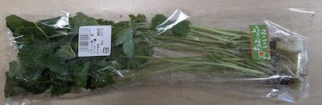
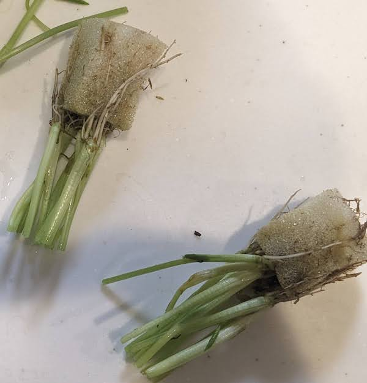
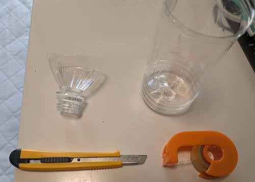
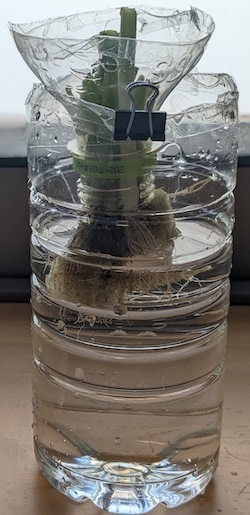

# 【再生野菜】ペットボトル水耕栽培キットでミツバを育てる方法

## ペットボトルで簡易水耕栽培キットの作り方

- スーパーで購入した根っことスポンジが付いたミツバで再生野菜を育てます。
- スポンジがあると水を吸いやすくなるので、育てやすくなります。

 

- 根っこの上の白から緑色に変わったところらへんを切ります。根っこの近くで切ると再生が遅くなります。

 

- ペットボトルの上の方をカッターで切ります。
- 切り口は危ないのでセロハンテープ等で覆うと安全です。

 

- ペットボトルの上部を逆さ(飲み口を下)にし、飲み口の外側に根が出るように、野菜を飲み口に刺して入れます。
- ペットボトルの下部に水を入れます。ペットボトル上部を逆さ(飲み口が下)にして、ペットボトル下部の上に置いて重ねます。
- 根の半分くらいが水に浸かるように、水を入れます。根が全て水に浸かると酸素を吸収できなくなって、腐りやすくなります。

 

- 水は1日1〜2回くらい交換すると良いです。ペットボトルの上部と下部を分離できるので、水の交換も簡単です。
- 室内で水耕栽培する場合、明るい日陰に置くと丁度良いです。日当たりの良い窓際に置く場合は、レースカーテン越しくらいが良いです。
- 特に、根は日光に弱いため、直射日光が当たらないように注意しましょう。ペットボトルの根がある部分の周囲だけ黒い紙や布で覆うなどするのも良いです。
- また、日光によって水が温まると、不純物が発生し、水が汚れやすくなります。

## 関連ページ

- [水耕栽培入門](hydroponics.md) 
- [トップページ](../index.md) 
