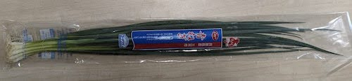
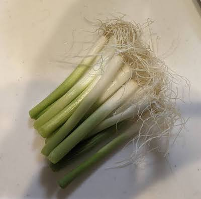
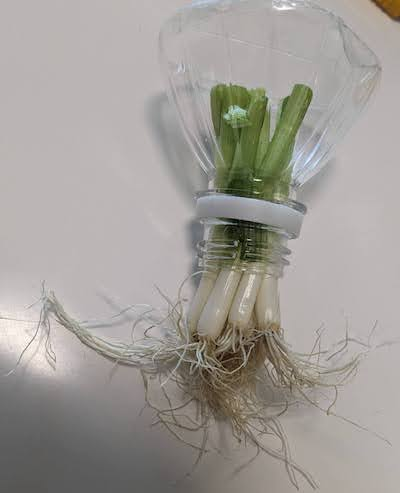
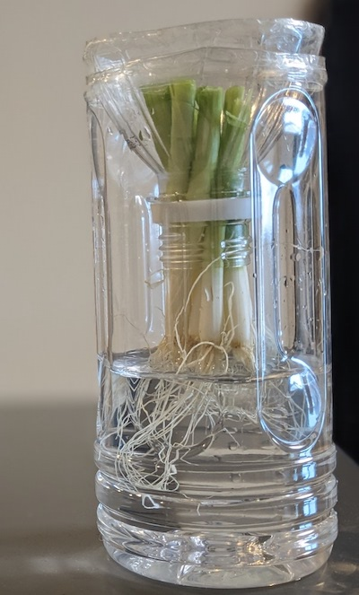

# 【再生野菜】ペットボトル水耕栽培キットでネギ(青ネギ、小ネギ)を育てる方法

## ペットボトルで簡易水耕栽培キットの作り方

- スーパーで購入した根っこが付いたネギ(青ネギ、小ネギ)で再生野菜を育てます。

 

- ネギの根元3～5センチ(根っこの上の白から緑色に変わった辺り)を切ります。根っこの近くで切ると再生が遅くなります。

 

- ペットボトルの上の方をカッターで切ります。
- 切り口は危ないのでセロハンテープ等で覆うと安全です。

 

- ペットボトルの上部を逆さ(飲み口を下)にし、野菜を飲み口に刺して入れます。
- ネギなどの根っこがある野菜は、写真のように飲み口の外側に根が出るように入れます。

 

- ペットボトルの下部に水を入れます。ペットボトル上部を逆さ(飲み口が下)にして、ペットボトル下部の上に置いて重ねます。
- 根の半分くらいが水に浸かるように、水を入れます。根が全て水に浸かると酸素を吸収できなくなって、腐りやすくなります。

 
適しています。

- 水は1日1〜2回くらい交換すると良いです。ペットボトルの上部と下部を分離できるので、水の交換も簡単です。
- 室内で水耕栽培する場合、明るい日陰に置くと丁度良いです。日当たりの良い窓際に置く場合は、レースカーテン越しくらいが良いです。
- 特に、根は日光に弱いため、直射日光が当たらないように注意しましょう。ペットボトルの根がある部分の周囲だけ黒い紙や布で覆うなどするのも良いです。
- また、日光によって水が温まると、不純物が発生し、水が汚れやすくなります。

## 水耕栽培で失敗しないためのポイント

水耕栽培の失敗でよくあるのが、野菜が腐ってしまうことです。

- 腐る原因①「水が多すぎる」
    - 水が多すぎて野菜が水に浸かりすぎていると、根が呼吸できずに酸素をうまく吸収できず、腐りやすくなります。そのため、前述で紹介した「根の上の部分は水に浸らないようにする」のがポイントです。
- 腐る原因②「水の汚染」
    - 定期的な水の交換(1日1〜2回)が必要です。
    - 特に夏場は気温が高く、水が腐りやすいので、1日に2～3回交換すると安心です。
    - ペットボトル容器にヌメリがあれば、しっかり洗い流しましょう。
    - 直射日光が当たり過ぎると、水溶液の汚れが進むこともあるので、LEDライトや直射日光を当てる時間を管理する。
- 腐る原因③「カビ」
    - 湿度が高い場所には置かないようにしましょう。
    - 湿度が高い日はエアコンを除湿モードにしたり、除湿機などで湿度を下げましょう。
    - 塵やホコリもカビの原因なので、換気をしっかりしましょう。
- 腐る原因

## ネギの特性

- 温度は20℃が生育適温。
    - 夏場に弱く、30℃を超えると生育しにくくなる。
    - 冬場に強く、氷点下まで耐える
- 湿度に弱い。
    - 通気が悪い粘土地や水はけの悪い土地で生育しにくい。

# 関連ページ

- [水耕栽培入門](hydroponics.md) 
- [トップページ](../index.md) 
