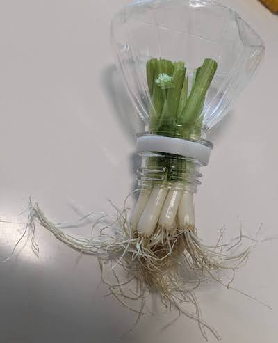

# 【再生野菜】ペットボトルで水耕栽培キットを簡単に作る方法を解説

## 再生野菜(リボべジ)とは?

再生野菜(リボべジ、リボーンベジタブル)とは、野菜の根やヘタなどを捨てずに育てて食べられる部分を再び再生させた野菜のことです。
再生野菜をしやすいものとして、ネギ、ミツバ、豆苗、人参、大根、サニーレタスなどがあります。

野菜の種類や栽培方法によって、難易度が異なります。

## おすすめの野菜

- [青ネギ、小ネギ、細ネギ](./assets/hydroponics-regenerated-vegetables-plastic-bottle-negi.md)
- [みつば](./assets/hydroponics-regenerated-vegetables-plastic-bottle-mitsuba.md)

## ペットボトルで簡易水耕栽培キットを自作

- ペットボトルの上の方をカッターで切ります。
- 切り口は危ないのでセロハンテープ等で覆うと安全です。

 

- ペットボトルの上部を逆さ(飲み口を下)にし、野菜を飲み口に刺して入れます。
- ネギなどの根っこがある野菜は、写真のように飲み口の外側に根が出るように入れます。

 

- ペットボトルの下部に水を入れます。ペットボトル上部を逆さ(飲み口が下)にして、ペットボトル下部の上に置いて重ねます。
- 根の半分くらいが水に浸かるように、水を入れます。根が全て水に浸かると酸素を吸収できなくなって、腐りやすくなります。

 

- 水は1日1〜2回くらい交換すると良いです。ペットボトルの上部と下部を分離できるので、水の交換も簡単です。
- 室内で水耕栽培する場合、明るい日陰に置くと丁度良いです。日当たりの良い窓際に置く場合は、レースカーテン越しくらいが良いです。
- 特に、根は日光に弱いため、直射日光が当たらないように注意しましょう。ペットボトルの根がある部分の周囲だけ黒い紙や布で覆うなどするのも良いです。
- また、日光によって水が温まると、不純物が発生し、水が汚れやすくなります。

# 関連ページ

- [水耕栽培入門](hydroponics.md) 
- [トップページ](../index.md) 

