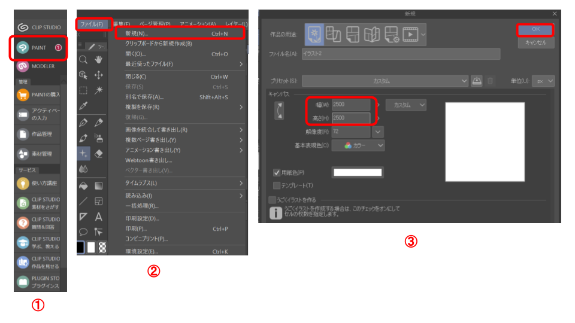

# クリスタでキャラクターに色塗りする方法

## ラフ画の作成

● 白地のキャンバスを作成します。
(下の例は2500 * 2500 サイズで作成)

  

## 線画の作成

●[カブラペン], [ブラシサイズ10], [ブレ補正100]を選択します。
●[髪 線画], [顔 線画], [体 線画]のレイヤーをそれぞれ作成し、線画をカブラペンで描きます。

## ベタ塗り

●[カブラペン], [ブラシサイズ170], [ブレ補正16]を選択します。
●[髪 色], [白目 色], [黒目 色], [顔 色], [体 色]レイヤーをそれぞれ作成します。
●[顔 色]レイヤーを選択し、[塗りつぶし]->[ほかレイヤーを参照]を選択します。
●[顔 色]レイヤーの顔の部分を緑色などで塗りつぶします。
※塗り残しは丁寧にカブラペンで塗りつぶします
●[顔 色]レイヤーを「透明ピクセルをロック」状態にして標準カラーセットから好きな肌色で塗り直します。
※細かい色の調整は[編集] -> [色調補正] -> [色相・彩度・明度]で行う
●[顔 色]レイヤーの顔の部分を緑色などで塗りつぶします。
●[目 色]レイヤーを作成し、黒目（緑色など）と白目（灰色）を塗ります。
緑色にすることで塗りミスがわかりやすくなります。

●塗りミスを修正したら、[編集] -> [色調補正] -> [色相・彩度・明度]で白目と黒目の色を調整します。

●[髪 色]レイヤーの髪の部分を塗りつぶしツールで塗りつぶし、細かいところはカブラペンで塗ります。
※細かい色の調整は[編集] -> [色調補正] -> [色相・彩度・明度]で行う

## 光と影をつける

●[肌 色 影1]レイヤーを[肌 色]レイヤーの上に作成します。
●[下のレイヤでクリッピング]をクリックします。
●スポイトで肌色を抽出し、それより少し濃い色を選択します。
●[カブラペン], [ブラシサイズ170], [ブレ補正100]を選択します。
●[肌 色 影1]に影を描きます。

同じやり方で[白目 色 影1][黒目 色 影1][髪 色 影1]レイヤーを作成し、クリッピングしてから少し濃い色で塗ります。

●[肌 色 影2]レイヤーを[肌 色 影1]レイヤーの上に作成します。
●[下のレイヤでクリッピング]をクリックします。
●スポイトで肌 色 影1の色を抽出し、それより少し濃い色を選択します。
●[カブラペン], [ブラシサイズ170], [ブレ補正100]を選択します。
●[肌 色 影2]に影を描きます。

同じやり方で[白目 色 影2][黒目 色 影2][髪 色 影2]レイヤーを作成し、クリッピングしてから少し濃い色で塗ります。

●[肌 色 光1]レイヤーを[肌 色 影2]レイヤーの上に作成します。
●[下のレイヤでクリッピング]をクリックします。
●白色（光）を選択します。
●[カブラペン], [ブラシサイズ170], [ブレ補正100]を選択します。
●[肌 色 光1]に光を描きます。