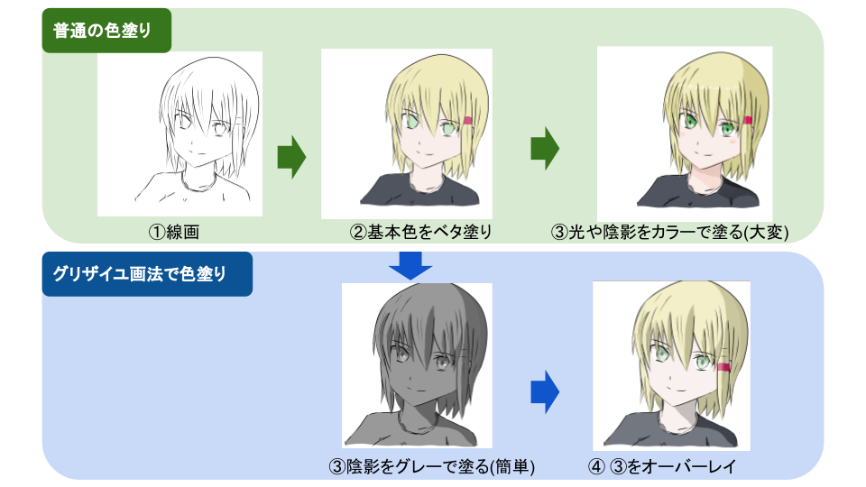
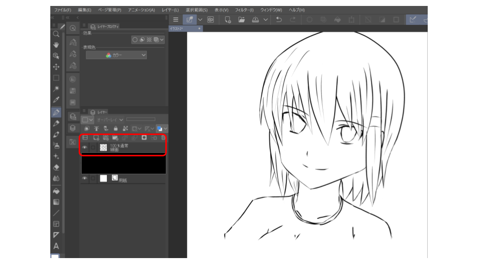
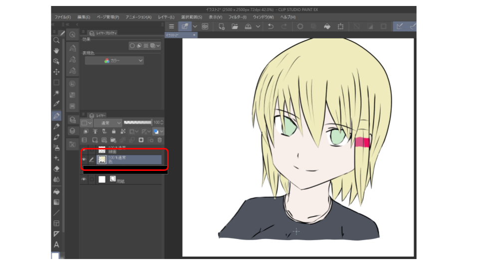
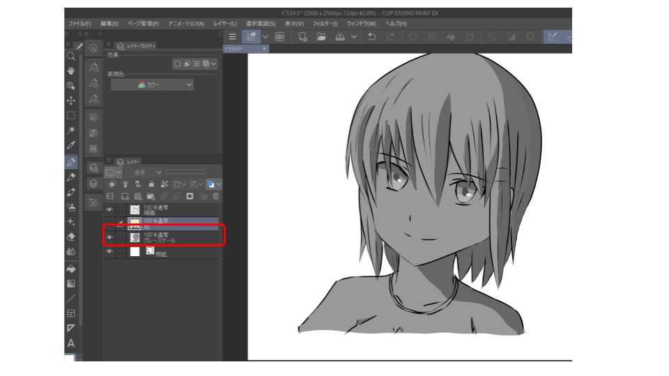
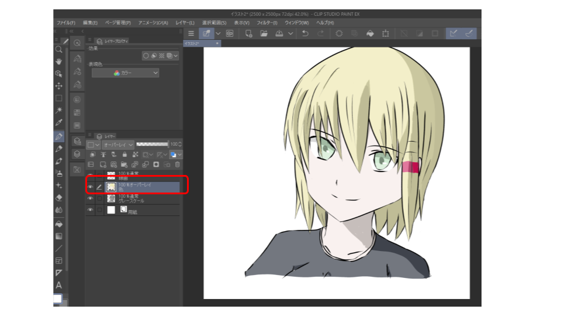
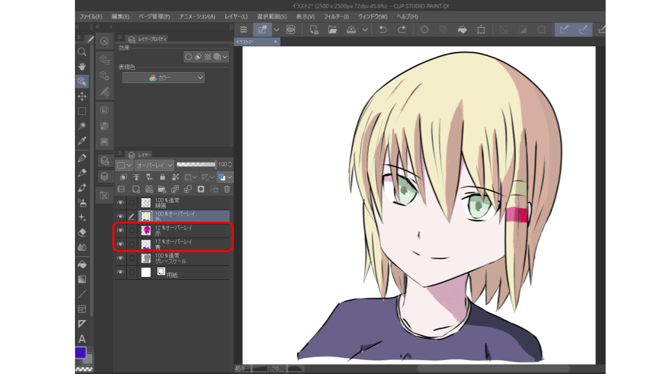

# 【クリスタ】グリザイユ画法で簡単に色塗りする方法

## グリザイユ画法とは

グリザイユ画法とは、色塗り方法の1つです。
通常の塗り方と違い、最初にグレースケール(白黒)の陰影だけを表現したレイヤーを作成し、そこに、オーバーレイで色を乗せていくことで、カラーの陰影を表現します。
レイヤー数が少なく、直感的に陰影を描けるため、比較的短時間で色塗りができます。

  

## グリザイユ画法で色塗りする手順(Clip Studioの例)

- 新規レイヤーを作成し、線画を描きます。

  

- 新規レイヤーを作成し、基本色をベタ塗りします。

  

- 新規レイヤーを作成し、グレースケール（灰色のみ）で、濃度40～50％をベースの灰色で線画に陰影を付けます。
※真っ黒 or 真っ白は使いません(後で色が乗らなくなるため)
※色味の明るい髪の毛や瞳のハイライトなどは、後から別で描き足すため、ここではハイライトを入れません

  

- グレースケールのレイヤーの上からレイヤー(レイヤーモードはオーバーレイ)を作成し、色を乗せます。

  

## 赤色と青色の発色を良くして、色のくすみを改善(Clip Studioの例)

単純にオーバーレイでパーツの色を上から乗せただけだと、色がくすんでしまいます。そこで、次のように赤と青色用の発色をよくするためのレイヤーを用意します。

- グレースケールのレイヤーの上に、レイヤー(オーバーレイ)を2つ新規作成します。
(下の例だとレイヤー名「赤」「青」)。

- 作成した1つ目のレイヤー(赤)には、肌や暖色系のパーツの上にくすんだ赤色で塗ります。2つ目のレイヤー(青)には、寒色系のパーツの上にくすんだ青色で塗ります。

- 2つのレイヤーの透明度を10～20%くらいの間でちょうど良い感じの発色になるよう調整します。

  
