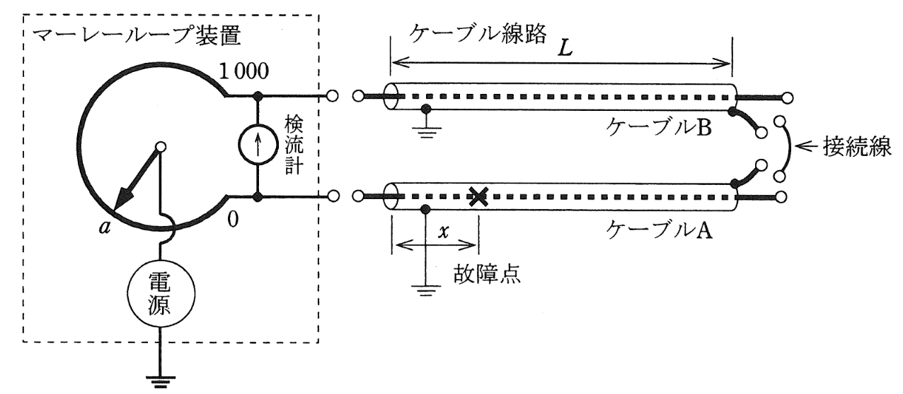

# 【電験3種・電力】マーレ―ループ法の原理と測定方法

マーレ―ループ法は、ホイートストンブリッジを利用してケーブル線路の故障点位置を特定する方法です。

  

- 上図のように、ケーブルAの一箇所においてその導体と遮へい層の間に地絡故障を生じているとします。

- 故障点の位置標定を行うため、並行した健全相(ケーブルA)と故障相(ケーブルB)の一端をマーレーループ装置に接続します。

- マーレ―ループ装置を接続する箇所の逆側端部において、健全相と故障相の**導体同士**を接続して短絡します。

- マーレ―ループ装置を電源につなぎます。

- 検流計に電流が流れないようにマーレーループ装置の目盛$a$を調整し，この結果から以下のように求めます。

- ケーブル全体の抵抗R、ケーブル線路長L、マーレ―ループ装置を接続した端部側から故障点までの距離xとします。

- 健全相側からの抵抗値は$\frac{2L-x}{L}R$となります。

- 故障相側からの抵抗値は$\frac{x}{L}R$となります。

- マーレーループ装置の全体抵抗$R_0$0、ブリッジが平衡したときの故障相に接続されたブリッジ端子までの目盛の読みが$a$のとき、マーレーループ装置の抵抗は$\frac{a}{1000}R_0$と $\frac{1000-a}{1000}R_0$に分けられ、以下のようなブリッジ回路に変換できます。

- ブリッジの平衡条件は以下の式になります。

$\frac{1000-a}{1000}\cdot \frac{x}{L}=\frac{a}{1000}\cdot\frac{2L-x}{L}$

- よって、上記の式を故障点までの距離$x$について解くと、$x=\frac{aL}{500}$となります。
    - ※故障点の地絡抵抗が十分低いことがよい位置標定精度を得るうえで必要です。
    - ※ケーブルA、Bは同一仕様かつ同一長とし、マーレ―ループ装置とケーブルの接続線及びケーブルどうしの接続線のインピーダンスは無視します。

## 参考動画

初心者向け電験三種・電力・27・フェランチ効果【超簡単に学ぶ！】第三種電気主任技術者
 

## 関連リンク

- [電験3種試験対策トップページ](../index.md)
- [トップページ](../../../index.md)

