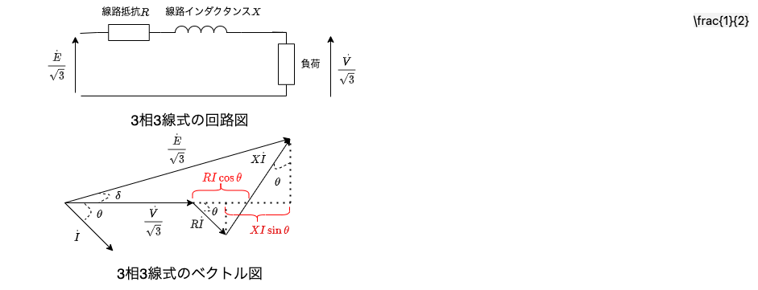
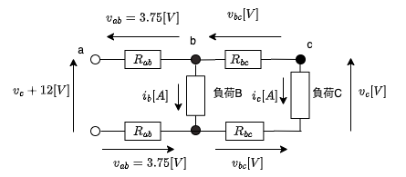

# 配電線路に関する試験問題対策【電験3種・電力】

## 高圧引込ケーブル

- [ストレスコーン](../07-1-shrink-back-stress-cone.md)
    - 遮蔽銅テープの端部へ電気力線が集中するのを防ぎ(電位傾度を緩和)、絶縁体の絶縁破壊を防止する。

## 単相2線式 配電線路の電圧降下

単相二線式の配電線路では、負荷に対して供給される線路と戻りの線路で電圧降下が発生します。
負荷の力率(遅れ力率)$cos\theta$のとき、回路図とベクトル図は以下のとおり。

 

$\dot{E}$と$\dot{V}$の位相差が十分に小さいとき、配電線路の電圧降下$\epsiron = E-V$は以下のとおり。

$ E \simeq V+2RIcos\theta + 2XIsin\theta $

$E-V=2RIcos\theta + 2XIsin\theta$

$ \epsilon = 2I(Rcos\theta + Xsin\theta) $

↑ この式は要暗記。

配電線路の線間電圧$V[V]$、線電流$I[A]$、力率$cos\theta$のとき、送電電力$P[W]$は以下のとおり。

$P=VIcos\theta$

↑ この式は要暗記。

## 3相3線式 配電線路の電圧降下

3相3線式の電線路では、荷の力率(遅れ力率)$cos\theta$のとき、一相分の等価回路とベクトル図は以下のようになる。

 

配電線路の三相分の電圧降下$\epsiron$は以下のとおり。

$ \frac{E}{\sqrt{3}} \simeq \frac{V}{\sqrt{3}}+RIcos\theta + XIsin\theta $

$\frac{E}{\sqrt{3}} - \frac{V}{\sqrt{3}}=RIcos\theta + XIsin\theta$

$ E-V = \sqrt{3}(RIcos\theta + XIsin\theta) $

$ \epsilon = \sqrt{3}I(Rcos\theta + Xsin\theta) $

↑最後の式は要暗記。

配電線路の線間電圧$V[V]$、線電流$I[A]$、力率$cos\theta$のとき、送電電力$P[W]$は以下のとおり。

$P=\sqrt{3}VIcos\theta$

↑ この式は要暗記。

## 【例題1】単相２線式配電線路の電圧降下と負荷電流

【問題】

 

単相 2 線式の配電線路において、電線 1 線当たりの抵抗と長さは、a−b 間で 0.3 [Ω/km]及び250[m]、b−c 間で 0.9 [Ω/km] 及び100 [m]である。このとき、次の①②の値を計算せよ

①b−c 間の 1 線の電圧降下$v_{bc}$ [V] 及び負荷 B と負荷 C の負荷電流$i_b,  i_c$[A]を求めよ。 
ただし、給電点aの線間の電圧値と負荷点c線間の電圧値の差を12.0[V] とし， a−b間の1線の電圧降下$v_{ab}=3.75 [V]$とする。負荷の力率はいずれも100[％] 、線路リアクタンスは無視するものとする。

②　次に、図の配電線路で抵抗に加えて a−c 間の往復線路のリアクタンスを考慮する。
このリアクタンスを 0.1 [Ω] とし、 b 点には無負荷で$i_b=0$ [A] ， c点には受電電圧が 100 [V] 、遅れ力率0.8、1.5 [kW] の負荷が接続されているものとする。このとき、給電点 a の線間の電圧値と負荷点 c の線間の電圧値 [V] の差を計算せよ。

【解答①】

- 題意の図から回路図を描くと以下のようになる。

 

- キルヒホッフの法則より、以下の式が成立する。

$v_c+12=v_{ab}+v_{bc}+v_c+v_{bc}+v_{ab}$
 
- $v_{ab}=3.75[V]$なので、上式に代入すると$v_{bc}が求まる。$

$v_{bc}=6-v_{ab}=6-3.75=2.25[V]$

- 抵抗$R_ab$及びR_{bc}は以下となる。

$R_{ab}=r_{ab}\times 0.25=0.075$[Ω]

$R_{bc}=r_{bc}\times 0.1=0.09$[Ω]

- よって、負荷Cに流れる電流$i_c$が求まる。

$i_c=\frac{v_{bc}}{R_{bc}}=\frac{2.25}{0.09}=25[A]$

- a−b 間を流れる電流$i_b+i_c$は以下のように求まる。

$i_b=\frac{v_{ab}}{R_{ab}}-i_c=\frac{3.75}{0.075}-25=25$[A]

【解答②】

- 往復線路のリアクタンスが 0.1 [Ω] なので、1線あたりのリアクタンスは X=0.05 [Ω] となる。

 

- 負荷 C に流れる電流$i_c$は、以下のように求まる。

$P_c=v_ci_ccos\theta$

$i_c=\frac{P_c}{v_ccos\theta}=\frac{1.5\times10^3}{100\times 0.8}=18.75$[A]

- また、$sin\theta$は以下のように求まる。

$sin\theta=\sqrt{1-cos^2\theta}=\sqrt{1-0.8^2}=0.6$

- よって、電圧降下は公式に代入すると6.1[V]と求まる。

$\epsilon = 2i_c((R_{ab}+R_{bc})cos\theta+Xsin\theta) = 2\times 18.75\times{(0.075+0.09)\times 0.8 + 0.05 \times 0.6}=6.1$[V]

## 参考動画

- 初心者向け電験三種・電力・26・送電・線路の電圧降下【超簡単に学ぶ！】第三種電気主任技術者
    -  
- 【カフェジカ実験室】穴あきケーブルに、高電圧メガをあててみた！
    - 

## 関連リンク

- [電験3種試験対策トップページ](../index.md)
- [トップページ](../../../index.md)