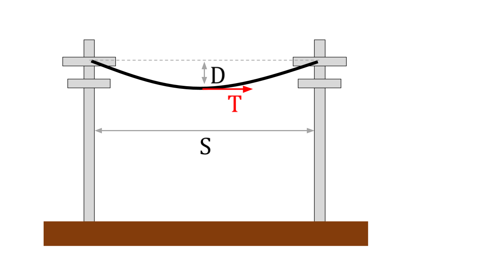
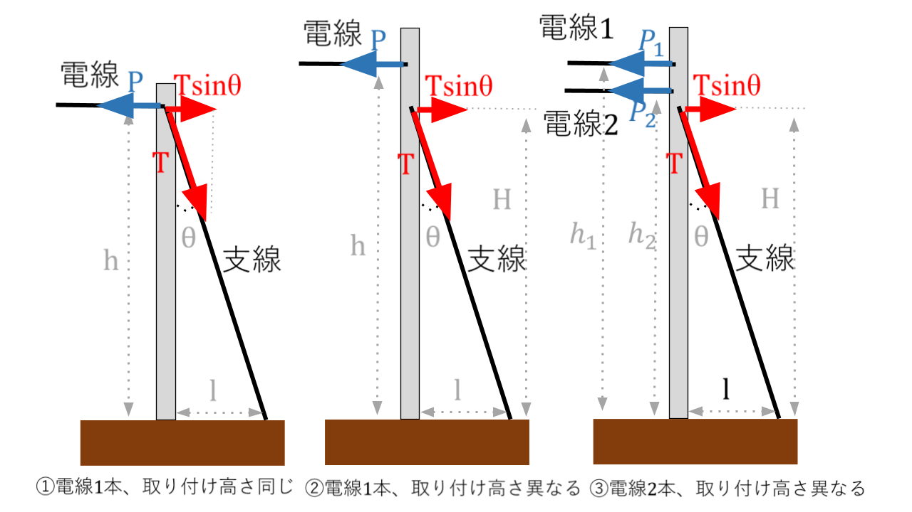
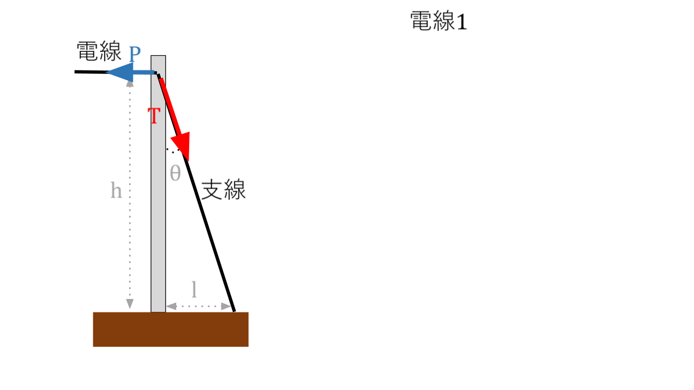

# 【電験3種・法規・電力】「電線の張力」「支線の張力」「風圧荷重」に関する試験問題対策

## 【電技6条】 電線等の断線の防止

電技6条では、電線等の断線の防止について記載されています。

'''
（電線等の断線の防止）
第六条　電線、支線、架空地線、弱電流電線等（弱電流電線及び光ファイバケーブルをいう。以下同じ。）その他の電気設備の保安のために施設する線は、通常の使用状態において断線のおそれがないように施設しなければならない。
'''

電線は、強く引っ張られることで、重力による「たるみ」が小さくなります。
ただし、電線は気温が低くなると縮み、熱くなると伸びるため強く引っ張りすぎると電線がキレてしまう恐れがあります。
そのため、強すぎず弱すぎない適切な強さで、支持物(電柱や鉄塔など)で電線を引っ張る必要があります。

## 【電技32条】風圧荷重

電技32条1項で、支持物が耐える必要のある風圧果汁について記載されています。

'''
（支持物の倒壊の防止）
第32条　架空電線路又は架空電車線路の支持物の材料及び構造（支線を施設する場合は、当該支線に係るものを含む。）は、その支持物が支持する電線等による引張荷重、10分間平均で風速40m/sの風圧荷重及び当該設置場所において通常想定される地理的条件、気象の変化、振動、衝撃その他の外部環境の影響を考慮し、倒壊のおそれがないよう、安全なものでなければならない。ただし、人家が多く連なっている場所に施設する架空電線路にあっては、その施設場所を考慮して施設する場合は、10分間平均で風速40m/sの風圧荷重の二分の一の風圧荷重を考慮して施設することができる。
２　架空電線路の支持物は、構造上安全なものとすること等により連鎖的に倒壊のおそれがないように施設しなければならない。
'''

電技解釈58条では、強度計算に用いられる風圧荷重の種別として、甲種、乙種、丙種、着雪時風圧荷重が記載されています。

'''
【架空電線路の強度検討に用いる荷重】（省令第32条第1項）
第58条 架空電線路の強度検討に用いる荷重は、次の各号によること。なお、風速は、気象庁が「地上気象観測指
針」において定める10分間平均風速とする。
一 風圧荷重 架空電線路の構成材に加わる風圧による荷重であって、次の規定によるもの
イ 風圧荷重の種類は、次によること。
(イ) 甲種風圧荷重 58-1表に規定する構成材の垂直投影面に加わる圧力を基礎として計算したもの、又は風速40m/s以上を想定した風洞実験に基づく値より計算したもの →※電線は980Pa
(ロ) 乙種風圧荷重 架渉線の周囲に厚さ6mm、比重0.9の氷雪が付着した状態に対し、甲種風圧荷重の0.5倍を基礎として計算したもの
(ハ) 丙種風圧荷重 甲種風圧荷重の0.5倍を基礎として計算したもの
(ニ) 着雪時風圧荷重 架渉線の周囲に比重0.6の雪が同心円状に付着した状態に対し、甲種風圧荷重の0.3倍を基礎として計算したもの
'''

まとめると以下のとおりです。

種別|風圧荷重の考え方
--|--
①氷雪の多い地方以外の地方|高温季においては甲種風圧荷重、低温季においては丙種風圧荷重。
②氷雪の多い地方（③に掲げる地方を除く）|高温季においては甲種風圧荷重、低温季においては乙種風圧荷重。
③氷雪の多い地方のうち、海岸地その他の低温季に最大風圧を生ずる地方|高温季においては甲種風圧荷重、低温季においては甲種風圧荷重又は乙種風圧荷重のいずれか大きいもの。
④人家が多く連なっている場所に施設される架空電線のうち、　(1)低圧又は高圧の架空電線路　(2)使用電圧が35,000V以下の電線に特別高圧絶縁電線又はケーブルを使用する特別高圧架空電線路|甲種風圧荷重又は乙種風圧荷重にかえて丙種風圧荷重を適用できる。

風圧荷重の種別|風圧［Pa］|風圧荷重F［N］
--|--|--
甲種風圧荷重|電線の垂直投影面積1m2について980Pa|980×S［N］
乙種風圧荷重|電線その他の架渉線にあってはその周囲に厚さ6mm、比重0.9の氷雪が付着した状態に対し、垂直投影面積1m2につき490Pa|490×S[N]
丙種風圧荷重|甲種風圧荷重の1/2|490×S[N]

S:電線の垂直投影面積$[m^2]$

$980Pa=100[kg/m^2]$

## 【電技解釈66条】電線のたるみ(弛度:ちど)、許容引張荷重、安全率

  

【*電線のたるみ(弛度)*】

- 電線中央部のたるみ(弛度)D[m]は、以下の式で計算できます。

$D=\frac{WS^2}{8T}$

W:電線1mあたりの合成荷重[N/m]
S:径間[m]
T:電線の水平張力(引張荷重)[N]

【*電線の長さとたるみ(弛度)*】

- 送電線の支持点間の距離S[m] と弛度(たるみ) D[m] のとき、電線の長さL[m]は以下の式で計算できます。

$L=S+\frac{8D^2}{3S}$

【*電線の長さと温度変化*】

- 温度がt1[℃]のときの電線の長さがL1[m]、温度がt2[℃]のときの電線の長さがL2[m]、線膨張係数αとすると、以下の関係式が成立する。

$L_2=L_1(1+\alpha(t_2 - t_1))$

【*電線1mあたりの合成荷重W*】

- 電線1mあたりの合成荷重W[N/m]は以下の式で計算できます。

$W=\sqrt{(W_o+W_i)^2+W_w^2}$

Wo:電線の自重[N/m]
Wi:氷雪荷重[N/m]
Ww:風圧荷重[N/m]

【*許容引張荷重*】

許容引張荷重T[kN]は、引張強さ[kN]を安全率で割ったものです。
電技解釈66条1項の【66-1表】で、電線の種類によって、引張強度は決められているため、安全性(安全率)を考慮し、「電線の引張強さ未満の許容引張荷重」で電線を引っ張ります。
「電線の引張強さ」以上で電線を引っ張ると、電線が破断してしまいます。
また、「電線の引張強さ」ギリギリの値でも破断する恐れが高いため、「安全率で割った余裕のある値」で電線を引っ張ります。

許容引張荷重T = 引張強さ / 安全率

'''
【低高圧架空電線の引張強さに対する安全率】（省令第6条）
第66条 高圧架空電線は、ケーブルである場合を除き、次の各号に規定する荷重が加わる場合における引張強さに対する安全率が、66-1表に規定する値以上となるような弛度により施設すること。
一 荷重は、電線を施設する地方の平均温度及び最低温度において計算すること。
二 荷重は、次に掲げるものの合成荷重であること。
イ 電線の重量
ロ 次により計算した風圧荷重
(イ) 電線路に直角な方向に加わるものとすること。
(ロ) 平均温度において計算する場合は高温季の風圧荷重とし、最低温度において計算する場合は低温季の風圧荷重とすること。
ハ 乙種風圧荷重を適用する場合にあっては、被氷荷重
'''

【66-1表】

電線の種類|安全率
--|--
硬銅線又は耐熱銅合金線|2.2
その他|2.5

## 【電技解釈61条】支線の張力

  

支線(電線の水平張力Pと逆方向に張ることで、支持物の傾きを抑える線)の張力T(引張許容荷重)は、電線の水平張力と等しくなるように計算して取り付ける必要があります。
ただし、支線の取り付け方により計算方法が変わります。

①電線が1本、取り付け高さが同じ場合

水平方向の力の釣り合い条件から以下の計算式になります。

$P=Tsin\theta$

$T=\frac{P}{sin\theta}=\frac{P\sqrt{h^2+l^2}}{l}$

P:電線の水平張力[kN]
θ:支線の角度[deg]
h:取り付け高さ[m]
l:支線の根開き[m]

②電線が1本、取り付け高さが異なる場合

支持物の根本からのモーメントの釣り合い条件から以下の計算式になります。

$THsin\theta = Ph$

$T=\frac{Ph}{Hsin\theta}$

P:電線の水平張力[kN]
θ:支線の角度[deg]
h:取り付け高さ[m]
l:支線の根開き[m]

③電線が2本、取り付け高さが異なる場合

支持物の根本からのモーメントの釣り合い条件から以下の計算式になります。

$THsin\theta = P_1h_1+P_2h_2$

$T=\frac{P_1h_1+P_2h_2}{Hsin\theta}$

P1:電線1の水平張力[kN]
P1:電線2の水平張力[kN]
θ:支線の角度[deg]
h1:電線1の取り付け高さ[m]
h2:電線2の取り付け高さ[m]
l:支線の根開き[m]

【*支線の許容引張荷重*】

支線の張力Tも、電線と同じく安全性を考慮して許容引張荷重以下にする必要があります。

許容引張荷重 = (素線の条数×素線1条あたりの引張強さ) / 安全率 = 支線の引張強さ / 安全率

電技解釈61条では、支線を施設するときの具体的なスペックが記載されています。

'''
【支線の施設方法及び支柱による代用】（省令第6条、第20条、第25条第2項）
第61条 架空電線路の支持物において、この解釈の規定により施設する支線は、次の各号によること。
一 支線の引張強さは、10.7kN（第62条及び第70条第3項の規定により施設する支線にあっては、6.46kN）以上であること。
二 支線の安全率は、2.5（第62条及び第70条第3項の規定により施設する支線にあっては、1.5）以上であること。
三 支線により線を使用する場合は次によること。
イ 素線を3条以上より合わせたものであること。
ロ 素線は、直径が2mm以上、かつ、引張強さが0.69kN/mm2以上の金属線であること。
四 支線を木柱に施設する場合を除き、地中の部分及び地表上30cmまでの地際部分には耐食性のあるもの又は亜鉛めっきを施した鉄棒を使用し、これを容易に腐食し難い根かせに堅ろうに取り付けること。
五 支線の根かせは、支線の引張荷重に十分耐えるように施設すること。
2 道路を横断して施設する支線の高さは、路面上5m以上とすること。ただし、技術上やむを得ない場合で、かつ、交通に支障を及ぼすおそれがないときは4.5m以上、歩行の用にのみ供する部分においては2.5m以上とすることができる。
3 低圧又は高圧の架空電線路の支持物に施設する支線であって、電線と接触するおそれがあるものには、その上部にがいしを挿入すること。ただし、低圧架空電線路の支持物に施設する支線を水田その他の湿地以外の場所に施設する場合は、この限りでない。
4 架空電線路の支持物に施設する支線は、これと同等以上の効力のある支柱で代えることができる。
'''

電技解釈62条では、高圧又は特別高圧の架空電線路の支持物として使用する木柱、A種鉄筋コンクリート柱又はA種鉄柱における支線の施設方法について記載されています。

'''
【架空電線路の支持物における支線の施設】（省令第32条第1項）
第62条 高圧又は特別高圧の架空電線路の支持物として使用する木柱、A種鉄筋コンクリート柱又はA種鉄柱には、次の各号により支線を施設すること。
一 電線路の水平角度が5度以下の箇所に施設される柱であって、当該柱の両側の径間の差が大きい場合は、その径間の差により生じる不平均張力による水平力に耐える支線を、電線路に平行な方向の両側に設けること。
二 電線路の水平角度が5度を超える箇所に施設される柱は、全架渉線につき各架渉線の想定最大張力により生じる水平横分力に耐える支線を設けること。
三 電線路の全架渉線を引き留める箇所に使用される柱は、全架渉線につき各架渉線の想定最大張力に等しい不平均張力による水平力に耐える支線を、電線路の方向に設けること。
'''

## 【例題1】「支線の張力」「支線の素線の必要最小条数」

  

【*問*】
以下のA種鉄筋コンクリート柱があり、支線(亜鉛メッキ銅より線)の素線が直径2.0mm、引張強さ1kN/mm2、取り付け高さhが5m、電線の水平張力Pが10kN、支線の根開きlが5mのとき、「支線の張力」「支線の素線の必要最小条数」を求めよ。

- 支柱の張力T

$T=\frac{P}{sin\theta}=\frac{P\sqrt{h^2+l^2}}{l}=\frac{10000\sqrt{5^2+5^2}}{5}=14142N=14kN$

- 支線の素線の必要最小条数
    - 素線1条あたりの引張強さ$T_1$は、素線の半径をrとすると

$T_1=\pi r^2 \times 1000 = \pi (\frac{2}{2})^2 \times 1000 = 3.14kN$

- 安全率は電技解釈61条2項より1.5で、許容引張荷重=張力なので、
    - 素線の条数=(安全率×許容引張荷重)/素線1条あたりの引張強さ=(1.5×14000)/3140≒6.7

- よって必要最小条数は7となる。

## 【例題2】「許容引張荷重」「弛度」

【*問1*】

両端の高さが同じで径間距離S=100mの架空電線路がある。
合成荷重(電線の重量と水平風圧)W=30N/mで、電線の引張強さが22kN、安全率が2.2のとき、電線の「許容引張荷重T」「弛度D」を計算せよ。

【*問1の解答*】

- 許容引張荷重

許容引張荷重T = 引張強さ / 安全率 = 22kN / 2.2 = 10kN

- 弛度

$D=\frac{WS^2}{8T}=\frac{30\times100^2}{80000}=\frac{300000}{80000}=3.75m$

【*問2*】

支持点間S1=180m、弛みD1=3.0m、水平張力T1の架空電線路がある。
架空電線路の支持点間S2=200m、弛みD2=4.0mに変更するときに必要な水平張力T2とするとき、T2はT1の何倍になるか計算せよ。
ここで、支持点間の高低差はなく、電線の単位長当たりの荷重wは変わらないものとする。

【*問2の解答*】

$\frac{w\cdot S_1^2}{8T_1}=\frac{w\cdot 180^2}{8T_1}=3 $

$\frac{w\cdot S_1^2}{8T_2}=4$

上2式を連立方程式として解くと、以下のとおり、0.926倍が導かれる。

$\frac{T_2}{T_1}=0.926$

## 【例題3】風圧荷重の計算

(1)以下の高圧ケーブルの夏季風圧荷重(甲種)を計算せよ。
外径φ:46mm
ケーブルの長さ:10m

電線1mあたりの風圧荷重=電線1［m］当たりの垂直投影面積 × 980[Pa] = (0.046m×1m) × 980 [Pa] = 45.08[N]

(補足)
Pa = N/m2
Pa * m2 = N

## 【例題4】電線の長さと水平力

以下の使用のある架空電線路について、電線の導体温度が35 ℃のとき、①②の値を計算せよ。

①電線の支持点間の実長の値[m] 

②電線の支持点間の最低点における水平張力の値[N]

【仕様】
・支持点の高さが同じ
・径間距離150m
・電線の質量による荷重20N/m
・線膨張係数は0.000018/1℃
・電線の導体温度が−10℃ のとき、たるみは3.5m
※張力による電線の伸縮等は無視できる

【*①の解答*】

$L_1=S+\frac{8D_1^2}{3S}=150+\frac{8\cdot 3.5^2}{3 \cdot 150}=150.22m$

$L_2=L_1(1+\alpha(t_2−t_1)) = 150.22 \cdot(1+0.000018 \cdot(35+10))=150.34m$

【*②の解答*】
$L_2=S+\frac{8D_2^2}{3S}$

$D_2^2=\sqrt{\frac{3S(L_2-S)}{8}}=4.373m$

## 【問題】送電線のたるみの温度変化

【問題】

径間Sが 100 [m] の架空電線路において、導体の温度が 30 [℃] のとき、たるみD=2[m]であった。
導体の温度が 60 [℃] になったとき，たるみD[m] の値を計算よ。
ただし，電線の線膨張係数は1[℃] につき$1.5×10^{−5}$とし、張力による電線の伸びは無視するものとする。

【解答】

- 導体の温度が 30 [℃] のときの電線の長さ$L_1$ [m] は以下のとおり100.1[m]と求まる。

$L_1=S+\frac{8D^2}{3S}=100+\frac{8 \times 2^2}{3\times 100}=100.1$

- 導体の温度が60 [℃] のときの電線の長さ $L_2$ [m] は以下のとおり100.1[m]と求まる。

$L_2=L_1\{ 1+\alpha (t_2 - t_1) \} = 100.1 \times \{1+1.5\times 10^{-5}\times (60-30) \}=100.15$

- 60 [℃] のときのたるみ $D_2$[m] は以下のとおり、2.39mと求まる。

$L_2=S+\frac{8D_2^2}{3S}$

$D_2=\sqrt{\frac{3S}{8}(L_2-S)}=\sqrt{\frac{3\times 100}{8}(100.15-100)}=2.39$

## 参考動画

初心者向け電験三種・電力・27・フェランチ効果【超簡単に学ぶ！】第三種電気主任技術者
 

## 関連リンク

- [電験3種試験対策トップページ](../index.md)
- [トップページ](../../../index.md)