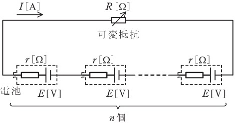

# オームの法則とは?直列抵抗、並列抵抗、ブリッジの平衡条件と計算問題 【電験3種・理論】

## オームの法則

電気回路における電圧$V$、電流$I$、抵抗値$R$には以下の関係が成立します。

$V=RI$

つまり、電圧$V$、電流$I$、抵抗値$R$のうち２つがわかれば残り１つも求めることができます。

- 【計算例1】電気回路の抵抗Rが10[Ω]、電流が5[A]のとき、電圧V[V]はいくらか。
    - $V=RI=10\times 5 =50$[V]

- 【計算例2】電気回路の電圧が10［V］、電流が5[A]のとき、抵抗R[Ω]はいくらか。
    - $R=\frac{V}{I}=\frac{10}{5}=2$[Ω]

## 合成抵抗(直列と並列の違い)

- 抵抗$R_1$と$R_2$が**直列に接続**されているとき、合成抵抗$R$は以下の式で計算できます。

$R= R_1+R_2$

- 抵抗$R_1$と$R_2$が**並列に接続**されているとき、合成抵抗$R$は以下の式で計算できます。

$\frac{1}{R}= \frac{1}{R_1}+\frac{1}{R_2}$

$R=\frac{R_1R_2}{R_1+R_2}$

## 分圧の法則

**直列回路**において，各抵抗にかかる電圧は以下の式で計算できます。

$V_{R1}=\frac{R_1}{R_1+R_2}E$

$V_{R2}=\frac{R_2}{R_1+R_2}E$

## 分流の法則

**並列回路**において，各抵抗に流れる電流は以下の式で計算できます。

$I_{R1}=\frac{R_2}{R_1+R_2}I$

$I_{R2}=\frac{R_1}{R_1+R_2}I$

## 直流ブリッジの平衡条件

- 直流ブリッジ回路において、以下の式が成立するとき、電流Iが流れません。

$R_1R_4=R_2R_3$

【補足】
- これを応用し、抵抗を測定することができます。詳細は以下のページで解説しています。
- 

## 可変抵抗の消費最大電力

 

電源$E$[V]に、抵抗$r$[Ω]と可変抵抗$R$[Ω]が直列接続されているとします。

このとき、回路に流れる電流$I$[A]は、以下のとおりです。

$I=\frac{E}{R+r}$

- 抵抗Rの消費電力P[W] は、以下のとおりです。

$P=RI^2+R(\frac{E}{R+r})^2=\frac{E^2}{R+2r+\frac{r^2}{R}}$

消費電力$P$が最大となるのは、上式の分母$f(R)=R+2r+\frac{r^2}{R}$が最小になる、つまり分母をRで微分した値$\frac{df(R)}{dR}=0になるのが条件となります。

$\frac{df(R)}{dR}=1-\frac{r^2}{R^2}=0$

$R=r$

よって、$R=r$のとき、消費電力$P[W]$は最大となります。
その最大消費電力$P_{max}$は以下のとおり。

$P_{max}=\frac{E^2}{r+2r+\frac{r^2}{r}}=\frac{E^2}{4r}$

## 【例題1】直流回路の端子電圧からの電源電圧の導出

【電験3種 理論 令和4年度下期 問題5 一部改変】

 

図のような直流回路において、抵抗3Ωの端子間の電圧が1.8Vであった。
このとき、電源電圧E[V]の値を求めよ。

【解答】

- 「直流ブリッジの平衡条件 $R_1R_4=R_2R_3$」を満たしているので、12[Ω]の抵抗には電流が流れないため、無視して合成抵抗を求めることができる。

$R=\frac{(4+5)(8+10)}{(4+5)+(8+10)}=6$[Ω]

- 「分圧の法則」「分流の法則」より、以下のとおり電源電圧E[V]が求まる。

$1.8=\frac{3}{R+3}E=\frac{3}{6+3}E$

$E=5.4$[V]

## 【例題1】可変抵抗の最大消費電力

【電験3種 理論 令和3年度 問題7 一部改変】

 

図のように，起電力 𝐸 [V] ，内部抵抗 𝑟 [Ω] の電池 𝑛 個と可変抵抗 𝑅 [Ω] を直列に接続した回路がある。この回路において，可変抵抗 𝑅 [Ω] で消費される電力が最大になるようにその値 [Ω] を調整した。このとき，回路に流れる電流 𝐼 の値 [A] を表す式を求めよ。

【解答】

- 可変抵抗R[Ω] の消費電力が最大となるのは$nr=R$の場合なので、そのときの電流$I$は以下のとおりに

$I=\frac{nE}{R+nr}=\frac{nE}{nr+nr}=\frac{E}{2r}$

## 関連リンク

- [電験3種試験対策トップページ](../index.md)
- [トップページ](../../../index.md)