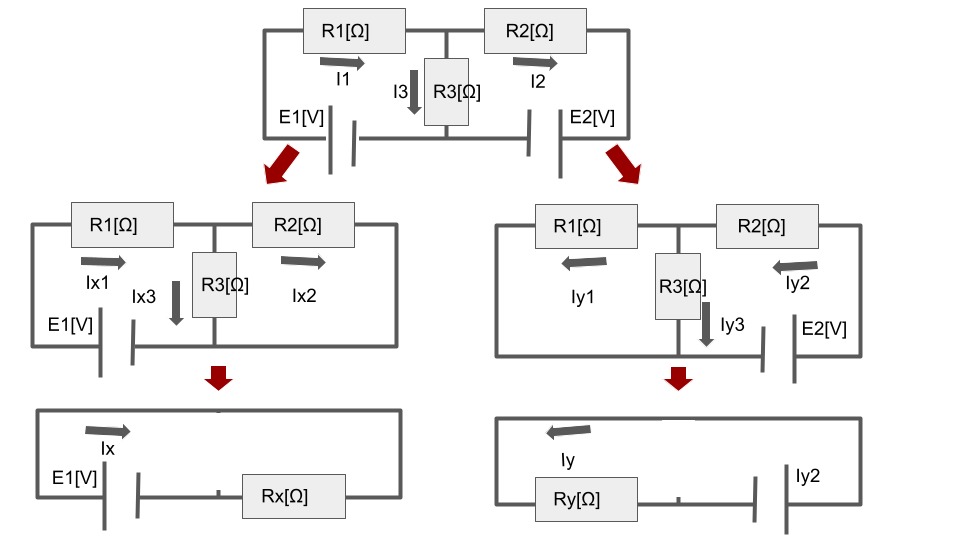
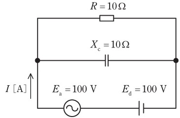

# 重ね合わせの定理の使い方とは?試験対策と計算問題【電験3種・理論】

## 重ね合わせの定理とは

  

「**重ね合わせの定理**」とは、複数の電源がある回路の場合、「**回路内の任意の場所における電流及び電圧は、回路内の各電源が単独で存在した場合の値の和に等しい**」というものです。
言葉だとわかりにくいので、以下の図(電源2個)を観たほうがわかりやすいです。

- 上図のように、電源が$E_1, E_2$の2つある回路を電源1つずつに分解したとき、以下の式が成立します。

$I_1=I_{x1}+(-I_{y1}) $

$I_2=I_{x2}+(-I_{y2}) $

$I_3=I_{x3}+I_{y3} $

$R_{x}=R_1+\frac{R_2R_3}{R_2+R_3}$

$R_{y}=R_2+\frac{R_1R_3}{R_1+R_3} $

$I_{x1}=I_{x2}+I_{x3} $

$I_{y2}=I_{y1}+I_{y3} $

$V_{R1}=V_{xR1}+(-V_{yR1})$

$V_{R2}=V_{xR2}+(-V_{yR2})$

$V_{R3}=V_{xR3}+V_{yR3}$

$I_x=\frac{E_1}{R_x} $

$I_y=\frac{E_2}{R_y}$

【計算例】

- 上図の$R_1=10$Ω、$R_2=30$Ω、$R_3=15$Ω、$E_1=16V$、$E_2=4V$のとき、$R_3$の両端電圧を重ね合わせの理で求めます。

- 2つの回路x, yに分解したときの、全体抵抗$R_x, R_y$を計算します。

$R_{x}=R_1+\frac{R_2R_3}{R_2+R_3}=10+\frac{30 \cdot 15}{30+15}=10+10=20$

$R_{y}=R_2+\frac{R_1R_3}{R_1+R_3}=30+\frac{10 \cdot 15}{10+15}=30+6=36$

- 2つの回路x, yに分解したときの、R3に加わる両端電圧$V_{xR3}, V_{yR3}$をそれぞれ計算します。

$V_{xR3}=E_1\frac{R_{x}}{R1+R_{x}}=16\frac{10}{20}=8$

$V_{yR3}=E_2\frac{R_{y}}{R2+R_{y}}=4\frac{6}{36}=0.67$

- よって、元の回路でR3に加わる両端電圧$V_{R3}$は以下のとおり。

$V_{R3}=V_{xR3}+V_{yR3}=8.67$

## 【例題1】直流電源と交流電源の組合せ回路

【電験3種 理論 令和元年度 問題8 一部改変】

 

図の回路において，正弦波交流電源と直流電源を流れる電流$I$の実効値 [A] を求めよ。
ただし，$E_1$は交流電圧の実効値 [V] ，$E_d$は直流電圧の大きさ [V] ， 𝑋C は正弦波交流電源に対するコンデンサの容量性リアクタンスの値 [Ω] ，$R$は抵抗値 [Ω] とする。

【解答】

- 「重ね合わせの理」より、図の回路を直流電源と交流電源に分ける。

- 直流電源において、定常状態においてコンデンサに流れる電流は0となる。よって、電流$I_1$は抵抗分のみ考えて計算すれば良い。

$I_1=\frac{E_d}{R}=\frac{100}{10}=10$[A]

- 交流電源において、合成インピーダンス$\dot{Z}$は以下のとおり。

$\dot{Z}=\frac{R\cdot jX_c}{R+jX_c}=\frac{10\cdot j10}{10+j10}=\frac{100j}{10+j10}$

- 合成インピーダンスの大きさ$Z$は以下のとおり。

$Z=\frac{100}{\sqrt{10^2+10^2}}=5\sqrt{2}$

- 交流電源により回路を流れる電流$I_2$は以下のとおり。

$I_2=\frac{E_1}{Z}=\frac{100}{5\sqrt{2}}=10\sqrt{2}$[A]

- 直流と交流の直交性により、それぞれを重ね合わせた電流$I$は、以下のとおり。

$I=\sqrt{I_1^2+I_2^2}=10\sqrt{3}$

## 参考動画

- *初心者向け電験三種・理論・23・FET・MOSFET【超簡単に学ぶ！】第三種電気主任技術者*
    - 
- *初心者向け電験三種・理論・24・バイアス回路【超簡単に学ぶ！】第三種電気主任技術者【2023年1月29日改訂】*
    - 

## 関連リンク

- [電験3種試験対策トップページ](../index.md)
- [トップページ](../../../index.md)