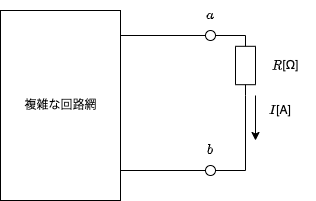
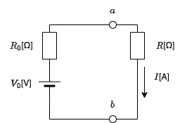
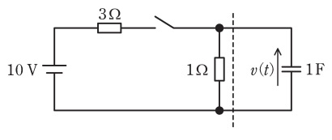

# テブナンの定理とは?使い方と例題・問題集【電験3種・理論】

## テブナンの定理

テブナンの定理を使うと「複雑な回路網」を「シンプルな等価回路」に変換し、複雑な回路網に流れる電流をオームの法則で簡単に求めることができます。

- 等価回路への変換方法
    - 電流を求めたい部分(a-bの左側と右側)を切り離します。
    -  
    - 切り離したa-bの右側(複雑な回路網側)から等価電源$V_0$を求めます。
    - 切り離したa-bの右側(複雑な回路網側)から等価抵抗$R_0$を求めます。
        - 【ルール】電圧源はすべて短絡除去、電流源はすべて開放除去します。
    - 等価回路に変換します。
    -  

## 【例題1】テブナンの定理と過渡現象

【電験3種 理論 令和2年度 問題10 一部改変】

 

図の回路のスイッチを閉じたあとの電圧 𝑣(𝑡) の波形を考える。破線から左側にテブナンの定理を適用することで，回路の時定数 [s] と 𝑣(𝑡) の最終値 [V] を求めよ。

ただし，初めスイッチは開いており，回路は定常状態にあったとする。

【解答】

 

- 題意のとおり、破線の左右で回路を分離すると、等価電源$V_0$[V]は以下のとおり。

$V_0=\frac{1}{3+1}\times 10 =2.5$[V]

- 等価抵抗$R_0$[Ω]は以下のとおり(電源は短絡除去して考える)。

$R_0=\frac{3\times 1}{3+1}=0.75$[Ω]

- 時定数$\tau$は以下のとおり。

$\tau =CR_0=1\times 0.75=0.75$[s]

- $v(t)$は最終的に$V_0$すべての電圧が加わるので、$V_C=V_0=2.5[V]$となる。
