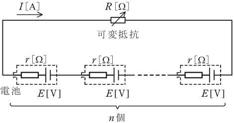

# 可変抵抗とは?消費最大電力の計算方法【電験3種・理論】

## 可変抵抗の消費最大電力

 

電源$E$[V]に、抵抗$r$[Ω]と可変抵抗$R$[Ω]が直列接続されているとします。

このとき、回路に流れる電流$I$[A]は、以下のとおりです。

$I=\frac{E}{R+r}$

- 抵抗Rの消費電力P[W] は、以下のとおりです。

$P=RI^2+R(\frac{E}{R+r})^2=\frac{E^2}{R+2r+\frac{r^2}{R}}$

消費電力$P$が最大となるのは、上式の分母$f(R)=R+2r+\frac{r^2}{R}$が最小になる、つまり分母をRで微分した値$\frac{df(R)}{dR}=0になるのが条件となります。

$\frac{df(R)}{dR}=1-\frac{r^2}{R^2}=0$

$R=r$

よって、$R=r$のとき、消費電力$P[W]$は最大となります。
その最大消費電力$P_{max}$は以下のとおり。

$P_{max}=\frac{E^2}{r+2r+\frac{r^2}{r}}=\frac{E^2}{4r}$

## 【例題1】可変抵抗の最大消費電力

【電験3種 理論 令和3年度 問題7 一部改変】

 

図のように，起電力 𝐸 [V] ，内部抵抗 𝑟 [Ω] の電池 𝑛 個と可変抵抗 𝑅 [Ω] を直列に接続した回路がある。この回路において，可変抵抗 𝑅 [Ω] で消費される電力が最大になるようにその値 [Ω] を調整した。このとき，回路に流れる電流 𝐼 の値 [A] を表す式を求めよ。

【解答】

- 可変抵抗R[Ω] の消費電力が最大となるのは$nr=R$の場合なので、そのときの電流$I$は以下のとおりに

$I=\frac{nE}{R+nr}=\frac{nE}{nr+nr}=\frac{E}{2r}$
