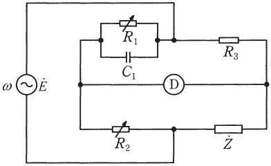

# ホイーストンブリッジとは?平衡条件の計算方法と例題【電験3種・理論】

## ホイーストンブリッジ

## 【例題1】交流回路のホイーストンブリッジ

【電験3種 理論 平成29年度 問題15 一部改変】

 

図は未知のインピーダンス$\dot{Z}$[Ω] を測定するための交流ブリッジである。電源の電圧を$\dot{E}$[V] ，角周波数を$w$[rad/s] とする。ただし、$w$、静電容量$C_1$[F] ，抵抗$R_1, R_2, R_3$[Ω]は0でないとするとき、次の①②を求めよ。

①交流検出器Dによる検出電圧が零となる平衡条件を$\dot{Z}$，$R_1, R_2, R_3, w, C_1$を用いて表せ。

②$\dot{Z}=R+jX$としたとき，この交流ブリッジで測定できる$R$[Ω]と$X$[Ω]の値が正か負か答えよ。

【解答①】

- $R_1$と$C_1$の合成インピーダンス$\dot{Z_1}$は以下のとおり。

$\dot{Z_1}=\frac{R_1\frac{1}{jwC_1}}{\frac{R_1+\frac{1}{jwC_1}}=\frac{R_1}{1+jwC_1R_1}$

- 交流ブリッジの平衡条件は以下のとおり。

$\dot{Z}\dot{Z_1}=R_2R_3$

$\dot{Z}\frac{R_1}{1+jwC_1R_1}=R_2R_3$

【解答②】

- ①の解答式を$\dot{Z}$について整理すると以下のとおり。

$\dot{Z}=\frac{R_2R_3}{R_1}+j\frac{wC_1R_1R_2R_3}{R_1}=\frac{R_2R_3}{R_1}+jwC_1R_2R_3$

- 与えられた値はすべて正なので、$\dot{Z}$の実部と虚部は正になる。
- つまり、R$[Ω]と$X$[Ω]の値はともに正となる。
