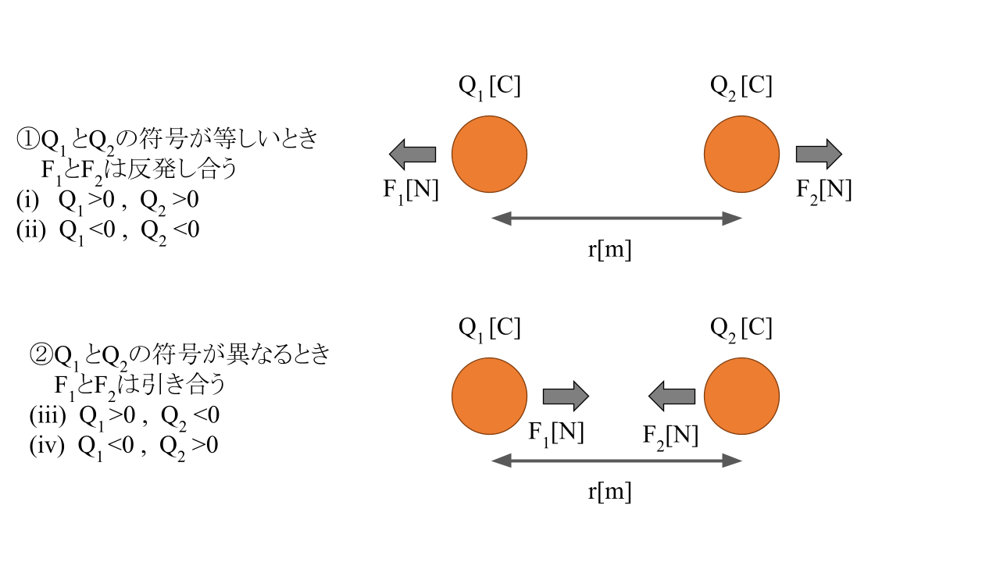
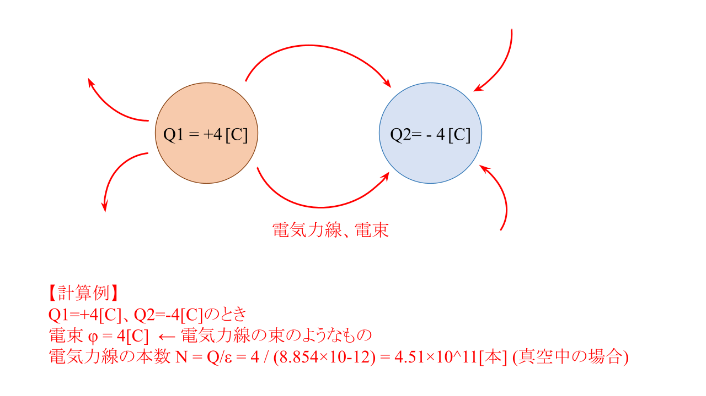
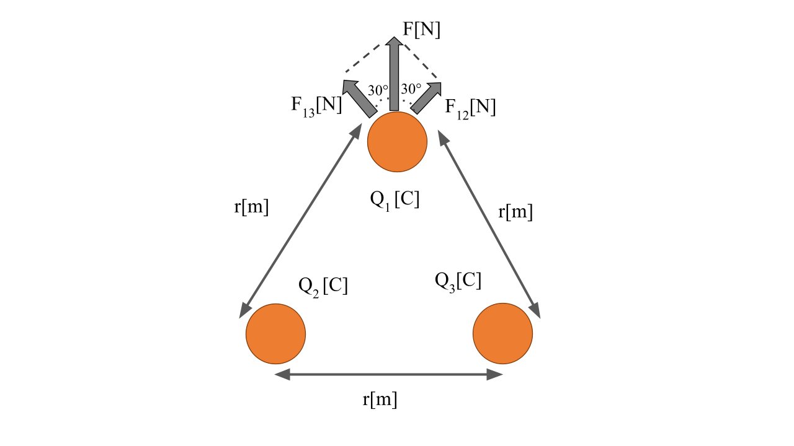

# 【電験3種・理論】電界、電気力線、電束、電束密度、クーロンの法則、静電気、静電力とは?試験対策と計算問題

## 静電気と静電力(クーロンの法則)

- 静電気
    - 物質が帯びている電気。
- 帯電(電気を帯びている)
    - 物質が正負いずれかの電荷が多い状態にあること。
- 帯電体
    - 帯電している物体。
- 点電荷
    - 大きさが無視できる帯電体。
- 静電誘導
    - 導体(電気をよく通す物体)に電荷を近づけたとき、反対の符号をもつ電荷が現れる現象。(例えば、導体に正の電荷を近づけると、導体には負の電荷が現れます)
- 静電力
    - 同じ符号をもつ電荷同士は引き合い、異なる符号をもつ電荷同士は反発する。このときの、引き合ったり反発したりする力のこと。

静電力F[N]は、以下の式で計算できます。

$F=k\frac{Q_1Q_2}{r^2}=\frac{1}{4\pi \epsiron}\frac{Q_1Q_2}{r^2}$

パラメータ|説明
--|--
$Q_1, Q_2$|2つの点電荷の電荷量[C]
$k$|比例定数$[N\cdot m^2/C^2]$※真空中なら9×10^9
$r^2$|2つの点電荷の間の距離[m]
$\epsilon$|誘電率

**静電力Fと誘電率$\epsilon$は反比例**の関係にあります。
つまり、真空に対して比誘電率εの絶縁体の液体で満たしたとき、小球の間に働く**静電力は真空より$\frac{1}{\epsilon}$倍だけ小さく**なります。

図で示すと以下のとおりです。

  

$F_1, F_2$はそれぞれ電荷$Q_1, Q_2$に働く静電力[N]です。

## 静電気と静電力、電気力線

  

- 電界
    - 電荷が周囲に生じさせる、静電力が働く空間。
- 電界の強さE[V/m]	電界中で単位電荷(1C)あたりに働く静電力の大きさと向き。
- 電位差V
    - **+1Cの点電荷が一様の電界E[V/m] に逆らって移動する仕事**。一様の電界E[V/m]中で、点電荷を点Aから点Bまで距離d[m]だけ動かしたとき、点Aと点Bの電位差$V=Ed[V]$となる。+Q[C] の点電荷を電位差V[V]だけ移動させるための仕事$W=VQ[J]$となる。つまり、**VのQ倍**になり、エネルギーW[J]が大きいほど、点電荷の電位を上げることができます。
- 電気力線
    - 正電荷(+Q)から出て負電荷(-Q)に吸い込まれる仮想の線(電気力の様子を表現している)。電荷量Qの正電荷から出る電気力線の本数$N=\frac{Q}{\epsilon}$[C]。つまり、**電気力線の本数N**は**電荷量に比例**し、**誘電率に反比例**します。
- 電気力線の特徴
    - **正電荷から出て負電荷に吸い込まれる**(途中で枝分かれしたり、消えたり、異なる線同士が結合したりしない)。
    - 1**本の電気力線は縮もうとする**が、**異なる電気力線同士は反発**しあう。
    - 導体表面に対して垂直に出入りする(導体内部には存在しない)。
    - **電気力線の接線の向き**と、その点の**電界の向き**は**一致**する。
    - 電気力線の$1m^2$あたりの密度は、その点の電界の大きさとなる。
    - 導体外部の電気力線は、導体内部の空洞に入り込まず、**外部の電界の影響は受けません**。これを**静電遮蔽**といいます。
    - **電気力線が密集している箇所**(電荷の近く)ほど、**斥力・反発力が強い**。
    - 電気力線の密集具合は、電解(電場)**E[本/$m^2$]が大きい**ほど密集しているとわかる。
- 誘電率ε
    - 周囲の空間における電気力線の透かしにくさ。
- 電束φ[C]
    - 電気力線を表す量(※単位は「本」ではなく、「C:クーロン」であることに注意)。
    - 1[C]の電荷から出る電束の総和は1[C]。
- 電束密度$D=\epsilon E=\frac{\phi}{S}[C/m^2]$
    - ある面を垂直に貫く**$1m^2$あたりの電束**。
- 誘電分極
    - 誘電体に電荷を近づけると、反対の符号をもつ電荷が誘電体表面に現れること。
- 静電誘導
    - 帯電した物体を導体に接近させると、**帯電した物体に近い側に帯電した物体とは逆の極性の電荷が引き寄せられる**現象です。
- 電磁誘導
    - 磁界が変化すると、**変化を妨げる向きに導体に誘導起電力や誘導電流が発生**する現象です。

- 電界E[V/m]にある電荷[C]に働く静電力F[N]は以下の計算式で求まります。

$F=QE$

点電荷からr[m]離れた点の電界の大きさは次式で計算できます。

$E=\frac{N}{4\pi r^2}=\frac{\frac{Q}{\epsilon}}{4\pi r^2}$

${4\pi r^2}$は半径rの球の表面積です。
点電荷$Q_1$からr[m]離れた点の電界$E_1$に、点電荷$Q_2$をおいたときに働く静電力Fは次式で計算できます。

$F=Q_2E_1=Q_2\frac{\frac{Q_1}{\epsilon}}{4\pi r^2}=\frac{1}{4\pi\epsilon}\frac{Q_1Q_2}{r^2}$

$k=\frac{1}{4\pi\epsilon}$としたときのkを比例定数といい、以下の式で簡単に表す事が多いです。

$F=k\frac{Q_1Q_2}{r^2}$

点電荷Q[C]からr[m]離れた点の電位V[V]は次式で計算できます。

$V=Ed=\frac{Q}{4\pi r^2}r=\frac{Q}{4\pi r}$

- 電束φ、電束密度D、面積S[m2]の間には、以下の関係式が成立します。

$D=\frac{\phi}{S}$

電束φの本数は、誘電率ε(電気力線の透かしにくさ)を考慮しないため、電気力線の本数Nのε倍となります(単位面積あたりの密度もε倍)。
よって、電気力線の密度は電界の大きさEを示すため、**電束密度Dは電界の大きさEのε倍**となります。

$D=\epsilon E =\epsilon_0 \epsilon_r E$

$\epsilon_r$:真空誘電率($8.85×10^{-12}$)
$\epsilon_0$:ある物質の誘電室$\epsilon$と真空誘電率$\epsilon_r$の比
 
## 【例題1】2つの電荷の静電力

【問】

真空中で、2つの電荷が直線上に30cmの間隔で位置する。2つの電荷の電荷量がそれぞれ$2\times 10^{-6}, -3\times 10^{-6}$[C]のとき、引き合う力Fはいくらになるか。

【解】

$F=k\frac{Q_1Q_2}{r^2}=9\times 10^9\frac{(2\times 10^{-6})(-3\times 10^{-6})}{0.3^2}=-0.6[N]$

## 【例題2】3つの電荷の静電力

【問】

真空中で、3つの点電荷(電荷量は$3\times 10^{-8}$)が1辺の長さが30cmの正三角形の頂点にある。
このとき、各点電荷に働く斥力Fの大きさを求めよ。

【解】

  

各点電荷に働く斥力Fの大きさすべて同じになる。
よって、3つの点電荷の電荷量を$Q_1, Q_2, Q_3$とし、そのうちの1つの点電荷($Q_1$)に働く斥力Fを求める。

$F=F_{12}cos(30)+F_{13}cos(30)$

$=(k\frac{Q_1Q_2}{r^2}+k\frac{Q_1Q_3}{r^2})cos(30)$

$=(9\times 10^9)(\frac{(3\times 10^{-8})(3\times 10^{-8})}{0.3^2}+\frac{(3\times 10^{-8})(3\times 10^{-8})}{0.3^2})cos(30)$

$=(9\times 10^9)(1\times 10^{-14}+1\times 10^{-14})\frac{\sqrt{3}}{2}$

$=(9\times 10^9)(2\times 10^{-14})\frac{\sqrt{3}}{2}$

$=(18\times 10^{-5})\frac{\sqrt{3}}{2}$

$=1.56\times 10^{-4}$

## 参考動画

- *初心者向け電験三種・理論・1・クーロンの法則【超簡単に学ぶ！】第三種電気主任技術者*
    - 

## 関連リンク

- [電験3種試験対策トップページ](../index.md)
- [トップページ](../../../index.md)