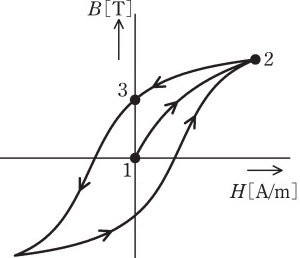
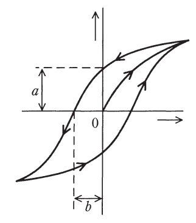

# 【BH曲線とは】磁化特性(BH曲線)とは?意味と過去問【電験3種・理論】

## 磁化特性(BH曲線)

  

- 図は積層した電磁鋼板の鉄心の磁化特性(BH曲線、ヒステリシスループ)を示す。
- 縦軸は磁束密度$B[T]$、横軸は磁界の強さH[A/m] を表す。
- この鉄心にコイルを巻きリアクトルを製作し、商用交流電源に接続し、実効値が$V[V]$の電源電圧を印加すると、図中に矢印で示す軌跡が確認された。
- コイル電流が最大のときの点は**2**である。
    - (理由)磁界の強さ$H$は電流$I$に比例し、磁束密度$B$は磁界の強さ$H$に比例する。よって、磁束密度$B$は電流$I$に比例するため、コイル電流が最大となるのは磁束密度及び磁界の強さが最大となる点2となる。
- 電源電圧実効値が一定に保たれたまま、周波数がやや低下したとき、ヒステリシスループの面積は**大きくなる**。
    - (理由)周波数が低下すると、コイルのリアクタンス$X_L=jWL$が低下するので、コイル電流が増加し、磁界の強さ H及び磁束密度Bが大きくなるため。
- 周波数が一定で、電源電圧実効値が低下したとき、ヒステリシスループの面積は**小さくなる**。
    - (理由)周波数が変わらないので、リアクタンスの大きさ$X_L$は変わらない。この状態で電源電圧が低下するとコイル電流は減少し、磁界の強さ$H$及び磁束密度$B$は小さくなる。
- コイル電流実効値が一定で、周波数がやや低下したとき、ヒステリシスループの面積は**ほとんど変化しない**。
    - (理由)コイル電流が変わらなければ、磁界の強さ$H$及び磁束密度$B$もほとんど変わらない。

## 【例題1】磁性体の磁化曲線

【電験3種 理論 平成29年度 問題4】※赤字を埋める空欄補充問題

  

図は磁性体の磁化曲線(BH曲線)を示す。次の文章は，これに関する記述である。

1. 直交座標の横軸は、**磁界の強さ[A/m]**である。
1. a は，**残留磁気**の大きさを表す。
1. 鉄心入りコイルに交流電流を流すと，ヒステリシス曲線内の面積に**比例**した電気エネルギーが鉄心の中で熱として失われる。
4. 永久磁石材料としては，ヒステリシス曲線の a と b がともに**大きい**磁性体が適している。

【補足】
- 横軸は磁界の強さ$H$、縦軸が磁束密度$B$。
- 図のaは残留磁気、bは保磁力である。
- 鉄心入りコイルには、ヒステリシス曲線の面積に比例してヒステリシス損が発生する。
- 永久磁石は磁化されやすいものが良いため、ヒステリシス曲線の面積が大きいものが選ばれる。逆に、鉄心には磁化されにくい方が良いため、ヒステリシスループの面積が**小さい**ものが採用される。

## 参考動画

- *初心者向け電験三種・理論・1・クーロンの法則【超簡単に学ぶ！】第三種電気主任技術者*
    - 

## 関連リンク

- [電験3種試験対策トップページ](../index.md)
- [トップページ](../../../index.md)