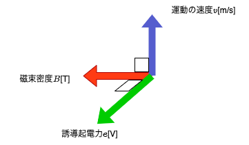

# 【合成インダクタンスとは】和動接続、差動接続の違いと計算方法・過去問【電験3種・理論】

## 合成インダクタンスの計算(和動接続、差動接続)

  

- 上図のようなトランスにおいて、2つのコイルが磁気的に結合して巻かれている時、合成インダクタンスは以下の式で求まります。

$L=L_1+L_2\pm 2M$

- $L_1, L_2$はそれぞれコイル$A, B$の自己インダクタンス、$2M$は相互インダクタンスです。
- 相互インダクタンス$M$は以下の式で計算できます。

$M=k\sqrt{L_1L_2}$

- $k$は結合係数と呼ばれ、$0\leq k \leq 1$となります。

- 合成インダクタンスの計算式を使うときに注意するのは、$M$の前についている符号です。
- この符号は、「コイル$A, B$に同じ向きの電流を流した時の**磁束（磁力線）の方向**」で決まります。

条件|符号
--|--
磁束（磁力線）の向きが同じ|符号は+(和動接続=磁束が強め合う)
磁束（磁力線）の向きが逆|符号は－(差動接続=磁束が弱め合う)

- 磁束（磁力線）の向きは「右手親指の法則」で簡単にわかります。そのため、合成インダクタンスを計算するときは、コイルの巻き方向に注意する必要があります。
ちなみに上記の図の場合、端子$A，B$に直流電圧を加えると2つのコイルの磁束（磁力線）の向きが異なるため差動接続となります。

## 【例題1】コイルの自己インダクタンスと相互インダクタンスの計算

【問題】

  

図のような環状鉄心に巻かれたコイルについて、

- 端子1−2間の自己インダクタンス$L_{12}$が40mH
- 端子3−4間の自己インダクタンスが10mH
- 端子2と3を接続した状態での端子1−4間のインダクタンスが$L_{14}=86mH$

であったとき、端子1−2間のコイルと端子3−4間のコイルとの間の結合係数$k$を求めよ。

【解答】

- 端子 1−2 間の自己インダクタンスを$L_{12}=40$[mH]、端子3−4間の自己インダクタンスを$L_{34}=10[mH]$とおくと、相互インダクタンス$M$は以下のとおり。

$M=k\sqrt{L_{12}L_{34}}=k\sqrt{40\cdot 10}=20k$

- 端子2と3を接続した状態は和動接続となるため、合成インダクタンス$L_{14}$は以下のとおり。

$L_{14}=L_{12}+L_{34}+ 2M = 40+10+20k=86$

$k = 0.9$

## 参考動画

- *初心者向け電験三種・理論・1・クーロンの法則【超簡単に学ぶ！】第三種電気主任技術者*
    - 

## 関連リンク

- [電験3種試験対策トップページ](../index.md)
- [トップページ](../../../index.md)