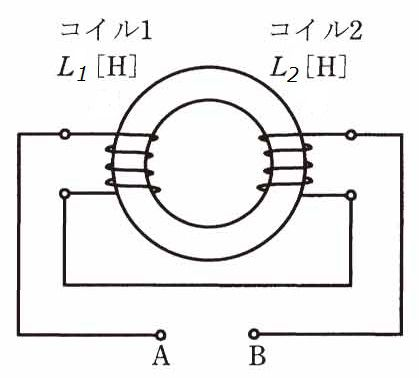

# 【磁界とは】磁力線、磁束、磁束鎖交数、自己インダクタンス、相互インダクタンス【電験3種・理論】

## 磁力線、磁束、磁束鎖交数、自己インダクタンス、相互インダクタンス

- 磁力線
    - 磁極の働きを理解するのに考えた仮想的な線。
- 磁力線の特徴
    - 磁石の**N極から出てS極に入る**。
    - 磁極周囲の物質の**透磁率**μ[H/m]は**磁極**m[Wb]から$\frac{m}{\mu}$ 本の **磁力線**が出入りする。
    - 磁力線の**接線の向き**は、その点の**磁界の向き**を表す。
    - 磁力線の**密度**は、その点の**磁界の強さ**を表す(磁束密度と間違えないように注意)。
    - 磁力線同士は、**互いに反発し合い**、交わらない。
- 磁束$\varphi =BS$[Wb]
    - 垂直断面を貫く磁束線の総本数[Wb]。
    - 垂直断面の面積:S、磁束密度:B
- 磁束鎖交数$\Phi = N \varphi = LI$[Wb]
    - N巻のコイル全体を貫く磁力線の本数[Wb]
- 自己インダクタンスL[H]
    - コイルに電流を流した時、コイルに発生する磁束鎖交数 $\Phi$ [Wb]は、電流 $I$ [A]に比例します。この比例定数を**自己インダクタンスL[H]**といいます。

- 自己インダクタンス $L$ の $N$ 巻コイルに電流 $I$ を流すとき、磁束 $\varphi$ [Wb]と磁束鎖交数 $\Phi$ [Wb]は次式で計算できます。

$\Phi=N\varphi=LI$

$\varphi=\frac{LI}{N}$

コイルに電流を流した時、コイルに発生する磁束鎖交数 $\Phi$ [Wb]は、電流 $I$ [A]に比例します。
この比例定数を自己インダクタンスL[H]といいます。

## 合成インダクタンス(和動接続、差動接続)

  

- 上図のようなトランスにおいて、2つのコイルが磁気的に結合して巻かれている時、合成インダクタンスは以下の式で求まります。

$L=L_1+L_2\pm 2M$

- $L_1, L_2$はそれぞれコイル$A, B$の自己インダクタンス、$M$は相互インダクタンスです。
- 相互インダクタンス$M$は以下の式で計算できます。

$M=k\sqrt{L_1L_2}$

- $k$は結合係数と呼ばれ、$0\leq k \leq 1$となります。

- 合成インダクタンスの計算式を使うときに注意するのは、$M$の前についている符号です。この符号は、「コイル$A, B$に同じ向きの電流を流した時の磁束（磁力線）の方向」で決まります。

条件|符号
--|--
磁束（磁力線）の向きが同じ|符号は+(和動接続=磁束が強め合う)
磁束（磁力線）の向きが逆|符号は－(差動接続=磁束が弱め合う)

- 磁束（磁力線）の向きは「右手親指の法則」で簡単にわかります。そのため、合成インダクタンスを計算するときは、コイルの巻き方向に注意する必要があります。
ちなみに上記の図の場合、端子$A，B$に直流電圧を加えると2つのコイルの磁束（磁力線）の向きが異なるため差動接続となります。

## 【例題1】コイルの自己インダクタンスと相互インダクタンスの計算

【問題】

図のような環状鉄心に巻かれたコイルについて、

- 端子1−2間の自己インダクタンス$L_{12}$が40mH
- 端子3−4間の自己インダクタンスが10mH
- 端子2と3を接続した状態での端子1−4間のインダクタンスがL_{14}=86mH

であったとき、端子1−2間のコイルと端子3−4間のコイルとの間の結合係数kを求めよ。

【解答】

- 端子 1−2 間の自己インダクタンスを$L_{12}=40$[mH]、端子3−4間の自己インダクタンスを$L_{34}=10[mH]$とおくと、相互インダクタンス$M$は以下のとおり。

$M=k\sqrt{L_{12}L_{34}}=k\sqrt{40\cdot 10}=20k$

- 端子2と3を接続した状態は和動接続となるため、合成インダクタンスLは以下のとおり。

$L_{14}=L_{12}+L_{34}+ 2M = 40+10+20k=86$

$k = 0.9$

## 参考動画

- *初心者向け電験三種・理論・1・クーロンの法則【超簡単に学ぶ！】第三種電気主任技術者*
    - 

## 関連リンク

- [電験3種試験対策トップページ](../index.md)
- [トップページ](../../../index.md)