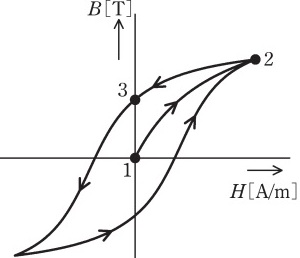

# 【磁界とは】磁力線、磁束、磁束鎖交数、自己インダクタンス、相互インダクタンス【電験3種・理論】

## 磁力線、磁束、磁束鎖交数、自己インダクタンス、相互インダクタンス

- 磁力線
    - 磁極の働きを理解するのに考えた仮想的な線。
- 磁力線の特徴
    - 磁石の**N極から出てS極に入る**。
    - 磁極周囲の物質の**透磁率**μ[H/m]は**磁極**m[Wb]から$\frac{m}{\mu}$ 本の **磁力線**が出入りする。
    - 磁力線の**接線の向き**は、その点の**磁界の向き**を表す。
    - 磁力線の**密度**は、その点の**磁界の強さ**を表す(磁束密度と間違えないように注意)。
    - 磁力線同士は、**互いに反発し合い**、交わらない。
- 磁束$\varphi =BS$[Wb]
    - 垂直断面を貫く磁束線の総本数[Wb]。
    - 垂直断面の面積:S、磁束密度:B
- 磁束鎖交数$\Phi = N \varphi = LI$[Wb]
    - N巻のコイル全体を貫く磁力線の本数[Wb]
- 自己インダクタンスL[H]
    - コイルに電流を流した時、コイルに発生する磁束鎖交数 $\Phi$ [Wb]は、電流 $I$ [A]に比例します。この比例定数を**自己インダクタンスL[H]**といいます。

- 自己インダクタンス $L$ の $N$ 巻コイルに電流 $I$ を流すとき、磁束 $\varphi$ [Wb]と磁束鎖交数 $\Phi$ [Wb]は次式で計算できます。

$\Phi=N\varphi=LI$

$\varphi=\frac{LI}{N}$

コイルに電流を流した時、コイルに発生する磁束鎖交数 $\Phi$ [Wb]は、電流 $I$ [A]に比例します。
この比例定数を自己インダクタンスL[H]といいます。

## 点磁荷のクーロン法則

点磁荷のクーロン法則ですが、考え方は点電荷と同じようなものです。
点電荷$Q$が点磁荷$m$，電界の強さ$E$が磁界の強さ$H$、真空の誘電率$epsilon_0$が真空の透磁率$\mu_0$となります。

真空中で距離$r$離れた二つの磁荷$m_A, m_B$に加わる𝐹$F$は、真空の透磁率を$\mu_0$とすると以下の式で計算できます。

$F=\frac{m_Am_B}{4\pi \mu_0 r^2}$

磁荷$m$から$𝑟$離れた点における磁界の強さ$H$は以下の式で計算できます。

$H=\frac{m}{4\pi \mu_0 r^2}$

## 磁化特性(ヒステリシスループ)

  

- 図は積層した電磁鋼板の鉄心の磁化特性(ヒステリシスループ)を示す。
- 縦軸は磁束密度$B[T]$、横軸は磁界の強さH[A/m] を表す。
- この鉄心にコイルを巻きリアクトルを製作し、商用交流電源に接続し、実効値が$V[V]$の電源電圧を印加すると、図中に矢印で示す軌跡が確認された。
- コイル電流が最大のときの点は**2**である。
    - (理由)磁界の強さ$H$は電流$I$に比例し、磁束密度$B$は磁界の強さ$H$に比例する。よって、磁束密度$B$は電流$I$に比例するため、コイル電流が最大となるのは磁束密度及び磁界の強さが最大となる点2となる。
- 電源電圧実効値が一定に保たれたまま、周波数がやや低下したとき、ヒステリシスループの面積は**大きくなる**。
    - (理由)周波数が低下すると、コイルのリアクタンス$X_L=jWL$が低下するので、コイル電流が増加し、磁界の強さ H及び磁束密度Bが大きくなるため。
- 周波数が一定で、電源電圧実効値が低下したとき、ヒステリシスループの面積は**小さくなる**。
    - (理由)周波数が変わらないので、リアクタンスの大きさ$X_L$は変わらない。この状態で電源電圧が低下するとコイル電流は減少し、磁界の強さ$H$及び磁束密度$B$は小さくなる。
- コイル電流実効値が一定で、周波数がやや低下したとき、ヒステリシスループの面積は**ほとんど変化しない**。
    - (理由)コイル電流が変わらなければ、磁界の強さ$H$及び磁束密度$B$もほとんど変わらない。

## 磁界中の電子運動

【電験3種 理論 平成30年 問12】で赤字箇所が穴埋め問題として出題されました。

  

- 図のように、平等磁界の存在する真空かつ無重力の空間に，電子を$x$方向に初速度v[m/s] で放出する。
- 平等磁界は$z$方向であり磁束密度の大きさ$B[T]$をもつとし、電子の質量を$m[kg]$、素電荷の大きさを$e[C]$とする。
- ただし、紙面の裏側から表側への向きを$z$方向の正とし、$v$は光速に比べて十分小さいとする。
- このとき、電子の運動は**等速円運動**となり、**時間$T=\frac{2\pi m}{eB}[s]$**後に元の位置に戻ってくる。
    - (理由)フレミングの左手の法則より、電子に対しては、回転円の中心に向かう力が加わるため。
- 電子の放出直後の軌跡は破線矢印の**$a$**のようになる。
    - (理由)フレミングの左手の法則より、電流の向きが$-x$方向、磁界の向きが$z$方向、力の向きは$y$方向なので、電子は$a$方向に動く。
- 一方、電子を磁界と平行な$z$方向に放出すると、電子の運動は**等速直線運動**となる。
    - (理由)電子を$z$方向に放出すると、電子には一切力が加わらず、等速直線運動になる。

【補足】$T=\frac{2\pi m}{eB}[s]$となる理由

- 電子に加わる電磁力$F=evB$と向心力$F=\frac{mv^2}{r}$は等しいので、

$evB=\frac{mv^2}{r}$

$r=\frac{mv}{eB}$

の等速円運動となる。よって、電子が元の位置に戻るまでの時間Tは、以下のとおり。

$T=\frac{2\pi r}{v}=\frac{2\pi}{v}\frac{mv}{eB}=\frac{2\pi m}{eB}[s]$

## 【例題1】点磁荷のクーロン法則

【電験3種 理論 平成30年 問3】

長さ$2m$の直線状の棒磁石があり、その両端の磁極は点磁荷とみなすことができ、その強さは、N極が$1\times 10^{−4}[Wb]$、S極が$−1\times 10^{−4}[Wb]$である。
図のように、この棒磁石を点BC間に置いた。このとき、点Aの磁界の大きさ[A/m]を求めよ。

ただし、点A、B、Cは、一辺を2mとする正三角形の各頂点に位置し、真空中にあるものとする。
真空の透磁率は$\mu_0=4\pi \times 10^{-7}[H/m]$とする。また、N極、S極の各点磁荷以外の部分から点Aへの影響はないものとする。

  

【解答】

点Bの磁荷$1\times 10^{−4}[Wb]による磁界の大きさ$H_B$は以下のとおり。

$H_B=\frac{m}{4\pi \mu_0 r^2}=\frac{m}{4\pi \mu_0 r^2}\frac{1\times 10^{-4}}{4\pi \times 4\pi \times 10^{-7}\times 2^2}=1.58 [A/m]$

となる。また，点Cの磁荷$1\times 10^{−4}[Wb]による磁界の大きさ$H_C$も$H_B$と同じ大きさとなる。
$H_B, H_C$が正三角形の辺となっていることから、その合成磁界Hの大きさもH_Bと同じ1.58 [A/m]となる。

## 参考動画

- *初心者向け電験三種・理論・1・クーロンの法則【超簡単に学ぶ！】第三種電気主任技術者*
    - 

## 関連リンク

- [電験3種試験対策トップページ](../index.md)
- [トップページ](../../../index.md)