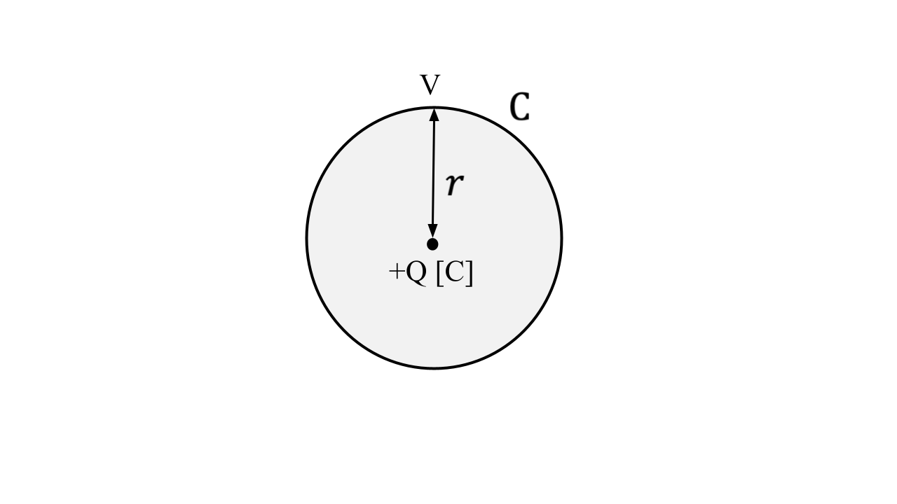
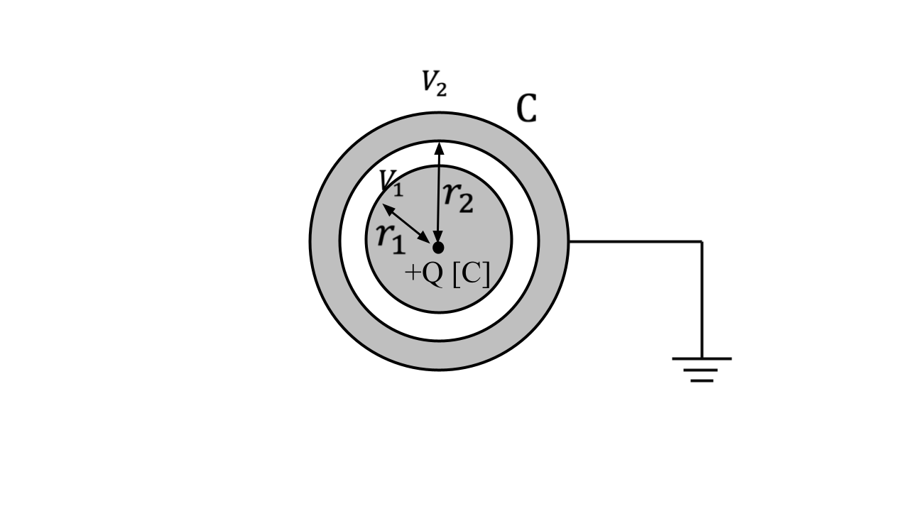
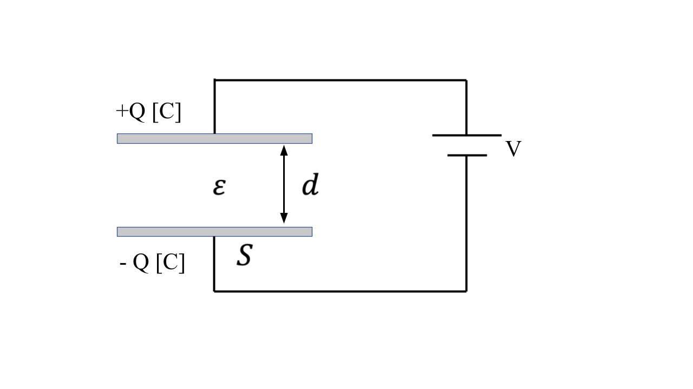
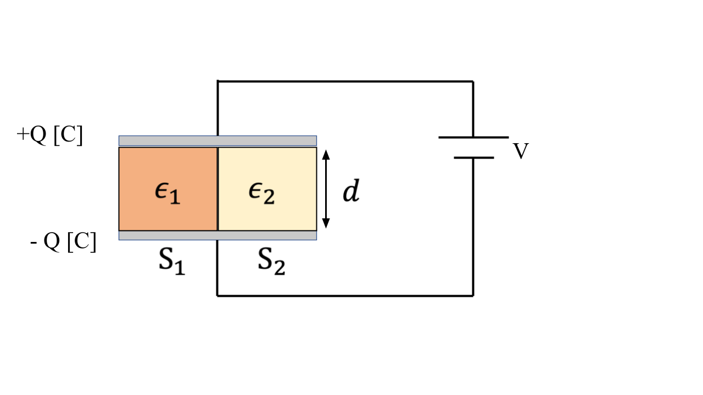
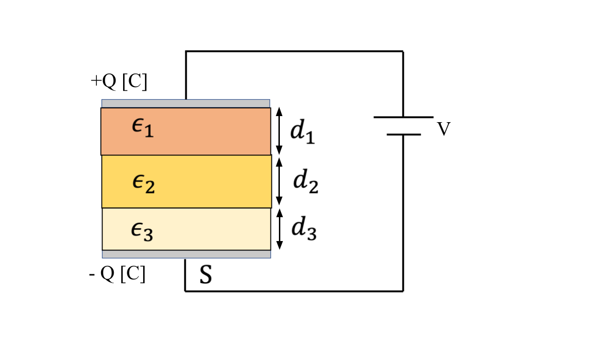
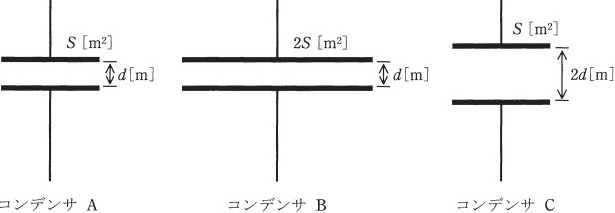
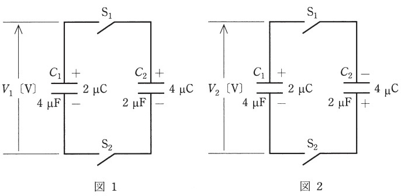
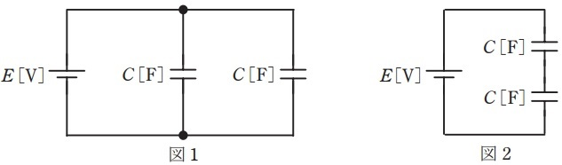
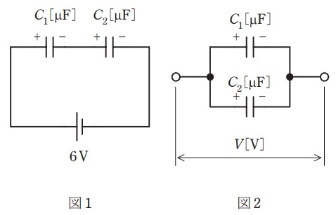

# コンデンサの静電容量、電気力線、電界の強さ、電束の本数【電験3種・理論】

## 静電容量とは

静電容量(電気容量)とは、コンデンサに蓄えられる電荷量です。

- 帯電体の電位と帯電量は、以下の関係となります。

$Q=CV[C]$

- この比例定数$C[F]$を静電容量といい、電荷量が$1[C$で電位差が$1[V]$の場合、$1[F]$となります。

## 球状導体の静電容量、電位、電束密度、電束の総数

  

- 誘電率$\epsilon$の空間にある点電荷$Q[C]$から$r[m]$離れた点の電位$V[V]$は次式で計算できます。

$V=\frac{Q}{4\pi \epsilon r}$

- 誘電率$\epsilon$の空間に球状導体(半径$r[m]$)に電荷$Q[C]$を与えたときの静電容量は以下のようになります。

$C=\frac{Q}{V}=\frac{Q}{\frac{Q}{4\pi \epsilon r}}=4\pi \epsilon r$

- 電束密度
    - 電束密度$D[C/m^2]$とは、単位面積($1[m^2$)当たりの電束数で、比誘電率に比例し以下の式で計算されます。
        - $D=\epsilon E$
- 電束の総数
    - **誘電率$\epsilon$に関係なく**、電荷$Q[C]$からは$Q[C]$の電束が出ます。

## 同心球状導体の静電容量、電位、電気力線の本数、電束密度、電束の総数

  

同心球導体とは、同じ中心をもつ大小２つの球殻がある導体です。
外球を接地し、内球と外球の間にある空間の誘電率は$\epsilon$とします。
内球の半径を$r_1$, 外球の半径を$r_2$とするとき、内球外面の電位を$V_1［V］$、外球内面の電位を$V_2［V］$とすると、電位差$V_{12}［V］$は次式で表されます。

$V_1=\frac{Q}{4\pi \epsilon r_1}$

$V_2=\frac{Q}{4\pi \epsilon r_2}$

$V_{12}=V_1 - V_2 = \frac{Q}{4\pi \epsilon}(\frac{1}{r_1}-\frac{1}{r_2})$

- したがって、同心球導体の静電容量$C[F]$は、次式で表されます。

$C_{12}=\frac{Q}{V_{12}}=\frac{Q}{\frac{Q}{4\pi \epsilon}(\frac{1}{r_1}-\frac{1}{r_2})}=\frac{4\pi \epsilon r_1 r_2}{r_2-r_1}$

- 電束密度
    - 電束密度$D[C/m^2]$とは、単位面積($1m^2$)当たりの電束数で、比誘電率に比例し以下の式で計算されます。
        - $D=\epsilon E$
 - 電束の総数
    - **誘電率$\epsilon$に関係なく**、電荷$Q[C]$からは$Q[C]$の電束が出ます。

## 平行導体板①の静電容量、電位、電気力線の本数、電束密度、電束の総数

  

平行導体板とは、以下のように2枚の導体板(面積$S[m^2]$)が平行にあるものです。

- 電気力線の本数
    - 極板間の電場の強さを$E[V/m]$とし、$1m^2$当たりの電気力線の本数を$E$[本]とすると、極板から出る電気力線の本数は$ES$[本]となります。また、ガウスの法則より、$Q[C]$の電荷が蓄えられたコンデンサーの極板間の電気力線の総数$N$は$\frac{Q}{\epsilon}$本となります。よって、以下の関係式が成り立ちます。
        - $N=\frac{Q}{\epsilon} = ES$
- 電束密度$D=\epsilon E[C/^2]$
    - 電束密度とは、単位面積($1m^2$)当たりの電束数で、誘電率に比例し以下の式で計算されます。
- 電束の総数
    - **誘電率$\epsilon$に関係なく**、電荷$Q[C]$からは$Q[C]$の電束が出ます。
- 電位差
    - 「$\frac{Q}{\epsilon}=ES$」と「$V=Ed$」より電位差は以下の式になります。
    - $V=Ed=\frac{Q}{\epsilon S}d$
- 静電容量
    - $上式を$Q$と$V$の関係式に変換します。
        - $Q = \epsilon \frac{S}{d}V$
    - $Q=CV$より静電容量は以下のようになります。
        - $C=\epsilon\frac{S}{d}$

## 平行導体板②(2つの誘電体が並列)の静電容量、電位、電気力線の本数、電束密度、電束の総数

  

同じ寸法の直方体で誘電率の異なる2つの誘導体(誘電率$\epsilon_1, \epsilon_2$)が平行板コンデンサに充填されている。
極板間は一定の電圧$V[V]$と電界E$$に保たれ2つの極板にはそれぞれ$+Q[C], -Q[C]$の電荷が蓄えられている。
2つの誘電体それぞれの静電容量$C_1,C_2$は以下のようになる。

$C_1=\epsilon_1\frac{S_1}{d}$

$C_2=\epsilon_2\frac{S_2}{d}$

- 全体の静電容量$C$は以下のようになる。

$C=C_1 + C_1 = \frac{\epsilon_1S_1+\epsilon_2S_2}{d}$

- 電気力線の本数
    - 2つの誘電体それぞれの面$S_1, S_2$を貫く電気力線の総数は$ES_1, ES_2$となる。
    - ※面積$S_1, S_2$が同じであれば電気力線の総数も等しくなる(誘電体の比誘電率に依存しない)。
- 電束密度
    - 電束密度($D=\epsilon E$)は誘電率$\epsilon_1, \epsilon_2$に比例するため同じにならない。それぞれの電束密度$D_1, D_2$は以下の式で計算できる。
    - $D_1=\epsilon_1 E$
    - $D_2=\epsilon_2 E$
- 電束の総数
    - 誘電率に関係なく、電荷$Q[C]$からは$Q[C]$の電束が出ます。

## 平行導体板③(3つの誘電体が直列)の静電容量、電位、電気力線の本数、電束密度、電束の総数

  

同じ寸法の直方体で誘電率の異なる3つの誘導体(誘電率$\epsilon_1, \epsilon_2, \epsilon_3$)が平行板コンデンサに充填されている。 
極板間は一定の電圧$V[V]$と電界Eに保たれ2つの極板にはそれぞれ$+Q[C], -Q[C]$の電荷が蓄えられている。

- 3つの誘電体それぞれの静電容量$C_1,C_2,C_3$は以下のようになる。

$C_1=\epsilon_1\frac{S}{d_1}$

$C_2=\epsilon_2\frac{S}{d_2}$

$C_3=\epsilon_3\frac{S}{d_3}$

- 全体の静電容量$C[F]$は以下のようになる。

$\frac{1}{C}=\frac{1}{C_1}+\frac{1}{C_2}+\frac{1}{C_3}$

- 電気力線の本数
    - 3つの誘導体それぞれを貫く電気力線の総数は$ES$となり等しい。(直列だと面積$S$は同じで、比誘電率に依存しないため)。
- 電束密度
    - 電束密度($D=\epsilon E$)は誘電率$\epsilon$に比例するため、それぞれの誘電体で異なる。それぞれの電束密度$D_1、D_2、D_3$は以下の式で計算できる。
    - $D_1=\epsilon_1 E$
    - $D_2=\epsilon_2 E$
    - $D_3=\epsilon_3 E$
- 電束の総数
    - 比誘電率に関係なく、電荷$Q[C]$からは$Q[C]$の電束が出ます。

## 【例題1】誘電率の異なるコンデンサの直列接続

【問題】

 

上図のように、直列に接続された二つの平行平板コンデンサに120Vの電圧が加わっている。
コンデンサ$C_1$の金属板間は真空であり、コンデンサ$C_2$の金属板間には比誘電率$\epsilon_r$の誘電体が挿入されている。
コンデンサ$C_1, C_2$の金属板間の距離は等しく、$C_1$の金属板の面積は$C_2$の2倍である。
このとき、コンデンサ$C_1$の両端の電圧が80Vであった。次の①②について求めよ。

① コンデンサ$C_2$の誘電体の比誘電率$\epsilon_r$。

②$C_1$の静電容量が30[𝜇F]のとき、$C_1 C_2$の合成容量[𝜇F]。

【解答①】

- 2つのコンデンサの静電容量は、$C_1$の金属板の面積をS、金属板間の距離をdとすると以下のとおり。

$C_1=\epsilon_0 \frac{S}{d}$

$C_2=\epsilon_0 \epsilon_r \frac{S/2}{d}$

- 題意より、コンデンサ$C_1$の両端の電圧$V_1=80[V]$なので、コンデンサ$C_2$の両端の電圧$V_2=40[V]$である。

- 直列接続された2つのコンデンサに蓄えらえる電荷は等しいので、以下のとおり$C_1$と$C_2$の関係が求まる。

$Q=C_1V_1=C_2V_2$

$C_1\times 80=C_2\times 40$

$2C_1=C_2$

- $C_1, C_2$に代入すると以下のとおり。

$2\epsilon_0 \frac{S}{d}=\epsilon_0 \epsilon_r \frac{S/2}{d}$

$\epsilon_r=4$

【解答②】

- $2C_1=C_2$より、$C_1=30$[𝜇F]のとき$C_2=60$[𝜇F]となる。

- 合成静電容量C[𝜇F]は以下のとおり20 [𝜇F]と求まる。

$C=\frac{C_1C_2}{C_1+C_2}\frac{30\cdot 60}{30+60}=20$[𝜇F]

## 【例題2】誘電体を挿入した平行平板コンデンサ

【問題】

 

- 図のように、極板間の厚さ$d[m]$、表面積$S[m^2]$の平行板コンデンサAとBがある。
- コンデンサAの内部は、比誘電率と厚さが異なる3種類の誘電体で構成され、極板と各誘電体の水平方向の断面積は同一である。
- コンデンサBの内部は、比誘電率と水平方向の断面積が異なる3種類の誘電体で構成されている。
- コンデンサAの各誘電体内部の電界の強さをそれぞれ$E_{A1}, E_{A2}, E_{A3}$、コンデンサBの各誘電体内部の電界の強さをそれぞれ$E_{B1}, E_{B2}, E_{B1}$とし、端効果、初期電荷及び漏れ電流は無視できるものとする。
- また、真空の誘電率を$\epsilon_0[F/m]$とする。
- 両コンデンサの上側の極板に電圧$V[V]$の直流電源を接続し、下側の極板を接地した。

次の①②について答えよ。

① コンデンサAにおける各誘電体内部の電界の強さ$E_{A1}, E_{A2}, E_{A3}$の大小関係、その中の最大値を$E$と$V$を用いて求めよ。

② コンデンサA全体の蓄積エネルギー$W_A$は、コンデンサB全体の蓄積エネルギー$W_B$の何倍か。

【ポイント】

- コンデンサAのように誘電体を水平方向に挿入した場合には電束密度$D$が等しくなる。
- コンデンサBのように誘電体を垂直方向に挿入した場合には電界$E$が等しくなる。

【解答①】

- コンデンサAの各誘電体における電束密度$D[C/m^2]$は等しい。$D=\epsilon E$より、

$E_{A1} = \frac{D}{2\epsilon_0}$

$E_{A2} = \frac{D}{3\epsilon_0} = \frac{2E_{A1}}{3}$

$E_{A3} = \frac{D}{6\epsilon_0} = \frac{E_{A1}}{3}$

- よって、電界の強さの大小関係は$E_{A1} > E_{A2} > E_{A3}$となる。
- 次に$V=Ed$より

$V=E_{A1}\frac{d}{6}+E_{A2}\frac{d}{3}+E_{A3}\frac{d}{2}$

$=E_{A1}\frac{d}{6}+\frac{2E_{A1}}{3}\frac{d}{3}+\frac{E_{A1}}{3}\frac{d}{2}$

$=\frac{5dE_{A1}}{9}$

となる。よって、$E_{A1}=\frac{9V}{5d}$と求まる。

【解答②】

- コンデンサAの各誘電体の静電容量をそれぞれ$C_{A1}, C_{A2}[F], C_{A3}[F]$とすると、以下のとおり。

$C_{A1}=\frac{2\epsilon_0S}{d/6}=\frac{12\epsilon_0S}{d}$

$C_{A2}=\frac{3\epsilon_0S}{d/3}=\frac{9\epsilon_0S}{d}$

$C_{A3}=\frac{6\epsilon_0S}{d/2}=\frac{12\epsilon_0S}{d}$

- コンデンサAの容量$C_A$は以下のとおり。

$C_A=\frac{1}{\frac{1}{C_{A1}}+\frac{1}{C_{A2}}+\frac{1}{C_{A3}}}=\frac{18\epsilon_0S}{5d}$

- コンデンサBの各誘電体の静電容量をそれぞれ$C_{B1}, C_{B2}[F], C_{B3}[F]$とすると、以下のとおり。

$C_{B1}=\frac{2\epsilon_0\frac{S}{6}}{d}=\frac{\epsilon_0S}{3d}$

$C_{B2}=\frac{3\epsilon_0\frac{S}{3}}{d}=\frac{\epsilon_0S}{d}$

$C_{B3}=\frac{6\epsilon_0\frac{S}{2}}{d}=\frac{3\epsilon_0S}{d}$

- コンデンサBの容量$C_B$は以下のとおり。

$C_B=C_{B1}+C_{B2}+C_{B3}=\frac{13\epsilon_0S}{3d}$

- コンデンサAとBに蓄えられるエネルギーを$W_A, W_B$[J] とすると、その比は以下のとおり。

$\frac{W_A}{W_B}=\frac{\frac{1}{2}C_AV^2}{\frac{1}{2}C_BV^2}=\frac{C_A}{C_B}=0.831$

## 【例題3】誘電体を挿入した平行平板コンデンサ

【電験3種 理論 平成29年度 問題2】

 

極板の面積$S[m^2]$、極板間の距離$d[m]$の平行板コンデンサ$A$、極板の面積$2S[m^2]$、極板間の距離$d[m]$の平行板コンデンサB及び極板の面積$S[m^2]$、極板間の距離$2d[m]$の平行板コンデンサ$C$がある。各コンデンサは、極板間の電界の強さが同じ値となるようにそれぞれ直流電源で充電されている。各コンデンサをそれぞれの直流電源から切り離した後、全コンデンサを同じ極性で並列に接続し、十分時間が経ったとき、各コンデンサに蓄えられる静電エネルギーの総和の値$[J]$は、並列に接続する前の総和の値$[J]$の何倍になるか。

【解答】

- コンデンサA〜Cの各誘電体の静電容量をそれぞれ$C_{A}, C_{B}[F], C_{C}[F]$とすると、以下のとおり。

$C_{A}=\frac{\epsilon S}{d}$

$C_{B}=\frac{2\epsilon S}{d}$

$C_{C}=\frac{\epsilon S}{2d}$

- コンデンサA〜Cを並列接続後の合成静電容量Cは以下のとおり。

$C=C_A+C_B+C_C=\frac{7\epsilon S}{2d}$

- コンデンサA〜Cの極板間の電界の強さEは等しい。よって、以下のとおり、コンデンサA〜Cの極板間電圧$V_A, V_B, V_C$が求まる。

$V_{A}=V_B=Ed$

$V_{C}=2Ed$

- コンデンサ〜Cに蓄えられる電荷$Q_A, Q_B, Q_C$は以下のとおり。

$Q_{A}=C_AV_A=\frac{\epsilon S}{d}Ed=\epsilon SE$

$Q_{B}=C_BV_B=\frac{2\epsilon S}{d}Ed=2\epsilon SE$

$Q_{C}=C_CV_C=\frac{\epsilon S}{2d}2Ed=\epsilon SE$

- 並列接続前後にて蓄えられる電荷量は変化しないため、並列接続前の合計電荷量Qと並列接続後の合計電荷量$Q'$は以下のとおり。

$Q=Q'=Q_A+Q_B+Q_C=4\epsilon SE$

- コンデンサA〜Cに蓄えられる静電エネルギー$W_A, W_B, W_C$は以下のとおり。

$W_A= \frac{1}{2}Q_AV_A=\frac{1}{2}\epsilon SE^2d$

$W_B= \frac{1}{2}Q_BV_B=\epsilon SE^2d$

$W_C= \frac{1}{2}Q_CV_C=\epsilon SE^2d$

- 並列接続前のコンデンサA〜Cに蓄えられる静電エネルギーの合計$W$は以下のとおり。

$W=W_A+W_B+W_C=\frac{5}{2}\epsilon SE^2d$

- 並列接続後に蓄えられる静電エネルギー$W'$は以下のとおり。

$W'=\frac{Q'^2}{2C}=\frac{16}{7}\epsilon SE^2d$

- よって、静電エネルギーの比は以下のとおり。

$\frac{W'}{W}=\frac{\frac{16}{7}\epsilon SE^2d}{\frac{5}{2}\epsilon SE^2d}=0.914$

## 【例題4】平行平板コンデンサの特性

【電験3種 理論 平成28年度 問題2 改変】

極板 A と極板 B との間に一定の直流電圧を加え，極板 B を接地した平行板コンデンサに関する記述 a ～ dが正しいか誤りか答えよ。

- a 　極板間の電位は，極板 A からの距離に対して反比例の関係で変化する。
    - V=Edより、極板間の電位Vは，極板 B からの距離dに対して比例関係にあるので、誤り。
- b 　極板間の電界の強さは，極板 A からの距離に対して一定である。
    - 正しい。
- c 　極板間の等電位線は，極板に対して平行である。
    - 正しい。
- d 　極板間の電気力線は，極板に対して垂直である。
    - 正しい。

## 【例題4】平行平板コンデンサの特性

【電験3種 理論 平成26年度 問題1 改変】

極板A−B間が比誘電率$\epsilon_r=2$の誘電体で満たされた平行平板コンデンサがある。
極板間の距離は$d[m]$，極板間の直流電圧は$V_0[V]$である。
極板と同じ形状と大きさをもち，厚さが$\frac{d}{4}[m]$の帯電していない導体を図に示す位置P−Q
間に極板と平行に挿入したとき，導体の電位[V]は$V_0[V]$の何倍になるか求めよ。

ただし，コンデンサの端効果は無視できるものとする。

【解答】

- A−P間とQ−B間では、誘電体の比誘電率が等しいので、電界Eも等しい。よって、A−P間とQ−B間の電位差を$V_{AP}, V_{QB}$とすると以下のとおり。

$V_{AP}=E\frac{d}{2}$

$V_{QB}=E\frac{d}{4}$

- よって、$V_{AP}=2V_{QB}$となる。また、導体中に電位差はない(電位が同じ)なので、$V_{AP}+V_{QB}=V_0$となる。以上から、$V_{QB}=\frac{V_0}{3}$とわかるため、答えは$\frac{1}{3}$倍となる。

- ポイントは、平行平板コンデンサの「**同じ導体中の電位Vは同じ**」「**同じ誘電体中の電界E(電位の傾き)は等しい**」ことです。

## 【例題5】平行平板コンデンサの特性

【電験3種 理論 平成25年度 問題1 改変】

極板間が比誘電率 𝜀r の誘電体で満たされている平行平板コンデンサに一定の直流電圧が加えられている。このコンデンサに関する記述 a～e が正しいか誤っているか判別せよ。
ただし，コンデンサの端効果は無視できるものとする。

a.極板間の電界分布は$\epsilon_r$に依存する。

→ $E=\frac{V}{d}$より、$\epsilon_r$に依存しないため誤り。

b.極板間の電位分布は$\epsilon_r$に依存する。

→ 極板間に一定の直流電圧Vが印加されているため、電界分布E及び電位分布Vも一様となる。よって、$\epsilon_r$に依存しないため誤り。

c.極板間の静電容量Cは$\epsilon_r$ に依存する。

→ 正しい。

d.極板間に蓄えられる静電エネルギーは$\epsilon_r$に依存する。

→ $W=\frac{1}{2}CV^2$より、$\epsilon_r$ に依存するため、正しい。

e.極板上の電荷(電気量)は$\epsilon_r$に依存する。

→ $Q=CV$より、$\epsilon_r$ に依存するため、正しい。

## 【例題6】2つのコンデンサの接続

【電験3種 理論 平成24年度 問題1 一部改変】

図1及び図2のように、静電容量がそれぞれ4[μF]と2[μF] のコンデンサ$C_1$及び $C_2$，スイッチ$S_1$及び$S_2$からなる回路がある。コンデンサ$C_1$と$C_2$には，それぞれ 2[μC]と4[μC]の電荷が図のような極性で蓄えられている。この状態から両図ともスイッチ $S_1$及び$S_2$を閉じたとき、図1のコンデンサ$C_1$の端子電圧を$V_1[V]$、図2のコンデンサ$C_1$の端子電圧を$V_2$[V] とすると，電圧比 $∣\frac{V_1}{V_2}∣$はいくらになるか。 

 

【解答】

- スイッチを閉じる前後で総電荷量(2つのコンデンサに蓄えられる電荷量の合計)は変わらないので、図1及び図2の総電荷量$Q_1, Q_2$は以下のようになる。

$Q_1=2+4=6$[μC]

$Q_2=4−2=2$[μC]

- 図1、図2ともに合成静電容量Cは以下のようになる。 

$C=C_1+C_2=2+4=6$ [μF]

- スイッチを閉じた後の各コンデンサの電圧$V_1, V_2$は以下のとおり。 

$V_1=\frac{Q_1}{C}=1$[V]

$V_2=\frac{Q_2}{C}=-\frac{1}{3}$[V]

- よって、電圧比$|\frac{V_1}{V_2}|=\frac{1}{3}$と求まる。

## 【例題7】平行平板コンデンサの静電容量と静電エネルギー

【電験3種 理論 平成23年度 問題2】

直流電圧 1000 [V] の電源で充電された静電容量 8 [μF] の平行平板コンデンサがある。
コンデンサを電源から外した後に電荷を保持したままコンデンサの電極間距離を最初の距離の半分に縮めたとき，静電容量 [μF] と静電エネルギー [J] を求めよ。

【解答】

- コンデンサ蓄えられる電荷$Q[C]$は以下のとおり。

$Q=CV=8\times10^{-6}\times 1000 = 8 \times 10^{-3}[C]$

- 電極間距離を半分に縮めたとき、静電容量$C_2$は2倍の$16$[μF]となる。 
- このときの静電エネルギーWは以下のとおり2Jと求まる。

$W=\frac{1}{2}\frac{Q^2}{C_2}=2$

## 【例題8】コンデンサの直列回路と並列回路

【電験3種 理論 令和4年度下期 問題4 一部改変】

 

電圧 E [V] の直流電源と静電容量 C [F] の二つのコンデンサを接続した図1，図2のような二つの回路に関して，次の(1)～(5)の記述が正しいかどうか答えよ。

【解答】

(1)　図1の回路のコンデンサの合成静電容量は，図2の回路の 4 倍である。

→ 正しい。図1の合成容量は2[F]、図2の合成容量は$\frac{1}{2}$[F]である。

(2)　コンデンサ全体に蓄えられる電界のエネルギーは，図1の回路の方が図2の回路より大きい。

→ 正しい。
図1及び図2のエネルギー$W_1, W_2$は以下のとおり。

$W_1=\frac{1}{2}CE^2+\frac{1}{2}CE^2=CE^2$[J]

$W_2=\frac{1}{2}C(\frac{E}{2})^2+\frac{1}{2}C(\frac{E}{2})^2=\frac{CE^2}{4}$[J]

(3)　図2の回路に，さらに静電容量 C [F] のコンデンサを直列に二つ追加して，四つのコンデンサが直列になるようにすると，コンデンサ全体に蓄えられる電界のエネルギーが図1と等しくなる。

→ 誤り。図2が4直列になると、エネルギー$ W_2$は以下のとおり。

$W_2=\frac{1}{2}C(\frac{E}{4})^2+\frac{1}{2}C(\frac{E}{4})^2+\frac{1}{2}C(\frac{E}{4})^2+\frac{1}{2}C(\frac{E}{4})^2=\frac{CE^2}{8}$

(4)　図2の回路の電源電圧を 2 倍にすると，コンデンサ全体に蓄えられる電界のエネルギーが図1の回路と等しくなる。

→ 正しい。図2の電源電圧を2倍にするとエネルギー$ W_2$は以下のとおり。

$W_2=\frac{1}{2}C(\frac{2E}{2})^2+\frac{1}{2}C(\frac{2E}{2})^2=CE^2$[J]

(5)　図1のコンデンサ一つ当たりに蓄えられる電荷は，図2のコンデンサ一つ当たりに蓄えられる電荷の 2 倍である。

→ 正しい。図1のコンデンサ1つに蓄えられる電荷$Q_1$[C] 、図2のコンデンサ1つに蓄えられる電荷$Q_2$[C]は以下のとおり。

$Q_1=CE$

$Q_1=C(\frac{1}{2}E)=\frac{1}{2}CE$

## 【例題9】コンデンサの直列回路と並列回路

【電験3種 理論 令和4年度上期 問題6 一部改変】

 

図1に示すように，静電容量 C1=4 μF と C2=2 μF の二つのコンデンサが直列に接続され，直流電圧 6 V で充電されている。次に電荷が蓄積されたこの二つのコンデンサを直流電源から切り離し，電荷を保持したまま同じ極性の端子同士を図2に示すように並列に接続する。並列に接続後のコンデンサの端子間電圧の大きさ V [V] を求めよ。

【解答】

- 図1において、 $C_1=4$[μF]と$C_2=2$[μF]に蓄えられる電荷量 Q[C]は等しい。よって、$C_1$と$C_2$に加わる電圧$V_1, V_2$[V]は以下のとおり。

$V_1=\frac{Q}{C_1}\frac{Q}{4\times 10^{-6}}$[V]・・・①

$V_1=\frac{Q}{C_1}\frac{Q}{2\times 10^{-6}}$[V]・・・②

また、$V_1+V_2=6$[V]なので、①②を代入すると、Q[C]が求まる。

$Q=8\times 10^{-6}$[C]

- 図2のように接続すると、①②式より $V_1 < V_2$なので$C_2$から$C_1$に電荷が移動し、2$C_1$と$C_2$に加わる電圧は等しくなる。
- 合成静電容量 C [μF] は以下のとおり。

$C=C_1+C_2=6\times 10^{-6}$[μF]

- 図1及び図2において蓄えられる電荷の総量は$2Q$で等しい。よって、以下の式が成り立ち、$V=\frac{8}{3}$[V]が求まる。

$2Q=CV$

$V=\frac{2Q}{C}=\frac{2\times 8\times 10^{-6}}{6\times 10^{-6}}=\frac{8}{3}$[V]

## 参考動画

- *初心者向け電験三種・理論・12・過渡現象【超簡単に学ぶ！】第三種電気主任技術者*
    - 

## 関連リンク

- [電験3種試験対策トップページ](../index.md)
- [トップページ](../../../index.md)