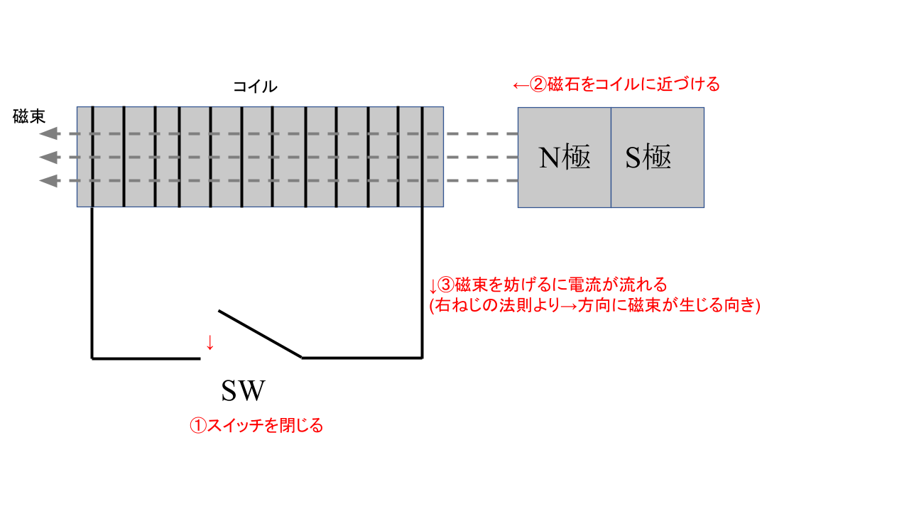

# 【電験3種・理論】ファラデーの電磁誘導とは?試験対策と計算問題

## ファラデーの電磁誘導とは

  

上図のように、コイルと磁石を用いた電磁誘導を考える。 
①**スイッチSWを閉じた状態**で②磁石をコイルに近づけると、コイルには②**磁束の変化を妨げる下向きに電流**が流れる。 
また、**スイッチSWを開いた状態**で、巻数Nのコイル断面を貫く磁束をt[秒]の間に$\Delta \phi [Wb]$だけ直線的に増加させると、**磁束鎖交数はN⊿φ[Wb]**だけ変化する。 
また、このt[秒]の間にコイルに発生する誘導起電力の大きさ**$e= N\Delta \frac{\phi}{t}[V]**となる。 

## 参考動画

*初心者向け電験三種・理論・5・自己誘導・電磁エネルギー（磁気エネルギー）リメイク版・訂正2023/5/23【超簡単に学ぶ！】第三種電気主任技術者*
 

## 関連リンク

- [電験3種試験対策トップページ](../index.md)
- [トップページ](../../../index.md)