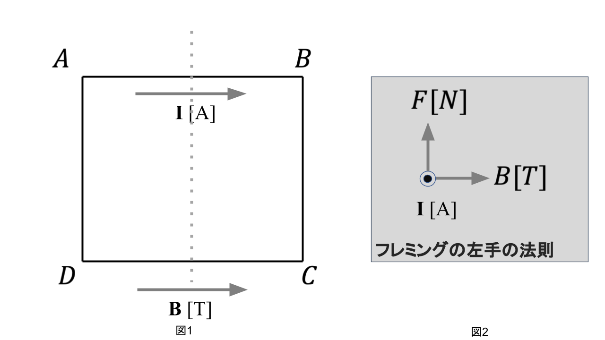

# 【電験3種・理論】電磁力(ローレンツ力)とは?試験対策と計算問題

## 電磁力(フレミングの左手の法則)

  

図2にのように、左手の中指を電流Iの向き、人差し指を磁界の向き$(B,H)$に合わせると、親指の方向に電磁力Fが働きます。 
(**※磁束密度と電流が直角のときに力が発生します**) 
磁束密度の大きさB[T]、電流の大きさI[A]、直線状導体の長さをl[m]とすると、電磁力Fの大きさは以下のようになります。 

$F=IBl$

図1のとき、電磁力が働くのは辺BCと辺DAに対してのみとなります。 
(**※磁束密度と電流が直角のときに力が発生します**) 
電磁力Fの大きさは、辺BCと辺DA(辺の長さはlとする)ともに「F=IBl」となります。 
よって、正方形ループABCDは図1の点線を中心に右回りに回転することになり、そのモーメントM[N⋅m]は以下のようになります。 

$M=2F\frac{h}{2}=IBl^2$

## フレミングの右手の法則

右手の親指を導体の運動方向$v[m/s]$，人差し指を磁界（磁束密度）の方向$B[T]$にすると、中指の方向に誘導起電力$e[V]$が発生するという法則です。
磁束密度の大きさ$B[T]$、導体の速度$v[m/s]$、導体の長さ$l[m]$のとき、誘導起電力の大きさ$e[V]$は以下のとおり。

$e=vBl$

## 参考動画

- *初心者向け電験三種・理論・26・ローレンツ力・向心力【超簡単に学ぶ！】第三種電気主任技術者*
    - 

## 関連リンク

- [電験3種試験対策トップページ](../index.md)
- [トップページ](../../../index.md)