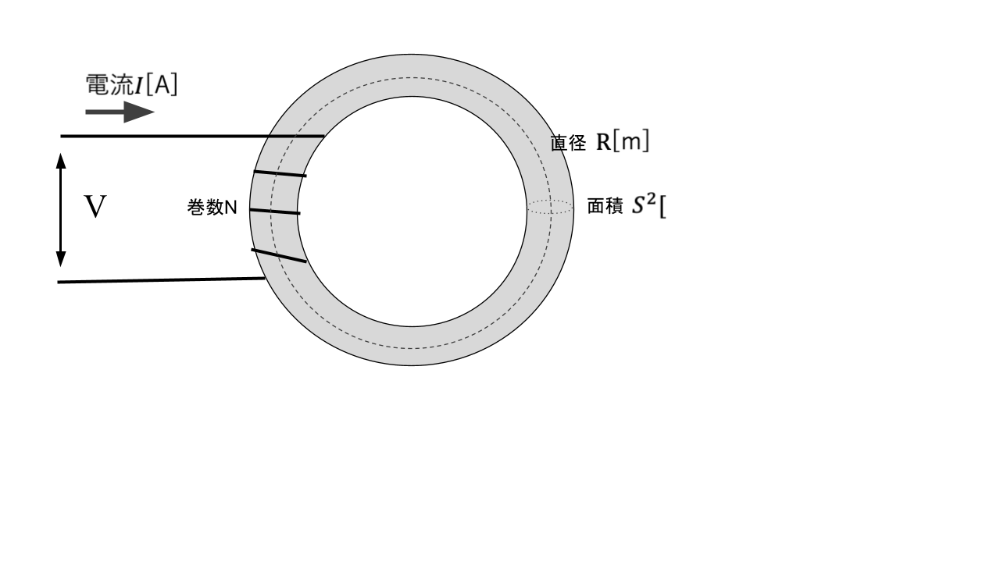

# 【電験3種・理論】環状ソレノイドとは?試験対策と計算問題

## 環状ソレノイド

  

- 環状ソレノイド内部において、コイルの巻数$N$、電流$I$ 、磁路の平均長$l$、磁界の強さ$H$、環状ソレノイドのとき、「アンペアの周回積分の法則」より以下の関係式が成り立ちます。

$NI=Hl$

- また、透磁率μの環状ソレノイド中の磁界の強さがHのとき、磁束密度の大きさ$B=\mu H$となるので以下の関係式となります。

$NI=\frac{B}{\mu}l$

## 関連リンク

- [電験3種試験対策トップページ](../index.md)
- [トップページ](../../../index.md)