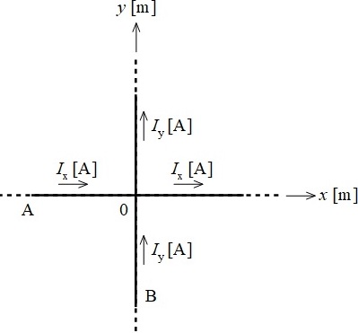
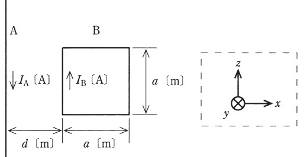
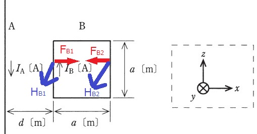
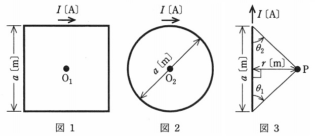

# アンペールの法則とは？微分形・積分形の違いは?計算式と問題集【電験3種・理論】

## アンペールの法則とは

アンペールの法則とは、電流とその周囲に発生する磁界(磁場)の関係をあらわす法則です。
1820年にフランスの物理学者アンドレ・マリー・アンペールによって発見されました。
直線導体に電流$I$を流すと電流の方向を右ネジの進む方向として、右ネジの回る向きに磁界(磁場)$H$が発生します。

RH=\frac{I}{2\pi r}$

ここで、$r$は円形領域Sの半径です。

## アンペールの法則の積分形

- 任意の点における磁界Hと電流密度jの関係は以下の式で表せます。

$\int_CHdl=\int_SjdS$

- これをアンペールの法則の積分形といいます。$H$は磁界の強さ、$C$は閉曲線、$dl$は線素ベクトル、$j$は電流密度、$dS$は面素ベクトルです。
- ここで、アンペールの法則の積分形を使って、直線導体に流れる電流の周りの磁界Hを求めてみます。直線電流によって中心を垂直に貫いた半径rの円領域Sとその周囲Cを考えると、アンペールの式（積分形）の左辺は以下のようになります。

$\int_CHdl=H\int_Cdl=2\pi rH$

- 一方右辺は次のようになります。

$\int_SjdS=I$

- これはＣ内を通過する全電流を示しています。これらの結果からHが以下のようにして求まり、最初に紹介したアンペールの法則の磁界Hを求める式が導出されます。

$2\pi rH=I$

$H=\frac{I}{2\pi r}$

## アンペールの法則の微分形

- 任意の点における磁界Hと電流密度jの関係は以下の式で表せます。

$rotH=j$

- これをアンペールの法則の微分形といいます。この式は、電流密度$j$、つまり電流の周りを回転するように磁界$H$が発生することを意味しています。

## 【例題1】アンペールの法則の積分形

【電験3種 理論 平成26年度 問題4】

 

図のように，十分に長い直線状導体A，Bがあり，AとBはそれぞれ直角座標系の𝑥軸と𝑦軸に沿って置かれている。
Aには$+x$方向の電流$I_x[A]$が，Bには$+y$方向の電流$I_y[A]$が、それぞれ流れている。
$I_x>0，I_y>0$とする。

このとき，$xy$平面上で$I_x$と$I_y$のつくる磁界が零となる点($x[m], y[m]$)の満たす条件として，正しいものを次の(1)～(5)のうちから一つ選べ。

ただし，𝑥≠0，𝑦≠0とする。

(1)　$y=\frac{I_x}{I_y}x$

(2)　$y=\frac{I_y}{I_x}x$

(3)　$y=-\frac{I_x}{I_y}x$

(4)　$y=-\frac{I_y}{I_x}x$

(5)　$y=\pm x$

【解答】

- アンペールの法則の積分形$H=\frac{I}{2\pi r}$より、
$I_x, I_y$が作る磁界の大きさ$H_x, H_y$は以下のとおり。

$H_x=\frac{I_x}{2\pi y}$

$H_y=\frac{I_y}{2\pi x}$

- 磁界の大きさが0となるのは、$H_x+H_y=0$となるときなので、以下のように答えは(1)だとわかる。

$\frac{I_x}{2\pi y}=\frac{I_y}{2\pi x}$

$y=\frac{I_x}{I_y}x$

## 【例題1】導体に働く力

【電験3種 理論 平成25年度 問題4 一部改変】

 

図のように，透磁率 μ0 [H/m] の真空中に無限に長い直線状導体 A と 1 辺 a [m] の正方形のループ状導体 B が距離 d [m] を隔てて置かれている。 
A と B は xz 平面上にあり， A は z 軸と平行， B の各辺は x 軸又は z 軸と平行である。
 A ， B には直線電流$I=A[A] ，I_B[A]$が，それぞれ図示する方向に流れている。
このとき， B に加わる電磁力を求めよ。

【解答】

- 導体Bのうち、左辺と右辺に働く電磁力$F_{B1}, F_{B2}$と磁界$F_{H1}, F_{H2}$は以下のとおり。

 

- アンペールの法則より、$H_1, H_2$は以下のとおり。

$H_{B1}=\frac{I_A}{2\pi d}$

$H_{B2}=\frac{I_B}{2\pi (d+a)}$

- 磁束密度の大きさ$B_{B1}, B_{B2}$は以下のとおり。

$B_{B1}=\mu_0 H_{B1}=\mu_0 \frac{I_A}{2\pi d}$

$B_{B2}=\mu_0 H_{B2}=\mu_0 \frac{I_B}{2\pi (d+a)}$

- よって、電磁力$F_1, F_2$は以下とおり。

$F_{B1}=B_{B1}I_Ba=\frac{\mu_0 I_A I_B a}{2\pi d}$

$F_{B2}=B_{B2}I_Ba=\frac{\mu_0 I_A I_B a}{2\pi(d+a)}$

- 導体Bに加わる合力Fは以下のとおり。

$F=F_1‐F_2=\frac{\mu_0 I_AI_Ba^2}{2\pi d(d+a)}$

## 【例題2】2本の平行な導体に働く力

【電験3種 理論 平成24年度 問題4 一部改変】

真空中に，2 本の無限長直線状導体が 20 [cm] の間隔で平行に置かれている。
一方の導体に 10 [A] の直流電流を流しているとき，その導体には 1 [m] 
当たり $1\times 10^{−6}$ [N] の力が働いた。他方の導体に流れている直流電流 I [A] の大きさはいくらか。

ただし，真空の透磁率は $\mu_0=4 \pi \times 10^{−7}$ [H/m] である。

【解答】

- 平行直線状導体間に働く力の大きさを求める計算式は以下のとおり。

$F=\frac{\mu I_1I_2}{2\pi r}$

- 題意の値を代入すると$I_2=0.1[A]$と求まる。

$(1.0 \times 10^{-6})=\frac{4\pi \times 10^{-7} 10I_2}{2\pi 0.2}$

$I_2=0.1[A]$

## 【例題2】正方形、円形、三角形のコイル

【電験3種 理論 平成23年度 問題4 一部改変】

 

図1のように， 1 辺の長さが a [m] の正方形のコイル（巻数： 1 ）に直流電流 I [A] が流れているときの中心点 O1 
の磁界の大きさを$H_1$[A/m] とする。また，図2のように，直径 a [m] の円形のコイル（巻数： 1 ）に直流電流 I [A] が流れているときの中心点 O2 の磁界の大きさを$H_2$ [A/m] とする。このとき，磁界の大きさ$H_1, H_2$を求めよ
ただし，中心点 O1 ， O2 はそれぞれ正方形のコイル，円形のコイルと同一平面上にあるものとする。

参考までに，図3のように，長さ a [m] の直線導体に直流電流 I [A] が流れているとき，導体から距離 r [m] 離れた点 P における磁界の大きさ H [A/m] は， $H=\frac{I}{4\pi r}(cos\theta_1+cos\theta_2)$で求められる（角度θ1 と θ2 の定義は図参照）。

【解答】

- 図1の正方形のコイルの一辺が中心点$O_1$に作る磁界の大きさ$H_{11}$[A/m]は以下のようになる。 

$H_{11}=\frac{I}{4\pi \frac{a}{2}}(cos\theta(45)+cos\theta(45))=\frac{I}{\sqrt{2}\pi a}$[A/m]

- 正方形全体(4辺分)が作る磁界の大きさは$H_{11}$の4倍なので、以下のとおりになる。

$H_1=H_{11}=\frac{2\sqrt{2}I}{\pi a}$[A/m]

- 円形コイルが中心点 O2 に作る磁界の大きさ H_2 [A/m] は以下のとおり。

$H_2=\frac{I_2}{2\frac{a}{2}=\frac{I}{a} [A/m]$

## 関連リンク

- [電験3種試験対策トップページ](../index.md)
- [トップページ](../../../index.md)
