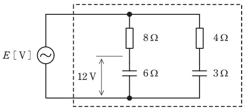
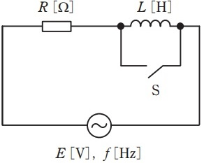
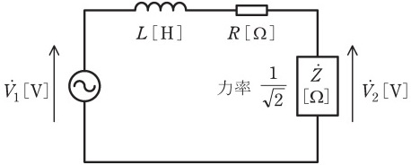

# 交流回路とは?実効値・平均値の違いなど 【電験3種・理論】

## 実効値・平均値の違い

交流電圧における「実効値」「平均値」の定義は次の通りです。

- 最大値$V_m$
    - 交流電圧の瞬時値の最大値。
- 瞬時値
    - 任意の時間(瞬間)における値。
- 平均値$V_{mean}$
    - 交流電圧の瞬時値の「絶対値」を1周期$T$で平均した値。
- 実効値$V$
    - 交流を抵抗に流したときに消費される電力が平均値をとる瞬間の値（交流の大きさは実効値で表すのが基本）

- 瞬時値の最大値$V_m$がわかれば交流電圧（正弦波）の「実効値」「平均値」は次の計算式で求まります。

波形の種類|実効値|平均値
--|--|--
直流|$V_m$|$V_m$
正弦波|$\frac{V_m}{\sqrt{2}}$|$\frac{2V_m}{\pi}$

- 例1 単相2線100V
    - 単相2線100V(一般的な家庭用コンセント)の交流電圧は、実効値(公称電圧)が100Vとなります。
    - 最大電圧は√2×100=141.4Vとなります。
    - 平均値は(実効値)x π/2 = 90Vくらいです。

- 例2 3相3線200V
    - 3相3線200Vの線間交流電圧は、実効値(公称電圧)が200Vとなります。
    - 最大電圧は√2×200=282.8Vとなります。
    - 相電圧(対地電圧)はフェザー図(Phasor diagram) を用いると、200V ×sin60°×(2/3)=200/√3 Ｖ≒115.5 Vとなります。

## インピーダンス(交流電流の流れを妨げる要素)

インピーダンスとは、交流電流の流れを妨げる要素のことで抵抗とほとんど同じです。抵抗を拡張した考え方がインピーダンスです。交流電流は、流れる方向が時間によって変化します。（直流は一定）単純な抵抗器（R）で抵抗を作った場合は、直流電流にも交流電流にも同じように作用します。しかし、コイルやコンデンサなどは、直流電流と交流電流が流れる場合で挙動が異なってきます。

- 補足
    - コイルやコンデンサのように、交流電流の周波数によって抵抗が変化する素子の抵抗を表すときに「インピーダンス」という言葉を使います。
    - 直流電流と交流電流信号で抵抗が異なる素子（コイルやコンデンサ等）が存在し、「抵抗」と言ってしまうと区別がつかなくるので「インピーダンス」という言葉が用いられます。

- コイル(L)の特性
    - 直流電流が流れると抵抗は0Ωになります。
    - しかし、交流電流が入ると電気的な抵抗が発生します。
    - コイルに電流と逆向きの誘導電流が発生するため）交流電流の周波数が高いほど電流が流れにくくなります。（抵抗が大きくなる）
- コンデンサ(C)の特性
   - 直流電流は流れません。（抵抗は無限大）
   - しかし、交流電流の場合は誘電されて電流が流れます。
   - 交流電流の周波数が高いほどど流がよく流れます。（抵抗が小さくなる）

## 位相変化(コンデンサ、コイルの進み位相、遅れ位相)

交流電源にコンデンサのみを接続すると、電流iの位相は、電源電圧vの位相よりも90°進みます。
※I、C、E（アイス）と覚えれば、「コンデンサは電流→電圧の順に位相が進む」と暗記でき試験は素早く解けます。
交流電源にコイルのみを接続すると、電流iの位相は、電源電圧vの位相よりも90°遅れます。

## リアクタンス(交流回路の電圧と電流の比)

リアクタンス(誘導抵抗、感応抵抗)とは、交流回路のインダクタ（コイル）やキャパシタ（コンデンサ）における電圧と電流の比を表したものです。
電気抵抗と同じ次元を持ち、単位としてはオームを持ちますが、リアクタンスではエネルギーは消費されません。

## 有効電力・無効電力・皮相電力・力率

## 【例題1】波形率と波高率

【電験3種 理論 令和4年度下期 問題8 一部改変】赤字箇所を埋める空欄補充問題

次の文章は，交流における波形率，波高率に関する記述である。
波形率とは，実効値の**平均**に対する比 (波形率=実効値/**平均**) をいう。波形率の値は波形によって異なり，正弦波と比較して，三角波のようにとがっていれば，波形率の値は**大きく**なり，方形波のように平らであれば，波形率の値は**小さく**なる。
波高率とは、**最大**の実効値に対する比 (波高率=**最大**/実効値) をいう。波高率の値は波形によって異なり，正弦波と比較して，三角波のようにとがっていれば，波高率の値は**大きく**なり，方形波のように平らであれば，波高率の値は**小さく**なる。

##【例題2】RC交流回路の消費電力

【電験3種 理論 令和4年度下期 問題9 一部改変】

 

図のような RC 交流回路がある。この回路に正弦波交流電圧 E [V] を加えたとき，容量性リアクタンス 6 Ω のコンデンサの端子間電圧の大きさは 12 V であった。このとき， E [V] と図の破線で囲んだ回路で消費される電力 P [W] を求めよ。

- 容量性リアクタンス$X_{C1}=6[Ω]$ に流れる電流$I_1$は以下のとおり。

$I_1=\frac{V_{C1}}{X_{C1}}=\frac{12}{6}=2$[A]

- 抵抗$R_1$の端子間電圧$V_{R1}$は以下のとおり。

$V_{R1}=R_1I_1=8\times 2 =16$[V]

- よって、$E[V]$は以下のとおり。

$E=\sqrt{V_{R1}^2+V_{C1}^2}=20[V]$

- 抵抗$R_2=4$[Ω]と容量性リアクタンス$X_C2=3$[Ω] の大きさの比は4:3であるため、それぞれの端子間電圧は抵抗$R_1$と容量性リアクタンス$X_{C1}=6[Ω]$と同じになる。よって、抵抗で消費される電力P[W] の合計は以下のとおり。

$P=\frac{V_{R1}^2}{R_1}+\frac{V_{R2}^2}{R_2}=96$[W]

## 【例題3】RL交流回路の消費電力

【電験3種 理論 令和4年度上期 問題8 一部改変】

 

図のように，周波数 f [Hz] の正弦波交流電圧 E [V] の電源に， R [Ω] の抵抗，インダクタンス L [H] のコイルとスイッチ S を接続した回路がある。スイッチ S が開いているときに回路が消費する電力 [W] は，スイッチ S が閉じているときに回路が消費する電力 [W] の半分になった。このとき， L [H] を求めよ。

【解答】

- スイッチ開放前後の回路の電流の大きさ$I_1, I_2$[A]は以下のとおり。

$I_1=\frac{E}{R}$

$I_1=\frac{E}{\sqrt{R^2+(2\pi fL)^2}}$

- 消費電力Pは電流Iの2 乗に比例するため、インダクタンスを接続して消費電力が$\frac{1}{2}$倍になると、電流は$\frac{1}{\sqrt{2}}$倍になる。よって、以下の式が成立する。

$I_1=\sqrt{2}I_2$

$\frac{E}{R}=\sqrt{2}\frac{E}{\sqrt{R^2+(2\pi fL)^2}}$

$\frac{1}{R}=\frac{\sqrt{2}}{\sqrt{R^2+(2\pi fL)^2}}$

$\frac{1}{R^2}=\frac{2}{\sqrt{R^2+(2\pi fL)^2}}$

$(2\pi fL)^2=R^2$

$L=\frac{R}{2\pi f}$

## 【例題4】交流回路の位相差

【電験3種 理論 平成30年度 問題8 一部改変】

 

図のように，各周波数 ω [rad／s]の交流電源と力率$\frac{1}{\sqrt{2}}$の誘導性負荷$\dot{Z}$[Ω] との間に，抵抗値 R[Ω] の抵抗器とインダクタンス L[H] のコイルが接続されている。R=ωL とするとき，電源電圧$\dot{V_1}$[V] と負荷の端子電圧$\dot{V_2}$[V] との位相差の値[°]を求めよ。

【解答】

- インダクタンスの端子間電圧$V_L=jwLI$は電流Iより位相が90°進む。
- 抵抗の電圧$R_I$は位相が電流Iと等しくなる。
- 誘導性負荷\dot{Z}の力率$cos\theta=\frac{1}{\sqrt{2}}$より、θ=45°なので、電圧$\dot{V_2}$は電流より45°進むことがわかる。
- よって、$\dot{V_1}$と$\dot{V_2}$の位相差は0°と求まる。

# 【例題5】交流回路の計算

【電験3種 理論 平成29年度 問題8 一部改変】

図のように，交流電圧 𝐸=100 V の電源，誘導性リアクタンス 𝑋=4 Ω のコイル， 𝑅1 [Ω] ， 𝑅2 [Ω] の抵抗からなる回路がある。いま，回路を流れる電流の値が 𝐼=20 A であり，また，抵抗 𝑅1 に流れる電流 𝐼1 [A] と抵抗 𝑅2 に流れる電流 𝐼2 [A] との比が， 𝐼1:𝐼2=1:3 であった。この時，抵抗 𝑅1 [Ω] を求めよ。

<iframe src="https://docs.google.com/presentation/d/e/2PACX-1vSqnTFEGR4n1VYcLZwoJ_xPPNStq9wyHDpjZPBQOXqMKpfBUvI_D8kpDurg2-7s9Q95uPsqaHSbLEAW/embed?start=false&loop=false&delayms=3000" frameborder="0" width="480" height="299" allowfullscreen="true" mozallowfullscreen="true" webkitallowfullscreen="true"></iframe>

【解答】

-  $I_1:I_2=1:3$より、抵抗$R_1:R_2=3:1$とわかる。よって、$R_1$と$R_2$の合成抵抗$R$は以下のとおり。

$R=\frac{R_1R_2}{R_1+R_2}=\frac{3R_2R_2}{3R_2+R_2}=\frac{3R_2}{4}=\frac{R_1}{4}$

- よって、以下のとおり抵抗$R=3$[Ω]と求まる。

$E=ZI=\sqrt{X^2+R^2}I$

$100=\sqrt{4^2+R^2}\times 20$

$R=3$

- よって、抵抗$R_1=12$[Ω]と求まる

$R_1=4R=4\times 3 =12$[Ω]

## 参考動画

- *初心者向け電験三種・理論・13・交流の位相差【超簡単に学ぶ！】第三種電気主任技術者*
    - 
- *初心者向け電験三種・理論・14・リアクタンス・インピーダンス【超簡単に学ぶ！】第三種電気主任技術者*
    - 
- *初心者向け電験三種・理論・15・瞬時値【超簡単に学ぶ！】第三種電気主任技術者*
    - 

## 関連リンク

- [電験3種試験対策トップページ](../index.md)
- [トップページ](../../../index.md)