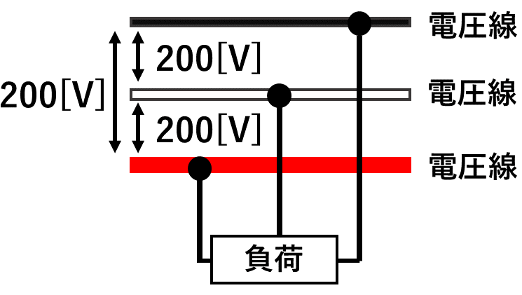
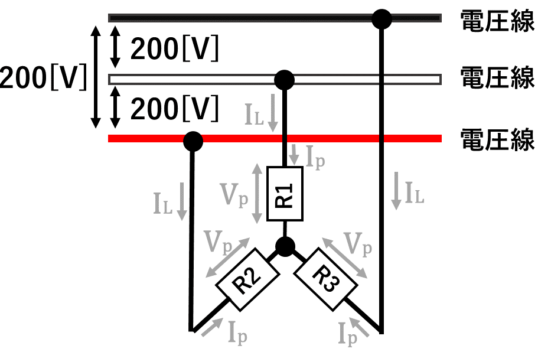
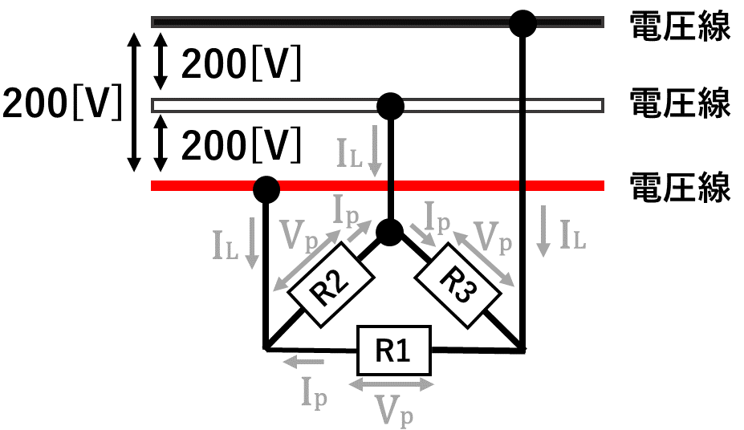
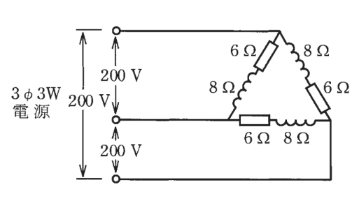
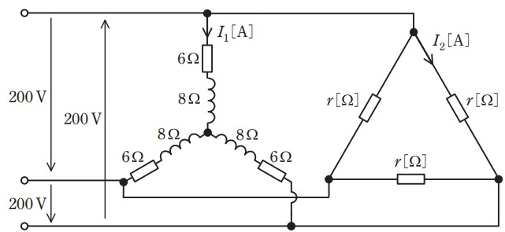
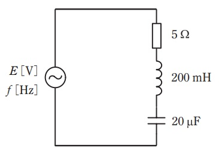
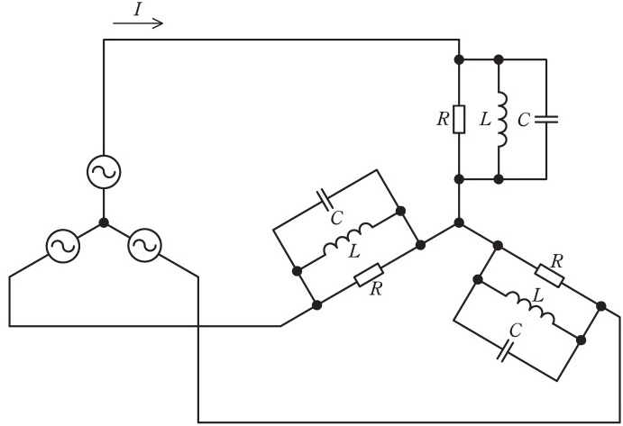

# 【電験3種・理論】三相交流とは?試験対策と計算問題

## 三相交流とは

三相交流(3相3線式)では、「**電圧線3本**」を三相負荷につないで利用します。
3相3線式は、電動機など、多くの電力を使用する動力系に使われる配電方式です。
また三相3線式の結線方法には、「**Y結線（スター結線）**」と「**Δ結線（デルタ結線）**」があります。

## Y結線（スター結線）

Y結線（スター結線）の回路図は次のようになります。

- 相電圧$V_p$
    - 各相にかかる電圧
- 相電流$I_p$
    - 各相を流れる電流
- 線間電圧$V_L=\sqrt{3}V_p$
    - 電線間にかかる電圧=√3×各相にかかる電圧
- 線電流$I_L=I_p$
    - 電線間を流れる電流=各相を流れる電流
- 三相負荷
    - 3つの負荷$R_1, R_2, R_3$
- 力率$cos\theta=\frac{R}{\sqrt{R^2+X^2}}$
    - 各相に抵抗Rとインダクタンス成分Xがあるとき
- 三相電力$P_{3L}=\sqrt{3}V_LI_Lcos\theta$
    - 全体で消費される電力

※計算問題で素早く解けるように、「$\sqrt{2}=1.41$」「$\sqrt{3}=1.73$」は覚えておきましょう

## Δ結線（デルタ結線）

Δ結線（デルタ結線）の回路図は次のようになります。

- 相電圧Vp
    - 各相にかかる電圧
- 相電流Ip
    - 各相を流れる電流
- 線間電圧$V_L=V_p$
    - 電線間にかかる電圧=×各相にかかる電圧
- 線電流$I_L=\sqrt{3}I_p$
    - 電線間を流れる電流=√3各相を流れる電流
- 三相負荷
    - 3つの負荷R1～R3
- 力率$cos\theta=\frac{R}{\sqrt{R^2+X^2}}$
    - 各相に抵抗Rとインダクタンス成分Xがあるとき
- 三相電力$P_{3L}=\sqrt{3}V_LI_Lcos\theta$
    - 全体で消費される電力

## YーY結線

YーY結線は、電源と負荷がY結線である回路です。
線間電流と相電流は大きさも位相も等しくなります。
線間電圧は、相電圧に対して、大きさが$\sqrt{3}$倍、位相が$\frac{\pi}{6}$[rad]遅れます。

## ⊿ー⊿結線

⊿ー⊿結線とは、電源と負荷が⊿結線である回路です。
線間電流と相電圧は大きさも位相も等しくなります。
線間電流は、相電流に対して、大きさが$\sqrt{3}$倍、位相が$\frac{\pi}{6}$[rad]遅れます。

## 3相3線式で中性線を省略できる理由

3相3線式では、位相が120度ずつずれた200Vの交流電力を3本の電線で送ります。
この場合、3相電流の和は0となるため、中性線（帰りの電線）は省略されます。
（※3線それぞれの電流の大きさが異なる場合、中性線（帰りの電線）は必要となり、3相4線式となる）

## 【例題1】三相電力の計算

【問題】

図のような三相3線式回路の全消費電力[kW]はいくらか。

【解答】

- 一相分のインピーダンスZp[Ω]は以下のとおり。

$Z_p= \sqrt{R^2 + (X_L-X_c)^2} = 10$

- 相電流Ip[A]は以下のとおり。

$I_p=\frac{V_p}{Z_p}=\frac{200}{10}=20$

- 一相分の力率cosθは以下のとおり。

$cos \theta = \frac{R}{Z}=\frac{6}{10}=0.6$

- 三相分の消費電力$P_{3L}$は以下のとおり。

$P_{3L}&=&\sqrt{3}V_LI_Lcos\theta =\sqrt{3}V_L\sqrt{3}I_pcos\theta = 3V_LI_pcos\theta = 3\cdot 200 \cdot 20 \cdot 0.6 = 7200[W]$

## 【例題2】三相交流回路の抵抗値と消費電力

【電験3種 理論 令和4年度下期 問題15 一部改変】

図のように，抵抗6[Ω]と誘導性リアクタンス8[Ω]をY結線し、抵抗$r$[Ω]をΔ結線した平衡三相負荷に、200Vの対称三相交流電源を接続した回路がある。抵抗6[Ω]と誘導性リアクタンス8[Ω]に流れる電流の大きさを$I_1$[A]、抵抗$r$[Ω]に流れる電流の大きさを$I_2$[A] とする。電流$I_1$[A]と$I_2$[A]の大きさが等しいとき抵抗$r$[Ω]、図中の回路が消費する電力P[kW]を求めよ。

【解答】

- 抵抗6[Ω]と誘導性リアクタンス8[Ω]の合成インピーダンス$Z_1$[Ω] の大きさは以下のとおり

$Z_1=\sqrt{6^2+8^2}=10$[Ω]

- $Z_1$ [Ω] に加わる電圧$V_1$ [V] は，$V_1=\frac{200}{\sqrt{3}}$[V]なので、電流$I_1$[A]は以下のとおり。 

$I_1=\frac{V_1}{Z_1}=\frac{\frac{200}{\sqrt{3}}}{10}=11.55$[A]

- 題意より$I_1=I_2$、抵抗r[Ω]に加わる電圧は200Vなので、抵抗r[Ω]は以下のとおり。

$r=\frac{200}{I_2}=\frac{200}{11.55}=17.32$[Ω]

- 図中の回路が消費する電力P[kW]は以下のとおり。 

$P=(6\I_1^2 \times 3) + (rI_2^2 \times 3) = 9330[W]=9.3[kW]$

## 【例題3】三相交流回路の抵抗値と消費電力

【電験3種 理論 令和4年度上期 問題15 一部改変】

図のように，線間電圧 200 V の対称三相交流電源に，三相負荷として誘導性リアクタンス X=9 Ω の 3 個のコイルと R [Ω] ， 20 Ω ， 20 Ω ， 60 Ω の 4 個の抵抗を接続した回路がある。端子 a ， b ， c から流入する線電流の大きさは等しいものとする。この回路について，次の(a)及び(b)の問に答えよ。

(a)　線電流の大きさが7.7A、三相負荷の無効電力が1.6kvarであるとき、三相負荷の力率を求めよ。

(b)　a 相に接続された抵抗R[Ω] を求めよ。

【(a)の解答】

- 端子a、b、cから流入する電流の大きさが等しいので、無効電力$Q[var]$の計算式に値を代入すると、$sin\theta$が求まる。

$Q=\sqrt{3}VIsin\theta$

$sin\theta=\frac{Q}{\sqrt{3}VI}=\frac{1600}{\sqrt{3}200\cdot 7.7}=0.6$

よって、力率$cos\theta$が求まる。

$cos^2\theta=1-sin^2\theta$

$cos\theta=\sqrt{1-sin^2\theta}=0.8$

【(b)の解答】

- Δ結線をY結線に変換(Δ−Y変換)すると、各相に対応する抵抗$R_a$[Ω]、$R_b$[Ω]、$R_c$[Ω] は以下のとおり。

$R_a=\frac{20\times 20}{20+60+20}=4$[Ω]

$R_b=\frac{20\times 60}{20+60+20}=12$[Ω]

$R_c=\frac{60\times 20}{20+60+20}=12$[Ω]

- 回路で消費される有効電力の大きさP[kW]は以下のとおり。

$Q=Ptan\theta$

$P=\frac{Qcos\theta}{sin\theta}=\frac{1.6 \times 0.8}{0.6}=2.134$[kW]

- 有効電力Pと各抵抗の間には以下の関係式があるので、整理すると抵抗$R=8$[Ω]と求まる。

$P=RI^2+R_aI^2+R_bI^2+R_cI^2$

$2134=(R+4+12+12)\times 7.7$

$R=8$[Ω]

## 【例題3】三相交流回路の線電流と有効電力

【電験3種 理論 令和元年度上期 問題16 一部改変】

図のように線間電圧 200 V ，周波数 50 Hz の対称三相交流電源に RLC 負荷が接続されている。 𝑅=10 Ω ，電源角周波数を 𝜔 [rad／s] として， 𝜔𝐿=10 Ω ， 1𝜔𝐶=20 Ω である。
このときの電源電流$I$[A]と三相負荷の有効電力P[kW]を求めよ。

【解答】

- 1相あたりの抵抗$R$、リアクタンス$L$、コンデンサ$C$に流れるそれぞれの電流$\dot{I_R}, \dot{I_L}, \dot{I_C}$は以下のとおり。

$\dot{I_R}=\frac{200\sqrt{3}}{10}=\frac{20}{\sqrt{3}}$[A]

$\dot{I_L}=\frac{200\sqrt{3}}{j10}=\frac{-j20}{\sqrt{3}}$[A]

$\dot{I_C}=\frac{200\sqrt{3}}{-j20}=\frac{j10}{\sqrt{3}}$[A]

- 電源を流れる電流$\dot{I}$は以下のとおり。

$\dot{I}=\dot{I_R}+\dot{I_L}+\dot{I_C}=\frac{20}{\sqrt{3}}-\frac{j10}{\sqrt{3}}$

- 電源を流れる電流の大きさ$I=13$[A]と求まる。

$I=\sqrt{(\frac{20}{\sqrt{3}})^2+(\frac{10}{\sqrt{3}})^2}=13$[A]

- 次に、1相あたりの有効電力$P_1$は以下のとおり。

$P_1=\frac{V^2}{R}=\frac{(200\sqrt{3})^2}{10}=\frac{4000}{3} [W]

- 三相負荷の有効電力Pは3相分なので、$P_1$の3倍の$4[kW]$となる。

# 【例題4】三相交流回路の消費電力

【電験3種 理論 平成30年度 問題15 一部改変】

図のように、$\dot{E}_a, \dot{E}_b, \dot{E}_c$[V]をもつ3つの定電圧源に、スイッチ$S_1, S_2$、抵抗$R_1=10, R_2=20$[Ω]を接続した交流回路がある。次の①②の値を求めよ。ただし、$ \dot{E}_a, \dot{E}_b, \dot{E}_c $[V]の正の向きはそれぞれ図の矢印のようにとり、これらの実効値は100V、位相は$\dot{E}_a, \dot{E}_b, \dot{E}_c$[V]の順に$\frac{2}{3}\pi $[rad]ずつ遅れているものとする。

①スイッチ$S_2$を開いた状態でスイッチ$S_1$を閉じたとき、抵抗$R_1$[Ω]に流れる電流$\dot{I}_1$の実効値[A]。

②スイッチ$S_1$を開いた状態でスイッチスイッチ$S_2$を閉じたとき、抵抗$R_2$[Ω]で消費される電力[W]。

<iframe src="https://docs.google.com/presentation/d/e/2PACX-1vQGExeGxK-g3VwTuHzlk27FIXcpokHnysnq75Hmms-305JELA36iY4hHRD8NZkqTHAgozAGB5Lpxq7A/embed?start=false&loop=false&delayms=3000" frameborder="0" width="480" height="299" allowfullscreen="true" mozallowfullscreen="true" webkitallowfullscreen="true"></iframe>

【解答①】
- 抵抗$R_1$ にかかる電圧は$\dot{E}_b-\dot{E}_c$。キルヒホッフの法則より、抵抗抵抗$R_1$に流れる電流$\dot{I}_1$の大きさは以下のとおり。

$|\dot{I}_1|=|\frac{\dot{E}_b-\dot{E}_c}{R_1}|=frac{100\sqrt{3}}{10}=17.3$[A]

【解答②】

- 抵抗$R_2$ にかかる電圧は$\dot{E}_a+\dot{E}_b-\dot{E}_c$。キルヒホッフの法則より、抵抗抵抗$R_2$に流れる電流$\dot{I}_2$の大きさは以下のとおり。

$|\dot{I}_2|=|\frac{\dot{E}_a+\dot{E}_b-\dot{E}_c}{R_2}|=|\frac{-2\dot{E}_c}{R_2}|=frac{200}{20}=10$[A]

- 抵抗$R_2$ で消費される電力$P_2$は以下のとおり。

$P_2=R_2|\dot{I}_2|^2=20\times 10^2=2000$[W]

 

## 参考動画

- *初心者向け電験三種・理論・23・FET・MOSFET【超簡単に学ぶ！】第三種電気主任技術者*
    - 
- *初心者向け電験三種・理論・24・バイアス回路【超簡単に学ぶ！】第三種電気主任技術者【2023年1月29日改訂】*
    - 

## 関連リンク

- [電験3種試験対策トップページ](../index.md)
- [トップページ](../../../index.md)