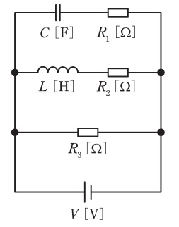

# 【電験3種・理論】過渡現象･過渡応答とは?試験対策と計算問題

## 直流回路の過渡現象

交流回路のRLC回路の特性とは全く別物ですので注意してください。
直流回路のRLC回路においては、過渡現象によりリアクトルとコンデンサは逆の特性を示します。

1. 過渡状態(電圧が印加された瞬間)
    - リアクトル$L$に流れる電流値を維持しようとするため、リアクトルに電圧が印加された瞬間はほとんど電流は流れないため、「リアクトル$L$は開放」と考えます。
    - コンデンサ$C$には電荷がなく、電流が流れやすい状態となり、「コンデンサ$C$は短絡」と考えます。
2. 定常状態(電圧が印加されて十分時間が経過後)
    - 電圧が印加されて十分時間が経過した後、リアクトル$L$の抵抗はほぼ0[Ω]になるため、「短絡」と考えます。
    - コンデンサに電荷が十分溜まっているため、電流が流れなくなり、「開放」と考えます。

## 【RC直列回路】時定数τ=RC

時定数$\tau$（緩和時間とも呼ばれる）とは、回路の応答の速さを表す数値です。
時定数$\tau$と回路の応答の速さは「反比例」の関係にあります。つまり時定数の値が小さいほど、回路の応答速度（立ち上がり速度）が速いことになります。
RC直列回路に流れる電流$I$、抵抗にかかる電圧$V_R$、コンデンサにかかる電圧$V_C$と時定数$\tau$の関係は次式で表せます。

$i(t)=\frac{V_i}{R} e^{-\frac{t}{RC}}$

$V_R(t)= V_ie^{-\frac{t}{RC}}$

$V_C(t)= V_i ( 1 - e^{-\frac{1}{RC}t} )$

$\tau =RC$

パラメータ|説明
--|--
$V_i$|入力電圧
$R$|抵抗値
$C$|コンデンサの静電容量
$V_R$|抵抗Rにかかる電圧
$V_c$|コンデンサCにかかる電圧
$\tau$|時定数（別名：緩和時間, 立ち上がりに比例）

抵抗R、コンデンサの静電容量Cが大きくなると時定数τも増大するため、応答時間（立ち上がり・立ち下がりの時間）は遅くなります。
この関係は物理的に以下の意味をもちます.

- 抵抗が大きい
    - 電流があまり流れず、コンデンサになかなか電荷がたまらないため, 電圧変化に時間がかかる(時定数は抵抗に比例)
- 静電容量が大きい
    - 電荷がたまっていてもなかなか電圧が変化せず、時間がかかる(時定数は静電容量にも比例)

## 【RL直列回路】時定数τ=L/R

時定数$\tau$とは、緩和時間とも呼ばれ、回路の応答の速さを表す数値です。

時定数$\tau$と回路の応答の速さは「反比例」の関係にあります。

- RL直列回路に流れる電流$I$、抵抗にかかる電圧$V_R$、コイルにかかる電圧$V_L$と時定数$\tau$の関係は次式で表せます。

$i(t)= \frac{V_i}{R} (1-V_i^{-\frac{R}{L}t})$

$V_R(t)= V_i (1-V_i^{-\frac{R}{L}t})$

$V_L(t)= V_i^{-\frac{R}{L}t}$

$\tau = \frac{L}{R}$

パラメータ|説明
--|--
$V_i$|入力電圧
$R$|抵抗値
$L$|コイルのインダクタンス
$V_R$|抵抗Rにかかる電圧
$V_L$|コイルLにかかる電圧
$\tau$|時定数（別名：緩和時間, 立ち上がり時間に比例）。定常状態の約63.2%まで到達する時間。

抵抗$R$が大きくなると立ち上がり・下がり時間（定常状態に達するまでの時間）は短くなります。
逆にコイルのインダクタンス$L$が大きくなると立ち上がり・下がり時間（定常状態に達するまでの時間）は長くなります。

この関係は物理的に以下の意味をもちます.

- 抵抗が大きい
    - 電流があまり流れず、コイルで電流に比例して発生する磁束も少しになるため, 電流変化も小さく定常状態にすぐに落ち着く(時定数は抵抗に反比例)
- インダクタンスが大きい
    - コイルでインダクタンスに比例して磁束も多く発生するため, 電流変化も大きくなり定常状態に落ち着くのに時間がかかる(時定数はインダクタンスに比例)

## 【CR直列回路】微分回路

入力信号(電圧)の時間微分(傾き)を出力する回路を微分回路といいます。
微分回路は、「パルスの検出」「ベースラインの除去」「ハイパスフィルター」「ビデオ信号の同期検出」などに用いられています。
この記事では、微分回路の1つである抵抗(R)とコンデンサ(C) を直列接続したCR回路の仕組みについて紹介します。

抵抗(R)とコンデンサ(C) を直列接続したCR回路は下図のようになります。

【電圧/電流】

- 入力電圧を$V_i$とするとき、時刻$t$における出力電圧$V_o$と電流$i$は次式で計算できます。

$V_o=V_ie^{-\frac{t}{\tau}}$

$i=\frac{V}{R}e^{-\frac{t}{\tau}}$

$\tau =RC$

ここで、 $\tau$ は時定数と呼ばれ、回路の応答の速さを示しています。
時定数が大きいほど回路の応答が遅く、小さいほど応答が速いことを表します。

例えばパルス波(入力電圧)を加えた時の出力電圧の波形は下図のようになります

出力電圧の波形が入力電圧の波形を微分したような形になっていることがわかります。
時定数 $\tau$ が小さいほど応答が速くなるので、出力波形の傾きもより急勾配になります。

## 【LR直列回路】積分回路

入力(電圧)の時間積分を出力する回路を積分回路といいます。
この積分回路は「検波回路」「ディレイ回路」「ローパスフィルタ」「ノイズ除去」などに用いられています。
この記事では、積分回路の1つである抵抗(R)とコイル(L) を直列接続したLR回路の仕組みについて紹介します。

- 抵抗(R)とコイル(L) を直列接続したLR回路は下図のようになります。

【電圧/電流】

- 入力電圧を $V_o$とするとき、時刻$t$における出力電圧を $V_o$とLR回路中を流れる電流を $i$ は以下のとおり。

$V_o=V_i(1-e^{-\frac{t}{\tau}})$

$i=\frac{V_i}{R}(1-e^{-\frac{t}{ \tau}})$

$\tau=\frac{L}{R}$

ここで、 $\tau$ は時定数と呼ばれ、回路の応答の速さを示しています。時定数が大きいほど回路の応答が遅く、小さいほど応答が速いことを表します。
例えばパルス波(入力電圧)を加えた時の出力電圧の波形は下図のようになります。

出力電圧の波形が入力電圧の波形を積分したような形になっていることがわかります。
時定数 $\tau$ が小さいほど応答が早くなるので、出力波形の傾きもより急勾配になります。

## 【例題1】RLC回路の過渡現象

【電験3種 理論 令和1年度 問題7 一部改変】

 

図のように，三つの抵抗 R1 [Ω]， R2 [Ω] ， R3 [Ω] とインダクタンス L [H] のコイルと静電容量 C [F] のコンデンサが接続されている回路に V [V] の直流電源が接続されている。定常状態において直流電源を流れる電流の大きさを求めよ。

【解答】

- 過渡現象の「定常状態」では、コンデンサは$C$は開放、リアクトル$L$は「短絡」と考える。
よって、図は定常状態において、電源V[V]に抵抗$R_2, R_3$が並列接続された回路と同じになるので、電流は以下のようになる。

$I=\frac{V}{\frac{1}{R_2}\frac{1}{R_3}}$[A]

## 参考動画

- *初心者向け電験三種・理論・12・過渡現象【超簡単に学ぶ！】第三種電気主任技術者*
    - 

## 関連リンク

- [電験3種試験対策トップページ](../index.md)
- [トップページ](../../../index.md)