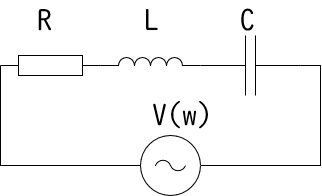

# RLC共振回路とは?共振各周波数・電圧拡大作用・選択度Qの計算【電験3種・理論】

 

RLC回路が共振状態となったとき、RLC共振回路となり、以下の以下の特性をもちます。

- 電圧$V$と電流$I$の位相が同じになる。
- 回路を流れる電流の大きさが最大になる。
- コイルLとコンデンサCの端子電圧が電源電圧より大きくなる。（電圧拡大作用）

共振状態は、電源電圧の角周波数$w_0$が以下の値になるとき発生します。

$\omega _0=\sqrt{\frac{1}{LC}}$

上式より、共振状態となる電源電圧の周波数$f_0$は以下のとおりです。

$f_0 = \frac{1}{2\p \sqrt{LC}}$

なぜこの値になるかは次節で紹介します。

## 共振角周波数の導出

- 回路全体のインピーダンス$Z$は以下のようになります。

$Z=R+Z_L+Z_C=R+j\omega L+\frac{1}{j\omega C}$

$=R+j\omega L-\frac{j}{\omega C}=R+j(\omega L-\frac{1}{\omega C})$

- $R, L, C$は定数なので、インピーダンス$Z$が最小となる条件は虚数項が$0$になるときです。インピーダンス$Z$が最小となるときの角周波数$\omega _0$を共振各周波数といいます。共振状態にあるとき、インピーダンス$Z$は最小（虚数項が0）になるので以下の式が成立します。

$\omega _0L-\frac{1}{\omega _0C}=0$

よって、各周波数$\omega _0$は以下のとおり。

$\omega _0^2=\frac{1}{LC}$

$\omega _0=\sqrt{\frac{1}{LC}}$

## 共振電流

共振状態の時には、見かけ上のインピーダンス$Z$が抵抗$R$だけになるため電流値が最大になります。このときの電流を共振電流$I_0$といいます。

$I_0=\frac{R}{V}$
電源電圧の角周波数$\omega$が共振角周波数$\omega$から離れるほど、電流値は小さくなります。
つまり、共振回路は「**特定の角周波数をもつ信号だけを通しやすくするフィルタ**」の役割を果たします。
共振回路は、無線機やラジオなどの選局にも応用されています。

## 電圧拡大作用とQ（選択度）

RLC直列共振回路が共振状態になると、電源電圧$V$よりもコイル$L$やコンデンサ$C$の端子電圧$V_L, V_C$の方が大きくなるという現象が発生します。これを「**電圧拡大作用**」といいます。

-|電圧拡大作用の倍率
--|--
コイル$L$の端子電圧|電源電圧$V$の$\omega LR$倍
コンデンサ$C$の端子電圧|電源電圧$V$の$\frac{1}{\omega CR}$倍

この倍率を共振回路の「**Q（選択度）**」といいます。
コイルの場合、分母の巻線抵抗が小さく、分子のインダクタンスが大きいほど、選択度Qは大きくります。
（※実際の回路ではインダクタンスを大きくするために巻数を増やせば、巻線分の抵抗も増えます）

【証明】

- 共振電流$I$は次のようになります。

$I_0=\frac{V}{R}$

- コイル$L$やコンデンサ$C$の端子電圧$V_L, V_C$は次のようになり、先程の倍率が成立します。

$V_L=\omega LI_0=\frac{\omega LV}{R}$

$V_C=\frac{1}{\omega C}I_0=\frac{V}{\omega CR}$

## 関連リンク

- [電験3種試験対策トップページ](../index.md)
- [トップページ](../../../index.md)
