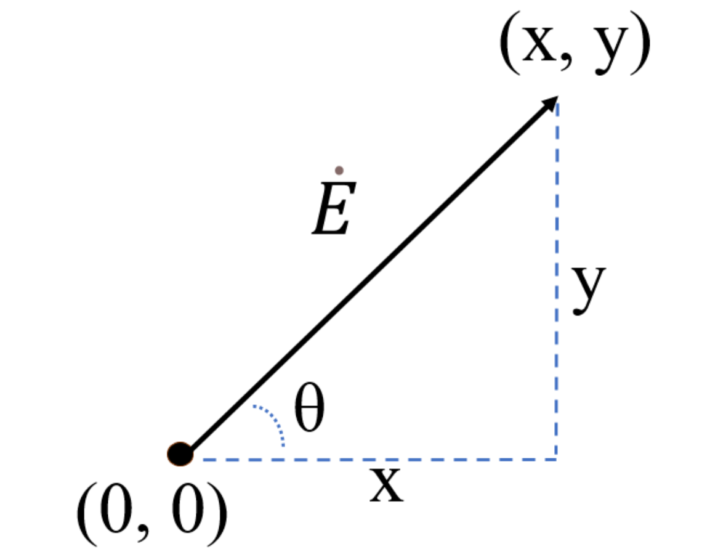

# 【電験3種・理論】直交座標表示と極座標表示とは?試験対策と計算問題

## 直交座標表示と極座標表示

  

直交座標表示と極座標表示は、どちらもベクトルを表現する方法です。
直交座標表示では$\dot{E}=(x, y)$、極座標表示では$\dot{E}=E\angle \theta$と書きます。

- 直交座標表示$\dot{E}=(x, y)$から極座標表示に変換するには、以下の式を用います。

$\dot{E}=E\angle \theta=\sqrt{x^2+y^2}\angle tan^{-1}\frac{y}{x}$

- 極座標表示は$\dot{E}=E\angle \theta$から直交座標表示に変換するには、以下の式を用います。

$\dot{E}=(Ecos\theta ,Esin\theta)$

## 関連リンク

- [電験3種試験対策トップページ](../index.md)
- [トップページ](../../../index.md)