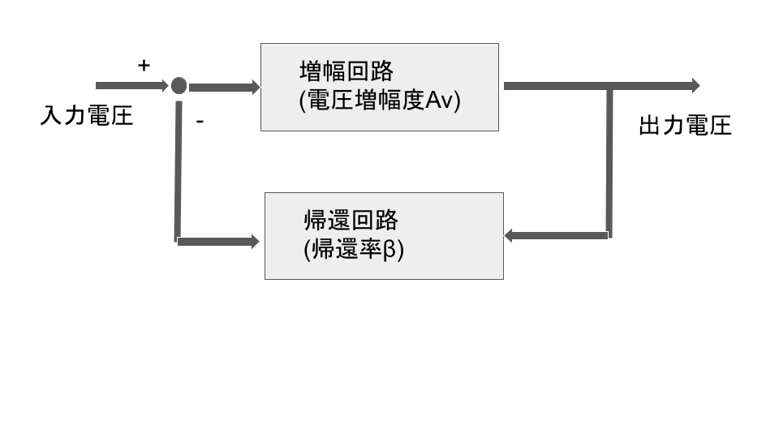

# 【電験3種・理論】オペアンプと増幅回路とは?試験対策と計算問題

## 反転増幅回路(逆相増幅回路)

演算増幅器は、入力端子に加えられた信号の「**差動成分**」を高い利得で増幅する回路である。演算増幅器の**入力インピーダンスは非常に大きい**ため、**入力端子電流はほぼ0**とみなしてよい。一方、**出力インピーダンスは非常に小さい**ため、**出力端子電圧は負荷による影響を受けやすい**。さらに、演算増幅器は利得が非常に大きいため、抵抗などの部品を用いて負帰還をかけたときに**安定した有限の電圧利得**が得られる。
オペアンプを用いた最も単純な反転増幅回路は以下の通りです。

- 上記の回路の入力電圧を$V_o$とするとき、出力電圧$V_i$は以下のとおり。

$V_o=-\frac{R\2}{R_1}V_i$

- この式からもわかるとおり、入力電圧$V_i$が反転して増幅された形で出力電圧$V_o$を得ることが出来ます。

## 非反転増幅回路(正相増幅回路)

- オペアンプを用いた最も単純な非反転増幅回路は以下の通りです。

- 上記の回路の入力電圧を$V_o$とするとき、出力電圧$V_i$は以下のとおり。

$V_o=\frac{R_1+R_2}{R_1}V_i$

- この式からもわかるとおり、入力電圧$V_i$が増幅された形で出力電圧$V_o$を得ることが出来ます。

【例題】

R1=Rのとき、電圧増幅度Av=V0/Vi=3とするためにはR2をいくらにすれば良いか。

(解答)

- 以下のとおり、R2=2Rとすれば良い。

$\frac{V_o}{V_i}=\frac{R_1+R_2}{R_1}=\frac{R+R_2}{R}=3$

$R_2 = 2R$

https://algorithm.joho.info/denki-denshi/operational-not-inverting-amplifier-circuit/

## 微分回路

オペアンプを用いた最も単純な微分回路は以下の通りです。

- 上記の回路の入力電圧を$V_o$とするとき、出力電圧$V_i$は以下のようになります。

$V_o=-CR\frac{dV_i}{dt}$

- この式からもわかるとおり、入力電圧$V_i$が時間微分された形で出力電圧$V_o$を得ることが出来ます。

パラメータ|内容
--|--
$V_i$|入力電圧
$V_o$|出力電圧
$R$|抵抗値
$C$|コンデンサの静電容量

## 積分回路

オペアンプを用いた最も単純な積分回路は以下の通りです。

上記の回路の入力電圧を$V_o$とするとき、出力電圧$V_i$は

$V_o=-\frac{1}{CR}\int V_idt$

となります。
この式からもわかるとおり、入力電圧$V_i$が時間積分された形で出力電圧$V_o$を得ることが出来ます。

パラメータ|内容
--|--
$V_i$|入力電圧
$V_o$|出力電圧
$R$|抵抗値
$C$|コンデンサの静電容量

## ボルテージホロワ回路

ボルテージホロワ回路は、入力電圧と出力電圧が等しくなる回路です。
非反転増幅回路の抵抗R1を開放(∞Ω)にし、抵抗R2を短絡(0Ω)すると、入力電圧と出力電圧が等しくなり、ボルテージホロワ回路となります。
インピーダンス変換や回路の分離などに用いられます。

## 負帰還増幅回路

- 電圧増幅度Avが**1より十分大きい場合**、増幅回路の利得は**帰還率βで制御**でき、電源電圧の変動抑制や、増幅回路でのノイズ抑制ができ、安定的となる
- 増幅回路の利得が一定となる帯域幅が大きくなる
- 負帰還増幅回路全体の利得は、負帰還をかけない増幅回路の利得よりも低下する
- ①**vβ≧1** ②**Avβの位相角が0**のとき、発振を継続します(**発振回**路となる)。

$(v_i-\beta v_o)A_v=v_o $

$\frac{v_o}{v_i}=\frac{A_v}{1+A_v\beta}$

AV>>1とすると以下のようになります。

$\frac{v_o}{v_i}=\frac{A_v}{1+A_v\beta}\simeq \frac{1}{\beta}$

## 参考動画

- *初心者向け電験三種・理論・25・オペアンプ【超簡単に学ぶ！】第三種電気主任技術者*
    - 

## 関連リンク

- [電験3種試験対策トップページ](../index.md)
- [トップページ](../../../index.md)