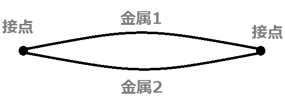

# 【電験3種・理論】FET、MOSFETとは?試験対策と計算問題

## 熱電対とは

  

熱電対とは、「ゼーベック効果」を用いて温度を計測するセンサーです。
熱電対の2つの接合点に温度差を与えると、起電力が発生する。この現象を「**ゼーベック効果**」といい、このとき発生する起電力を「**熱起電力**」といいます。
熱電対の接合点の温度の高いほうを「**温接点**」、低いほうを「**冷接点**」といいます。
ゼーベック効果とは、異なる二種類の金属線を接続して1つの回路（熱電対）を構成し、2つの接点に温度差を与えると、回路に電圧が発生する現象のことです。
つまり、一方の接点の温度がわかれば、電位差からもう一方の温度を計測できます。

- 熱電対の主な特徴
    - 仕組みが単純で安価
    - 応答速度が高速
    - 測定範囲が広い(-200～1700度)
    - センサー出力が電圧なので簡単にデーターロガーで読み取れる

## ゼーベック効果(熱電対の原理)

熱電対は、ゼーベック効果により温度を測定します。
ゼーベック効果とは、ドイツ人科学者ゼーベックが1821年に発見しました。

- ゼーベック効果
    - 異なる二種類の金属線を接続して1つの回路（熱電対）を構成します。
    - 2つの接合部（測温接点と計測器側接点）に温度差を与えます。
    - 回路に電圧が発生します。熱電対では、この電圧を計測器で測定することで温度がわかります。

## 測定方法(冷接点補償、基準接点補償)

ゼーベック効果による電圧の測定方法には、冷接点補償、基準接点補償の２つがあります。

- 冷接点補償
    - 基準接点を氷水などで0度に保ち、温度を読み取る方法
- 基準接点補償
    - 基準接点の気温を測定し、温度差ΔTを加算して温度を読み取る方法.
    - 「基準接点補償機能」がついた計測器を用いるのが一般的です。

## 熱電対の種類とJIS規格

熱電対は、2つの金属の選び方で種類が異なります。
JIS規格になっている代表的な熱電対の8種類はつぎのとおりです。

記号|構成材料|使用温度範囲|概要
--|--|--|--
K|+：ニッケルおよびクロムを主とした合金（クロメル） -：ニッケルを主とした合金|-200℃～1000℃|温度と熱起電力との関係が直線的であり、工業用として最も多く使用
J|+：鉄 -：銅およびニッケルを主とした合金（コンスタンタン）|0℃～600℃|Ｅ熱電対に次いで熱起電力特性高く、工業用として中温域で使用
T|+：銅 -：銅およびニッケルを主とした合金（コンスタンタン）|-200℃～300℃|電気抵抗が小さく、熱起電力が安定しており、低温での精密測定に広く利用
E|+：ニッケルおよびクロムを主とした合金（クロメル） -：銅およびニッケルを主とした合金（コンスタンタン）|-200℃～700℃|ＪＩＳに定められた熱電対の中で最も高い熱起電力特性をもつ
N|+：ニッケル、クロムおよびシリコンを主とした合金（ナイクロシル） -：ニッケルおよびシリコンを主とした合金（ナイシル）|-200℃～1200℃|低温から高温まで、広い範囲にわたって熱起電力が安定
R|+：ロジウム13%を含む白金ロジウム合金 -：白金|0℃～1400℃|高温での不活性ガスおよび、酸化雰囲気での精密測定に利用。精度が良くバラツキや劣化が少ないため、標準熱電対として利用。
S|	+：ロジウム10%を含む白金ロジウム合金 -：白金|0℃～1400℃|高温での不活性ガスおよび、酸化雰囲気での精密測定に利用。精度が良くバラツキや劣化が少ないため、標準熱電対として利用。
B|+：ロジウム30%を含む白金ロジウム合金 -：ロジウム6%を含む白金ロジウム合金|0℃～1500℃|ＪＩＳに規定された熱電対で最も使用温度が高い熱電対。

## 補償導線で熱電対を延長接続

補償導線は、「熱電対」と「温度計測器」を相互に接続する導線です。
「温度計測器」と「熱電対」の間が長いときの延長ケーブルとして使用することが多いです。

## 参考動画

- *初心者向け電験三種・理論・23・FET・MOSFET【超簡単に学ぶ！】第三種電気主任技術者*
    - 
- *初心者向け電験三種・理論・24・バイアス回路【超簡単に学ぶ！】第三種電気主任技術者【2023年1月29日改訂】*
    - 

## 関連リンク

- [電験3種試験対策トップページ](../index.md)
- [トップページ](../../../index.md)