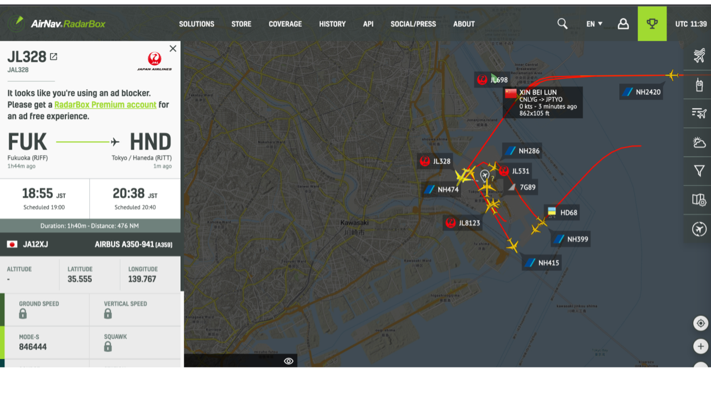

# 【航空無線】専用の受信機なしでスマホやPCのみで楽しむ方法

## 世界中の航空無線をスマホやPCブラウザで聴く【LiveATC】

LiveATCは、エアバンド受信機などで、世界中の航空無線をスマホやPCブラウザから聴けるアプリケーションです。
日本の空港だけでなく米軍基地の航空無線も視聴可能。

【PCブラウザ版の使い方】

- [https://www.liveatc.net/](https://www.liveatc.net/)にアクセスします。
- 検索ボックスに目的の空港コードを入力して検索します(例:羽田空港だと空港コードは「HND」なので、それを検索)。
- 緑の『LISTEN』をクリックすると、再生画面が表示されるので、再生ボタンを押すと航空無線が聴こえます。
    - 「App/Dep」だと、アプローチとディパーチャーがまとめられていて、両方を同時に聴くことができます。
-   

空港名|3レター|4レター
--|--|--
羽田|HND|RJTT

なお、地図から空港を選択することも可能です。その場合は「LiveATC Feed Map」をタップして選択します。

## 民間航空機の現在位置をリアルタイム表示【フライトレーダー24】

フライトレーダー24は、飛行中の民間航空機の現在位置をリアルタイムで表示してくれるアプリケーションです。

ブラウザ上でも、スマートフォンアプリからも使えます。

多くの航空機に搭載されているADS-B（自動位置情報伝送・監視装置）が自身の機体情報を地上の管制システムや他の航空機に発信しています。
フライトレーダー24は、このADS-Bから送られてくるデータを受信し、集約したものです。

【ブラウザ版の使い方】

- [https://flightradars24.info/ja/](https://flightradars24.info/ja/)にアクセスし、検索窓でコールサイン(JA〇〇Jみたいな機番)を入力します。
- 該当する機番の飛行機が表示され、「LIVE」をタップすると現在の飛行状態が表示されます。
    - 航空機をタップすると、その飛行機の位置、航空会社、便名、出発空港、目的地、飛行時間、機種、レジ、速度、高度、飛行の航跡など
    - 空港をタップするとその空港の到着・出発ボードや、天気、風向きなどがわかる
    - アプリで空を飛んでいる飛行機に向けてスマホをかざすとその飛行機のフライト情報を表示できる
-   

## 用語

- デリバリー
    - スポットにいる飛行機に対して飛行計画を承認）
- グランド
    - 地上走行する飛行機
- タワー
    - 滑走路の離着陸、横断
- ディパーチャー
    - 離陸した飛行機に対してコントロールに引き継ぐまで
- アプローチ
    - 着陸する飛行機に対してタワーに引き継ぐまで
- コントロール
    - 空港から離れた高空を飛ぶ飛行機
- ATIS
    - 飛行場の情報提供

