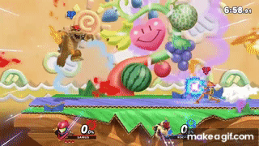

# サムス・ダークサムスの使い方(スマブラSP)

- リーチが長く、空中攻撃が強い
- 遠距離戦に強い(飛び道具)
- 復帰力が高い
- 機動力が低い(一度近接攻撃を受けると、コンボで一方的にやられやすい)
- つかみや回避の隙が大きい
- 体が大きい(被弾しやすい)

## 立ち回り

- はじめに
    - 「CS」は横Bのチャージショットのこと。
    - 小CSは少しだけチャージした状態で横Bを放つこと。中CSは中程度、高CSがMAX手前。最大CSは最大チャージ。

- 序盤（相手が低％）の立ち回り
    - NBコンボ、「対空空上→空上→上B」「下投げ→空前」「下投げ→空上→空上→上B」のコンボで％稼ぎ
        - 「NB(最大手前チャージショット)→掴み→下投げ→空前」で40％以上稼げる。
    - 飛び道具(ミサイル、チャージショット)を相手に意識させ、ジャンプしてきた相手には空前を合わせる
    - ボムを自分の前に置き、相手が「ダッシュガード」「ジャンプ」のどちらで向かってくるか把握する。
- 中盤 （相手が中％）の立ち回り
    - NBコンボで％稼ぎ
        - NB(微チャージ) → DAが繋がる。
    - 崖に追い出したら、崖ボムで％稼ぎ。崖ボムを意識させたら、飛び出して復帰阻止。
    - 崖端の相手には、「空後」や「*横B→空下(メテオ)*」で早期撃墜を狙ってみる。
    - 横B(ミサイル) → チャージショットでガードが割れる
- 終盤 （相手が高％）の立ち回り
    - 「DA」「上投げ」「NB(最大手前チャージショット)」「空前」「空後」などでバーストを狙っていく。
        - 飛び道具でジャンプしたら、「空前」「空後」でバースト。
    - 崖捕まりし続ける相手には、無敵時間切れを期待して上強を置く。
    - 崖ボム → 各スマッシュ攻撃で撃墜を狙う。

## コンボ

- 0〜中%帯
	- 下投げ→空前(約23%)
		- お手軽定番コンボ。相手によっては0%付近や高%で繋がらない。
	- 空前 → DA 
		- 牽制で空前をよく使うので、空前が当たれば繋がる
- 中%帯
	- 上強→空前(約30%)
        - お手軽定番コンボ。
    - 空N → NB(チャージ最大で約43%)
        - 空中NからNB(チャージショット)を放つ。
        - ダメージ稼ぎだけでなく、早期撃墜を狙うことも可能。
- 中〜高%帯(約26%)
    - 上強 → 空上
        - 上強 → 空前よりダメージが少ないが、高%帯でも繋がる。
        - 空前が当てられそうになければ、空上を出すのが無難。

## 技

- NB(チャージショット) **超重要**
    - 最大チャージで放つと後隙が長いため、最大手前でチャージを止めるのがポイント。
    - 序盤〜終盤までダメージ稼ぎや撃墜まで幅広く活躍する。
    - チャージショットを溜めている状態で立ち回ることで、相手がジャンプ多め・ガード多め空前や投げで崩しやすくなる。
    - 崖外から復帰する相手にぶっ放す復帰阻止も強い。
- 下B(ボム) **超重要**
    - 着地拒否に使う場合
        - 自分が空中に居る場合、ボムをばら撒きながら左右に逃げることで着地狩りを回避できる。
    - 復帰
        - 復帰時にボムを何度も出すと、少し横に移動し、復帰距離が伸びる。また、復帰阻止してくる相手にボムが当たったり、タイミングをずらせるのでサムスの復帰能力が高いといわれる所以。
        ので、
    - 牽制
        - サムスの前に頻繁にボムを生成して置くと、ダッシュで突っ込んできた相手にガードやジャンプをを強要できる。
        - ガードした相手には投げ、ジャンプした相手には空前を合わせる。
    - 崖狩り
        - 相手が崖外から復帰する時に、崖下にボムを置くと、相手の上B復帰にかち合ってダメージを稼げる。
        - 相手が崖を掴もうとする時に、崖上にボムを置くと、相手のその場上がり・攻撃上がり・ジャンプ上がりに当たってダメージを稼げる。
            - 回避上がりが多くなったら下スマ・上スマで狩る。
            - 崖に捕まり続けてきたら相手の無敵切れに上強で狩る。
            - ボムが当たらないタイミングでジャンプ上がりしてきたら、上強で狩る。
- 空前 **超重要**
    - 飛び道具を嫌ってジャンプしてきた相手に合わせてダメージ稼ぎ。
        - NB(チャージショット)を溜めて相手に圧をかけることで、相手のジャンプを強要して空前でダメージを稼いでいくのが大事。
    - 持続が長いため、復帰阻止や崖外での早期撃墜にも使える。いやすい。
- 上B(スクリューアタック) **重要**
    - 発生が速く、ガーキャンで使用する。超高％だと撃墜可能。
    - 避けられるとスマッシュ確定なので、ガーキャン、緊急回避、コンボ用として使う。
    - 復帰技としても使えるが、ワイヤー掴みのほうが安全なので出番は少ない。
- DA(ダッシュアタック) **重要**
    - 高%だと撃墜可能。
    - 「NB(チャージショット) → DA」コンボが繋がる。
- 上強 **重要**
    - 崖捕まり、ジャンプ上がりを狩れる撃墜択。
    - ボムを嫌がって崖に捕まり続けている相手に振る。
- 空N **重要**
    - 前後に判定のあるので、復帰阻止時や空対空時で振る。撃墜も狙える。
    - 序盤の崖攻防時にボムをばら撒き続け、中盤以降に突然崖を飛び出し、空Nで復帰阻止できる。
- 空後 **重要**
    - リーチがあるので、終盤になったら牽制がてら振っていく。
    - 中盤で崖端で戦っている時に当てる早期撃墜が狙えるので、積極的に振って良い。
- 空上 **重要**
    - 「下投げ→空上→空上→上B」コンボで40％程度稼げる。
    - 対空性能が高いので、空中にいる相手に振っておくと良い。
    - 相手が空上を警戒して回避を使うようになったら、回避を読んでNB(チャージショット)を当てる。
- 下スマッシュ **重要**
    - 崖ボム時に、回避上がりの位置に下スマッシュを置くと撃墜可能。
        - 崖ボムを続けていると、相手が回避上がりを多用するようになるので、そのタイミングで狙っていく。
- 投げ **重要**
    - 序盤はコンボで下投げ、終盤は撃墜で上投げを使う。
    - 範囲が広いので、飛び込んでくる相手から引いて投げを置くと良い。
    - NB(チャージショット)を警戒して相手がガードを固めたら、投げを増やしていく。
    - 空中で投げ入力するとグラップリングビームが出せる。空中での牽制や復帰阻止に使える。

## 必須コンボ・撃墜技

- 小〜中CS → 前投げ → 空前
    - 相手が低%帯で入るダメージ40%超えの強力コンボ。序盤に狙っていく。
    -   

## 参考動画

- 
- 
- 
- 【初心者必見】即VIPいけるサムスの即死コンボ3選！【スマブラSP】
    - 
- 【解説】 VIP行きたいならこれを見ないと損 サムスのテクニック10選|スマブラSP
    - 
- 上手くなるためのポイント教えます！サムス/ダークサムスの崖待ち講座|スマブラSP
    - 
- 【スマブラSP】弾キャラの代名詞、サムス初心者向け解説！【Part1/2】
    - 
- 【スマブラSP】最恐の崖攻めを使いこなそう！サムス徹底解説！【Part2/2】
    - 
- 【スマブラSP】目指せＶＩＰ上位！サムス解説動画 ステップアップ編！
    - 
- 3分でわかるVIPサムスの作り方- 初心者のための全キャラVIP企画 〜サムス編〜【スマブラ SP】
    - 
- 【即死コンボ】サムス/ダークサムスで即VIP行くための上級技全て教えます|スマブラSP
    - 
- 1分ちょっとでわかる_猿でも勝てるサムス_ダークサムス対策【スマブラSP】
    - 
