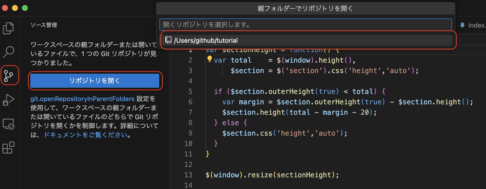

# Markdown入門 サンプルコード集

## 見出し(hタグ)

【サンプルコード】
```
# 見出しh1
## 見出しh2
### 見出しh3
```


## 箇条書きリスト(liタグ)

ハイフン(-)、プラス(+)、アスタリスク(*)のいずれかで箇条書きリストを作成できます。
記号と箇条書きの間には半角スペースを1つ入れます。

【サンプルコード】
```
- リスト1
    - リスト1-1
        - リスト1-1-1
    - リスト1-2
- リスト2
- リスト3
```

【実行結果】
- リスト1
    - リスト1-1
        - リスト1-1-1
    - リスト1-2
- リスト2
- リスト3

## 番号付き箇条リスト(liタグ)

「任意の数値 + 半角ドット(.)」で番号付きリストを作成できます。
記号と箇条書きの間には半角スペースを1つ入れます。

【サンプルコード】
```
1. リスト1
    1. リスト1-1
        1. リスト1-1-1
    1. リスト1-2
1. リスト2
1. リスト3
```

【実行結果】
1. リスト1
    1. リスト1-1
        1. リスト1-1-1
    1. リスト1-2
1. リスト2
1. リスト3


## 取り消し線

取り消しを引きたいテキストを~~（チルダ2つ）で囲みます。

【サンプルコード】
```
私は~~宇宙人~~人間です。
```

【実行結果】

私は~~宇宙人~~人間です。

## コードブロック(pre)

「```」（バッククオート3つ）で段落を囲みます。
コードブロックをpre表示できます

【サンプルコード】
```
｀｀｀
# 標準出力
print("コードブロックのサンプルです")
｀｀｀
```
※上記は全角でバッククオート3つを書いていますので、半角に直してください。

【実行結果】
```# 標準出力
print("コードブロックのサンプルです")
```

## 画像(imgタグ)
画像ファイルの表示は以下のコードで表示できます。

ｋ
```

```

【実行結果】


## 

【サンプルコード】
```
インストールコマンドは `pip install opencv-python` です
```

【実行結果】
インストールコマンドは `pip install opencv-python` です

