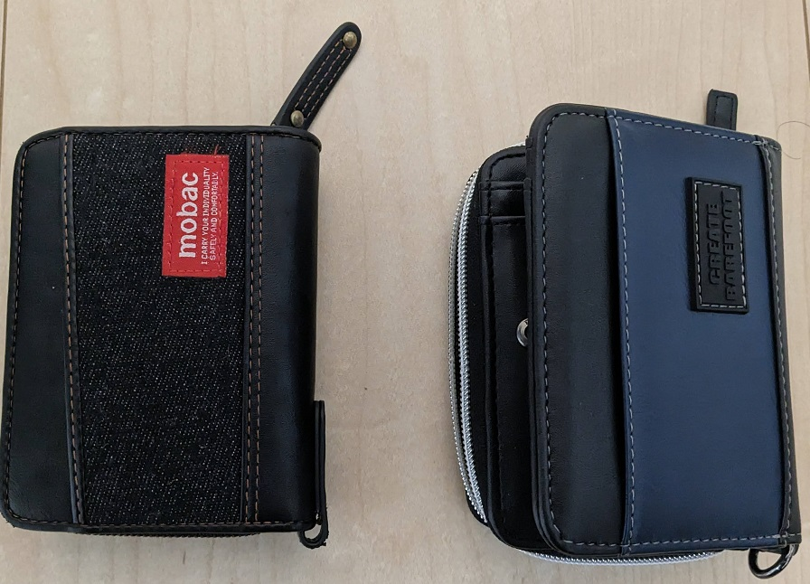
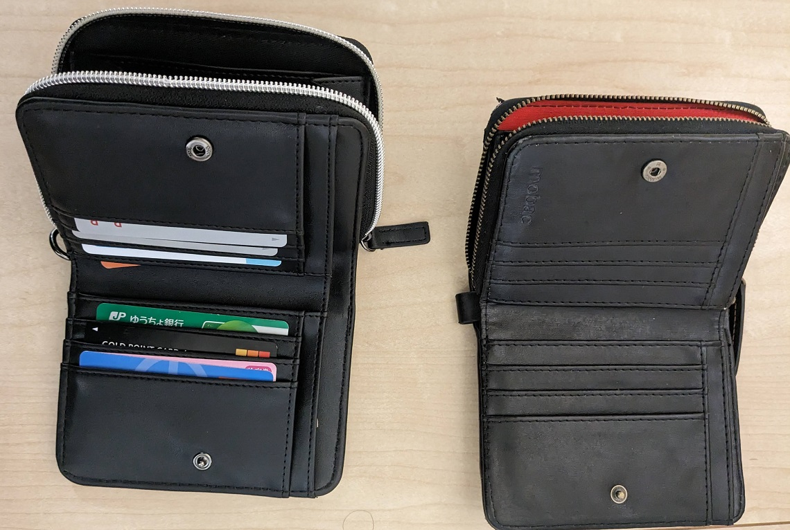
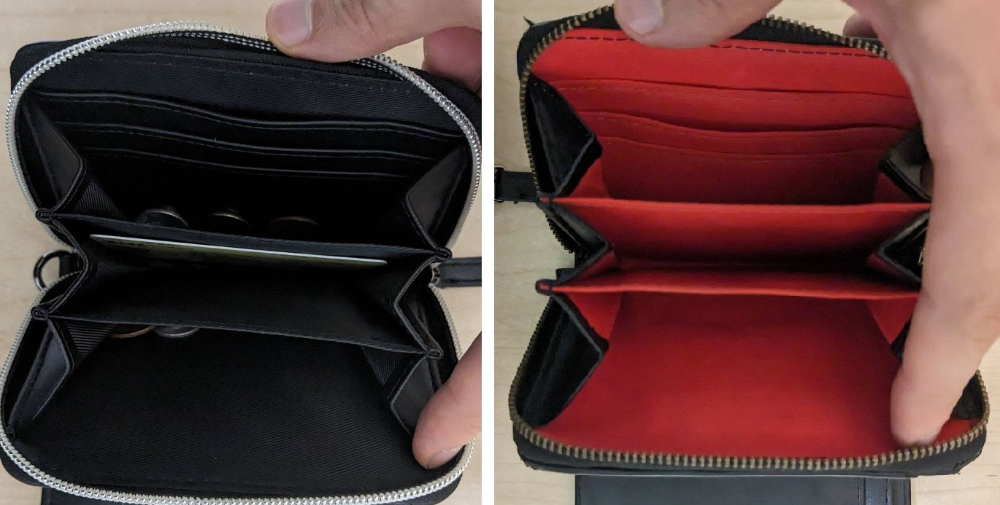

# Mobacにそっくりで半額?Create Barefootのを使ってみた感想

# Mobacの2つ折り財布

Mobac(モバック)は株式会社ポーム(本社:大阪市)が販売している財布や小物などのブランドです。
イオンやライフの財布売り場などでよく見かけ、実用的で2000～3000円と安く、私も学生の頃からずっとお世話になっていました。

･デザインが派手すぎずシンプル
･軽量かつ機能的で使い勝手が良い
･低価格で購入しやすい(2000～3000円)
･リングが付いている

特に、財布にリングが付いており、紐などでカバンやズボンに括り付けられるので重宝していました。
ただ、このリングを留めていた合皮部分が千切れてしまい、しまむらで新しいものを探していたとき、Mobacそっくりで価格が1200円と半額のものを見つけました。

それが Create Barefoot(クリエイト ベアフット)というブランドです。

 

 

 