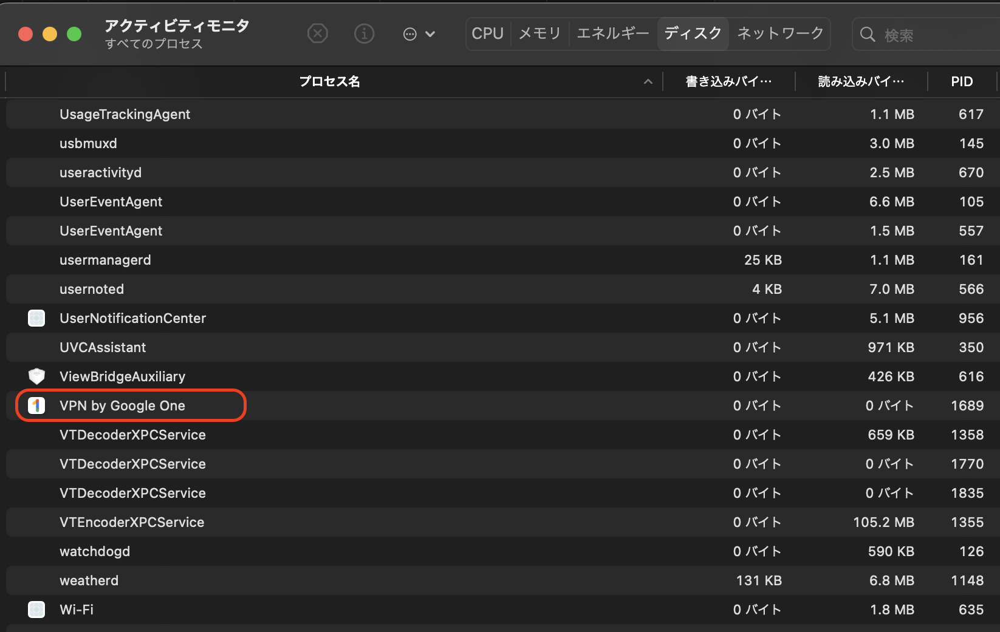
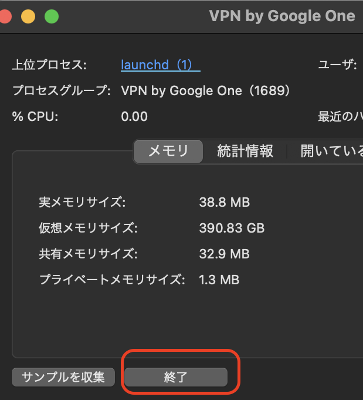

## 【Mac】バックグラウンドアプリを強制終了する方法

「command+option+ESC」だと開いているアプリは強制終了できますが、バックグラウンドで動いているアプリ(Google VPNなど)は強制終了できません。

バックグラウンドアプリを強制終了させたい場合は、以下の手順でアクティビティモニタ上で操作します。

- アクティビティモニタを起動し、閉じたいアプリを選択します。

 

- 「終了」をクリックします。

 

