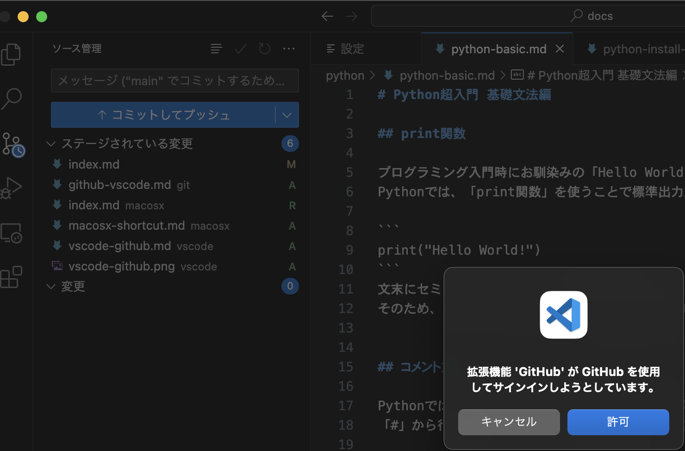

# VSCodeからGithubのリポジトリを操作する方法

## VSCodeのGithubプラグイン

VSCodeには、Githubのプラグインが標準でインストールされているため、特に追加でプラグインを入れなくてもGithubのリポジトリを操作できます。

## 既にあるローカルリポジトリを開き、リモートリポジトリにコミット・プッシュする

- VSCodeを開いたら、「左の共有アイコン」→「リポジトリを開く」→「操作したいリモートリポジトリ」をクリックします。


- メッセージ欄にコメントを記載し、「コミットしてプッシュ」をクリックすると、「拡張機能GithubがGithubを使用してサインインしようとしています。」と表示されるので「許可」をクリックします。



- 以下のメッセージが表示されたら「はい」をクリックします。

```
There are no staged changes to commit.
Would you like to stage all your changes and commit them directly?
```

- ブラウザが開き、Githubアカウントにログインしたら「Authorize Visual-Studio-Code」をクリックします。
これでGithubのリモートリポジトリにコミットプッシュできるようになります。
