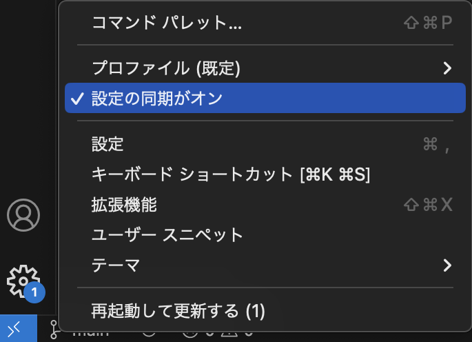

# VSCodeの設定を複数のPC間で同期させる(Settings Sync)

## settings syncで出来ること

VSCodeには、「Settings Sync」という複数のPC間で設定を同期させる機能があります。
必要なものは「Githubアカウント」もしくは「Microsoftアカウント」です。

- 設定画面から設定できる項目
- キーボードショートカット
- ユーザースニペット
- 拡張機能
- 画面のカスタマイズ

## settings syncを有効にして設定を同期させる手順

- 画面左下の「歯車のアイコン」→「設定の同期をONにする」をクリックします。

- 「GitHubでサインイン」もしくは「Microsoftでサインイン」をクリックします。

- ブラウザでGithubのログイン画面が表示されるのでログインし、拡張機能がURIを開くことを許可します。

- 同期させたい他のPCのVScodeでも同様の操作を行います。
